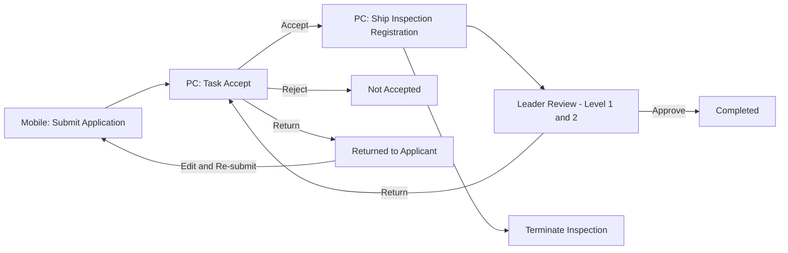
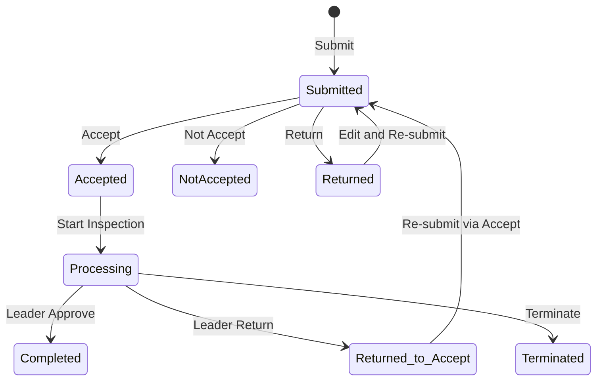
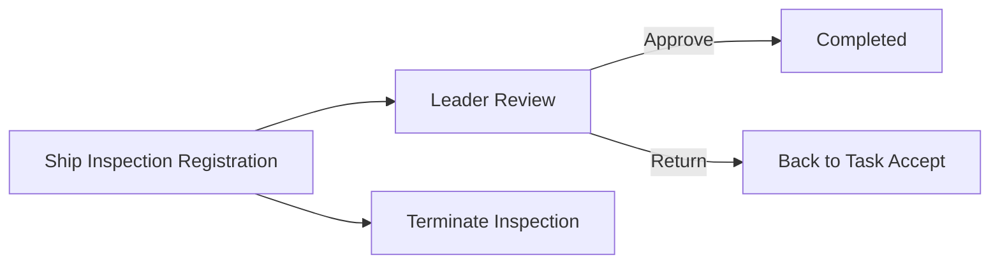

# xxxxxx整体需求分析文档

---

## 第1章 项目概述

### 1.1 功能背景与目标

本模块为xxx辅助管理平台（xxx）的xxxxxx子系统，旨在实现xxx建造xxx申请、受理、办理、审核的全流程线上管理，覆盖移动端申请与 PC 端审批的完整业务链，提升xxx工作的效率与规范化水平。

### 1.2 系统架构说明

| 端 | 技术栈 | 说明 |
|---|--------|------|
| PC 前端 | Vue 3 + Element Plus（Options API） | xxx机构管理、xxx受理、xxx办理、领导审核、统计分析 |
| 移动端 | UniApp + uView UI 2.x | 建造xxx申请（xxx/xxx提交） |
| 后端 | Spring Boot 3 + MyBatis-Plus | 统一 API 服务 |
| 数据库 | mysql 8 | 业务数据存储 |

### 1.3 整体业务流程图



> **一期实现范围说明**：图纸确认、实xxx验、报告签发环节暂不实现；文书管理暂不实现；工作移交暂不实现。领导审核退回后回到「任务受理」环节。

---

## 第2章 角色与权限设计

### 2.1 角色列表

| 角色 | 说明 |
|------|------|
| xxx申请人(xxx/xxx) | 通过移动端提交建造xxx申请 |
| xxx人员(xxx/xxx) | 对申请进行受理、xxx登记等操作（一期仅实现xxx登记环节） |
| 部门负责人(领导) | 对xxx办理结果进行逐级审核 |
| 系统管理员 | 管理xxx机构、xxx人员、字典数据等基础配置 |

### 2.2 功能权限矩阵

| 功能模块 | 申请人 | xxx人员 | 部门负责人 | 系统管理员 |
|---------|--------|---------|----------|----------|
| 建造xxx申请(移动端) | 新建/查看/查看退回列表/重新编辑提交 | - | - | - |
| xxx机构管理 | - | - | - | 新建/修改/删除/查看 |
| xxx人员管理 | - | - | - | 新建/修改/删除/查看 |
| xxx受理(任务受理) | - | 受理/不予受理/退回/查看 | - | 查看 |
| xxx办理 | - | 登记/办理/保存 | - | 查看 |
| 领导审核 | - | - | 通过/退回/查看 | 查看 |
| xxx统计分析 | - | 查看 | 查看 | 查看 |

**权限规则：**
- 同部门可查看，仅创建人可维护
- xxx受理：xxx机构下所有xxx人员均可受理本机构收到的申请
- 领导审核：xxx人员归属的部门负责人审核；最多两级审核（部门负责人审核 → 机构负责人核准），退回后回到任务受理环节
- 系统管理员：拥有所有权限，也可以全流程自己操作

---

## 第3章 功能模块详细说明

### 3.1 建造xxx申请（移动端）

- **访问端**：移动端（uni-app）
- **功能描述**：xxx/xxx通过手机端提交xxx建造xxx申请，选择xxx机构和xxx种类，上传申请材料

#### 页面列表

- 建造xxx申请表单页

#### 字段说明 - 基本信息

| 字段名 | 字段类型 | 是否必填 | 说明 |
|--------|---------|---------|------|
| xxx名 | 文本输入 | 是 | xxx名称 |
| xxx | 文本输入 | 是 | xxx注册xxx口 |
| xxx材质 | 文本输入 | 是 | 如钢质、玻璃钢等 |
| xxx长(m) | 数字输入 | 是 | xxx长度，单位米 |
| 总xxx | 数字输入 | 是 | xxx总xxx |
| 主机功率(kw) | 数字输入 | 是 | 主机功率，单位千瓦 |
| xxx制造厂 | 文本输入 | 是 | 制造厂名称 |
| xxx所有人 | 文本输入 | 是 | xxx姓名或企业名称 |
| 计划建造开工日期 | 日期选择 | 是 | 预计开工日期 |
| xxx机构 | 下拉选择 | 是 | 数据来源：xxx机构管理 |
| xxx种类 | 下拉选择 | 是 | 仅支持：建造xxx、初次xxx（不含运营xxx） |
| 计划xxx日期 | 日期选择 | 是 | 预计xxx日期 |
| xxx地点 | 文本输入 | 是 | xxx的具体地点 |
| 申请人 | 文本输入 | 是 | xxx个人或xxx名称 |
| 申请时间 | 日期选择 | 是 | 默认当前时间 |
| 联系人 | 文本输入 | 是 | 联系人姓名 |
| 联系电话 | 文本输入 | 是 | 联系电话号码 |
| 特别说明 | 多行文本 | 否 | 补充说明信息 |

#### 字段说明 - 申请材料(文件上传)

| 序号 | 材料名称 | 是否必传 | 说明 |
|------|---------|---------|------|
| 1 | 经审批的设计图纸资料及图纸批准书复印件 | 是 | word/pdf，最多3个 |
| 2 | xxx安全环保技术状况声明书 | 是 | word/pdf，最多3个 |
| 3 | 现有xxxxxx证书及技术文件 | 是 | word/pdf，最多3个 |
| 4 | xxx所有人授权申报xxx的委托书 | 是 | word/pdf，最多3个 |
| 5 | xxxxxxxxx名号审批文件 | 是 | word/pdf，最多3个 |
| 6 | xxx灭失/拆解或销毁处理文件 | 否 | word/pdf，最多3个 |
| 7 | xxxxxx购买合同书或修造合同复印件 | 条件必传 | 根据xxx种类决定是否必传 |
| 8 | xxx政批准造xxx(或买卖)的准造(更新)证副本 | 否 | word/pdf，最多3个 |
| 9 | 其他 | 否 | word/pdf，最多3个 |

#### 页面列表

- 建造xxx申请表单页（新建提交）
- 被退回申请列表页（查看被受理退回的申请）
- 重新编辑提交页（对退回的申请进行修改后重新提交）

#### 操作按钮

| 按钮名 | 触发条件 | 操作说明 |
|--------|---------|---------|
| 提交 | 必填校验通过 | 提交申请进入待受理状态 |
| 查看退回列表 | 列表页入口 | 查看被受理退回的申请列表 |
| 重新编辑 | 退回列表操作 | 打开退回的申请进行修改 |
| 重新提交 | 编辑页 | 修改后重新提交 |

#### 业务规则

1. 提交时校验：若当前xxx名已存在同一xxx种类的未办结流程(待受理/整改中/办理中)，弹窗提醒「当前xxx尚有未办结的xxx申请，请待流程办结后申请」，阻止提交
2. 申请时间默认填充为当前系统时间
3. xxx机构下拉数据来源于xxx机构管理模块
4. 申请提交后，对应xxx机构的所有xxx人员均可在「任务受理」中看到该申请
5. **不提供草稿保存功能**，仅支持直接提交
6. **被退回的申请**：申请人可在「退回列表」中查看被受理退回的申请，点击重新编辑修改后重新提交
7. xxx种类仅支持：建造xxx、初次xxx（不含运营xxx）

#### 状态流转



#### 接口需求

| 接口名称 | 方法 | 路径 | 说明 |
|---------|------|------|------|
| 提交建造xxx申请 | POST | /xxx/cbjy/sqd/save | 保存并提交申请 |
| 查询xxx机构列表 | GET | /xxx/cbjy/jyjg/list | 供移动端下拉选择 |
| 查询我的申请 | GET | /xxx/cbjy/sqd/myList | 申请人查看自己的申请 |
| 查询退回列表 | GET | /xxx/cbjy/sqd/returnedList | 查看被退回的申请列表 |
| 申请详情 | GET | /xxx/cbjy/sqd/queryById | 查看申请详情 |
| 重新提交申请 | POST | /xxx/cbjy/sqd/resubmit | 修改退回的申请后重新提交 |
| 重复申请校验 | GET | /xxx/cbjy/sqd/checkDuplicate | 校验同xxx名同xxx种类是否有未办结流程 |

---

### 3.2 xxx机构管理（PC端）

- **访问端**：PC端
- **功能描述**：管理xxxxxx机构的基础信息，支持多级机构树形结构，包含机构信息、资质信息和人员信息三个 Tab

#### 页面列表

- xxx机构管理列表页面(树形列表)
- xxx机构新增/修改页面(三个 Tab：机构信息、资质信息、人员信息)

#### 字段说明 - 机构列表页

| 字段名 | 字段类型 | 说明 |
|--------|---------|------|
| xxx机构名称 | 文本 | 树形展示，支持展开/折叠 |
| 归属区域 | 文本 | 所属省市区域 |
| 部门负责人 | 文本 | 机构负责人 |
| 联系人 | 文本 | 联系人 |
| 排序号 | 数字 | 显示排序 |

#### 字段说明 - 机构信息 Tab

| 字段名 | 字段类型 | 是否必填 | 说明 |
|--------|---------|---------|------|
| 上级机构 | 下拉选择(树形) | 否 | 支持多级机构层级，不选则为顶级机构 |
| 机构名称 | 文本输入 | 是 | 机构全称 |
| 机构代码 | 文本输入(4位) | 是 | 手输4位，保存校验唯一性，用于xxx登记号生成 |
| 归属区域 | 区域选择 | 是 | 选择省市区 |
| 通讯地址 | 文本输入 | 否 | 机构通讯地址 |
| 排序号 | 数字输入 | 否 | 列表排序号 |
| 联系人 | 文本输入 | 否 | 机构联系人 |
| 联系电话 | 文本输入 | 否 | 联系电话 |
| 业务范围 | 多行文本 | 否 | 机构业务范围描述 |

#### 字段说明 - 资质信息 Tab

| 字段名 | 字段类型 | 是否必填 | 说明 |
|--------|---------|---------|------|
| 证书名称 | 文本输入 | 是 | 资质证书名称 |
| 证书编号 | 文本输入 | 是 | 证书编号 |
| 证书类型 | 下拉选择 | 是 | 证书分类 |
| 证书等级 | 下拉选择 | 否 | 证书级别 |
| 发证机关 | 文本输入 | 否 | 颁发机构名称 |
| 发证日期 | 日期选择 | 否 | 证书颁发日期 |
| 有效期 | 日期选择 | 否 | 证书有效截止日期 |

#### 字段说明 - 人员信息 Tab

人员信息 Tab 自动关联该机构下的xxx人员，不需要手动维护（数据来自xxx人员管理模块）。

#### 操作按钮

| 按钮名 | 触发条件 | 操作说明 |
|--------|---------|---------|
| 新建 | 列表页 | 打开新建机构弹窗 |
| 删除 | 列表页勾选 | 批量删除机构（需确认） |
| 修改 | 列表页操作列 | 打开修改机构弹窗 |
| 删除(行) | 列表页操作列 | 删除单条机构 |
| 新增(资质) | 资质信息 Tab | 新增资质证书行 |
| 修改(资质) | 资质信息操作列 | 修改资质行 |
| 删除(资质) | 资质信息操作列 | 删除资质行 |
| 保存 | 弹窗底部 | 保存机构全部信息 |
| 关闭 | 弹窗底部 | 关闭弹窗 |

#### 业务规则

1. 机构支持多级树形结构，列表以树形展示
2. 机构代码为4位，保存时校验唯一性，用于后续xxx登记号的自动生成
3. 删除机构时需校验是否有下级机构或关联的xxx人员，有则不允许删除
4. 资质信息和人员信息可在同一弹窗的不同 Tab 切换维护

#### 接口需求

| 接口名称 | 方法 | 路径 | 说明 |
|---------|------|------|------|
| 查询机构树 | GET | /xxx/cbjy/jyjg/tree | 返回树形机构列表 |
| 查询机构列表 | GET | /xxx/cbjy/jyjg/list | 分页/不分页列表 |
| 查询机构详情 | GET | /xxx/cbjy/jyjg/queryById | 含机构信息+资质信息+人员信息 |
| 保存机构 | POST | /xxx/cbjy/jyjg/save | 保存机构(含资质) |
| 删除机构 | DELETE | /xxx/cbjy/jyjg/delete | 删除机构(含级联检查) |
| 校验机构代码唯一 | GET | /xxx/cbjy/jyjg/checkCode | 校验4位机构代码是否已存在 |

---

### 3.3 xxx人员管理（PC端 - xxx机构管理子模块）

- **访问端**：PC端
- **功能描述**：管理各xxx机构下的xxx人员，从系统用户中选择关联，设置xxx职称和部门负责人标识

#### 页面列表

- xxx人员管理列表页面
- xxx人员新增/修改页面

#### 字段说明 - 列表页

| 字段名 | 字段类型 | 说明 |
|--------|---------|------|
| 姓名 | 文本 | 人员姓名 |
| 所属部门 | 文本 | 归属xxx机构 |
| xxx职称 | 文本 | xxx/xxx |
| xxx证号 | 文本 | xxx证编号 |

#### 字段说明 - 新增/修改页

**基本信息**

| 字段名 | 字段类型 | 是否必填 | 说明 |
|--------|---------|---------|------|
| 姓名 | 文本输入(手输) | 是 | xxx人员姓名 |
| 联系方式 | 文本输入 | 是 | 手机号码 |
| 身份证号 | 文本输入 | 是 | 18位身份证号 |
| 所属部门 | 部门选择(弹窗) | 是 | 关联xxx机构/部门 |
| 职务 | 文本输入 | 否 | 行政职务 |
| xxx职称 | 下拉选择(字典) | 是 | 字典：xxx、xxx |
| xxx证号 | 文本输入 | 否 | xxxxxx证号 |
| 系统用户 | 用户选择(弹窗) | 是 | 从框架用户管理中选择，关联系统用户账号 |
| 是否部门负责人 | 下拉选择(是/否) | 是 | 设为「是」的人员将作为领导，用于xxx审核环节 |
| 备注 | 多行文本 | 否 | 备注信息 |

**资格证书**

| 字段名 | 字段类型 | 是否必填 | 说明 |
|--------|---------|---------|------|
| 证书类型 | 文本 | 否 | 如「注册xxx」 |
| 证件号码 | 文本输入 | 否 | 资格证件编号 |
| 级别 | 下拉选择 | 否 | 证书级别 |
| 批准日期 | 日期选择 | 否 | 证书批准日期 |

#### 操作按钮

| 按钮名 | 触发条件 | 操作说明 |
|--------|---------|---------|
| 新建 | 列表页 | 打开新建人员弹窗 |
| 删除 | 列表页勾选 | 批量删除 |
| 修改 | 列表页操作列 | 打开修改弹窗 |
| 删除(行) | 列表页操作列 | 删除单条 |
| 保存 | 弹窗底部 | 保存xxx人员信息 |
| 关闭 | 弹窗底部 | 关闭弹窗 |

#### 业务规则

1. 系统用户为必填，通过用户选择弹窗从框架用户管理模块中选取
2. xxx职称为字典项：xxx、xxx
3. 「是否部门负责人」字段为下拉选择（是/否），设为「是」的人员将作为领导在xxx审核环节进行审核
4. xxx人员自动关联到所属xxx机构的人员信息 Tab

#### 接口需求

| 接口名称 | 方法 | 路径 | 说明 |
|---------|------|------|------|
| 查询xxx人员列表 | GET | /xxx/cbjy/jyry/list | 分页列表，支持按机构筛选 |
| 查询人员详情 | GET | /xxx/cbjy/jyry/queryById | 含基本信息+资格证书 |
| 保存xxx人员 | POST | /xxx/cbjy/jyry/save | 保存人员信息(含资格证书) |
| 删除xxx人员 | DELETE | /xxx/cbjy/jyry/delete | 删除xxx人员 |
| 按机构查询xxx人员 | GET | /xxx/cbjy/jyry/listByOrg | 用于xxx登记时选择xxx人员/组长 |

---

### 3.4 xxx受理 - 任务受理（PC端）

- **访问端**：PC端
- **功能描述**：xxx人员对移动端提交的建造xxx申请进行受理、不予受理或退回操作

#### 页面列表

- 任务受理列表页面（左侧机构树 + 右侧列表，Tab：待办/已办）
- 任务受理详情/受理页面

#### 字段说明 - 列表页

| 字段名 | 字段类型 | 说明 |
|--------|---------|------|
| xxx名 | 文本 | 申请xxx名称 |
| xxx | 文本 | xxx口 |
| xxx机构 | 文本 | 申请的xxx机构名称 |
| xxx种类 | 文本 | 建造xxx/初次xxx等 |
| 申请人 | 文本 | 申请人姓名 |
| 申请时间 | 日期 | 申请提交时间 |
| 受理状态 | 文本 | 待受理(即已提交)/已受理/不予受理/退回 |

**左侧为机构树**（xxx省 → 各地市 → 区县），筛选列表数据。

**列表上方说明（原型注释）：**
> 列表按xxx机构过滤小程序提交数据，包含建造xxx、运营xxx申请。区域管理员查看本辖区所有数据（创建角色=辖区管理人员）。

#### 字段说明 - 受理页面

| 区域 | 字段名 | 说明 |
|------|--------|------|
| 申请信息 | 全部申请字段 | 字段同移动端申请表单，受理人可修改并保存 |
| 申请材料 | 文件列表 | 展示申请人上传的文件，可下载查看 |
| 办理日志 | 环节/办理人/办理时间/工作附件 | 展示流程处理记录 |

#### 操作按钮

| 按钮名 | 触发条件 | 操作说明 |
|--------|---------|---------|
| 办理 | 待办列表操作列 | 打开受理页面进行受理 |
| 查看 | 已办列表操作列 | 查看受理详情(只读) |
| 受理 | 受理页面底部 | 受理该申请，进入xxx办理流程 |
| 不予受理 | 受理页面底部 | 拒绝受理，需填写原因 |
| 退回 | 受理页面底部 | 退回给申请人补充材料 |
| 关闭 | 受理页面底部 | 关闭页面 |

#### 业务规则

1. 待办 Tab 显示待受理的申请；已办 Tab 显示已处理的申请
2. xxx机构的所有xxx人员均可对本机构收到的申请进行受理
3. 受理人可修改申请信息并保存
4. **受理通知书不自动生成**，受理人在办理日志中手动上传受理通知书附件
5. 退回后申请人可在移动端「退回列表」中查看，修改后重新提交
6. 受理成功后，系统在「xxx办理」模块自动创建一条xxx办理记录
7. **领导审核退回后**，流程回到「任务受理」环节，受理人重新处理

#### 接口需求

| 接口名称 | 方法 | 路径 | 说明 |
|---------|------|------|------|
| 待受理列表 | GET | /xxx/cbjy/slrw/todoList | 待办列表(支持机构树过滤) |
| 已办列表 | GET | /xxx/cbjy/slrw/doneList | 已办列表 |
| 受理详情 | GET | /xxx/cbjy/slrw/queryById | 查看申请详情 |
| 受理操作 | POST | /xxx/cbjy/slrw/accept | 受理申请 |
| 不予受理 | POST | /xxx/cbjy/slrw/reject | 不予受理(含原因) |
| 退回 | POST | /xxx/cbjy/slrw/returnBack | 退回给申请人 |
| 保存修改 | POST | /xxx/cbjy/slrw/save | 受理人修改申请信息后保存 |

---

### 3.5 xxx办理（PC端）

- **访问端**：PC端
- **功能描述**：xxx人员对已受理的申请进行xxx登记，指派xxx人员和组长，填写审查结论后提交领导审核

> **一期实现范围**：仅实现「xxx登记」环节和「终止xxx」功能。图纸确认、实xxx验、报告签发环节**暂不实现**。文书管理 Tab **暂不实现**。工作移交**暂不实现**。

#### 页面列表

- xxx办理列表页面（左侧机构树 + 右侧列表，Tab：待办/已办）
- xxx办理详情页面（xxx办理 Tab）

#### 字段说明 - 列表页

| 字段名 | 字段类型 | 说明 |
|--------|---------|------|
| xxx登记号 | 文本 | 自动生成的12位登记号 |
| xxx名号 | 文本 | xxx名称编号 |
| xxx类别 | 文本 | xxx种类 |
| 接收申报材料时间 | 日期 | 申请提交时间(自动填充) |
| xxx人员 | 文本 | 指派的xxx人员 |
| xxx组长 | 文本 | xxx组长 |
| 完工报告发放人 | 文本 | 填写完工报告的创建人 |
| 办理环节 | 文本 | 当前所在环节(一期仅：xxx登记/终止xxx) |
| 办理状态 | 文本 | 办理中/已办结/终止xxx |

#### 字段说明 - xxx登记环节（xxx办理 Tab）

| 字段名 | 字段类型 | 是否必填 | 说明 |
|--------|---------|---------|------|
| 关联受理单 | 链接 | 自动 | 点击可查看原申请表单(自动关联) |
| xxx登记号 | 文本(自动) | 自动 | 自动生成12位 |
| xxx名号 | 文本(自动) | 自动 | 来自申请信息 |
| xxx种类 | 文本(自动) | 自动 | 来自申请信息 |
| 申请材料接收时间 | 日期(自动) | 自动 | 等于申请人提交时间 |
| 审查人 | 文本(自动) | 自动 | 当前受理人 |
| 审查时间 | 日期(自动) | 自动 | 自动填充 |
| 申请资料审查结论 | 多行文本 | 是 | 受理人填写审查结论 |
| xxx人员 | 人员选择(弹窗) | 是 | 从xxx人员管理中选择，列表字段：姓名/手机号/身份证号/xxxxxx证号/xxx职称 |
| xxx组长 | 人员选择(弹窗) | 是 | 从xxx人员管理中选择 |

**xxx登记号生成规则（已确认）：**

12位编号，格式：`YYYYXNNSSSSSS`
- `YYYY` = 年份（如 2025）
- `X` = xxx类别代码（B=建造xxx，C=初次xxx）
- `NN` = 机构编码（如 41=xxx省级xxx机构）
- `SSSSSS` = 流水序号（6位，不足前补0）
- 示例：`2025B4101234` = 2025年 / 建造xxx(B) / xxx省级机构(41) / 第1234号

#### 操作按钮

| 按钮名 | 触发条件 | 操作说明 |
|--------|---------|---------|
| 办理 | 待办列表操作列 | 进入xxx办理页面 |
| 查看 | 已办列表操作列 | 查看已办详情(只读) |
| 保存 | 办理页面底部 | 保存xxx登记信息并提交领导审核 |
| 关闭 | 办理页面底部 | 关闭页面 |
| 终止xxx | 办理页面右上 | 终止当前xxx流程 |

#### 办理环节流转（一期）



#### 业务规则

1. 受理成功后，系统自动创建xxx办理记录，自动生成12位xxx登记号
2. xxx登记号规则：`YYYYXNNSSSSSS`（年份+类别代码+机构编码+流水号）
3. xxx登记环节由受理人操作，填写审查结论、指派xxx人员和组长
4. 保存后提交领导审核
5. **领导审核退回后，流程回到「任务受理」环节**，受理人重新处理
6. 终止xxx可在xxx登记环节执行
7. ~~图纸确认、实xxx验、报告签发环节一期暂不实现~~
8. ~~文书管理 Tab 一期暂不实现~~
9. ~~工作移交一期暂不实现~~

#### 接口需求

| 接口名称 | 方法 | 路径 | 说明 |
|---------|------|------|------|
| 待办列表 | GET | /xxx/cbjy/cjbl/todoList | 待办xxx列表 |
| 已办列表 | GET | /xxx/cbjy/cjbl/doneList | 已办xxx列表 |
| 办理详情 | GET | /xxx/cbjy/cjbl/queryById | 查看xxx办理详情 |
| 保存xxx登记 | POST | /xxx/cbjy/cjbl/saveRegister | 保存xxx登记并提交审核 |
| 终止xxx | POST | /xxx/cbjy/cjbl/terminate | 终止xxx流程 |
| 选择xxx人员 | GET | /xxx/cbjy/jyry/listByOrg | xxx人员选择弹窗数据 |

---

### 3.6 领导审核（PC端）

- **访问端**：PC端
- **功能描述**：部门负责人对xxx人员的xxx办理结果进行审核，支持逐级审核

#### 页面列表

- 领导审核列表页面（Tab：待办/已办）
- 领导审核详情/审核页面

#### 字段说明 - 列表页

| 字段名 | 字段类型 | 说明 |
|--------|---------|------|
| 审核节点名称 | 文本 | 如：实xxx验-工作移交、图纸确认-终止xxx、实xxx验-终止xxx、实xxx验-问题反馈、报告签发-流程记录 |
| xxx登记号 | 文本 | 12位登记号 |
| xxx名号 | 文本 | xxx名称编号 |
| xxx类别 | 文本 | xxx种类 |
| 接收申报材料时间 | 日期 | 申请提交时间 |
| xxx人员 | 文本 | xxx人员姓名 |
| xxx组长 | 文本 | xxx组长姓名 |
| 审核状态 | 文本 | 待审核/已审核 |

**审核节点说明（原型注释）：**
> 审核节点：部门负责人审核；机构负责人核准

#### 字段说明 - 审核页面（流程记录）

| 字段名 | 字段类型 | 是否必填 | 说明 |
|--------|---------|---------|------|
| 受理人 | 文本(自动) | 自动 | 受理人姓名 |
| 受理日期 | 日期(自动) | 自动 | 受理日期 |
| 申请资料审查结论 | 文本(自动) | 自动 | 来自xxx登记的审查结论 |
| 审查人 | 文本(自动) | 自动 | 审查人姓名 |
| 审查日期 | 日期(自动) | 自动 | 审查日期 |
| xxx人员 | 文本(自动) | 自动 | 指派的xxx人员 |
| xxx组长 | 文本(自动) | 自动 | 指派的xxx组长 |
| xxx完成日期 | 日期选择 | 是 | 实际xxx完成日期 |
| xxx结论 | 单选 | 是 | 符合 / 不符合 |
| xxx结果说明 | 多行文本(手输) | 是 | xxx结果详细说明 |
| xxx完工报告 | 文件上传 | 是 | 上传新的完工报告文件(word/pdf) |

**审核意见区域**

| 列 | 说明 |
|----|------|
| 提交 | 显示提交人(创建人)和部门，提交环节不需要填写意见 |
| 审核意见 | 部门负责人姓名+部门，弹出意见填写 |
| 核准意见 | 机构负责人(签发人)姓名+部门，弹出意见填写 |

#### 操作按钮

| 按钮名 | 触发条件 | 操作说明 |
|--------|---------|---------|
| 审核 | 待办列表操作列 | 进入审核页面 |
| 查看 | 已办列表操作列 | 查看已审核详情 |
| 弹出意见填写 | 审核页面底部 | 弹窗填写审核/核准意见 |
| 通过 | 审核页面底部 | 审核通过 |
| 退回 | 审核页面底部 | 退回给xxx人员整改 |
| 关闭 | 审核页面底部 | 关闭页面 |

#### 业务规则

1. **最多两级审核**：部门负责人审核 → 机构负责人核准，每级审核均需填写意见
2. 两级审核均通过后流程结束，状态变为已办结
3. **退回后流程回到「任务受理」环节**，受理人重新处理（不是回到xxx人员）
4. 审核页面中流程记录的字段均为自动填充(来自前序环节)，审核人只需关注xxx结论、xxx结果说明、完工报告以及审核/核准意见
5. **xxx完工报告为上传新文件**（非选择已有文件）

#### 接口需求

| 接口名称 | 方法 | 路径 | 说明 |
|---------|------|------|------|
| 待审核列表 | GET | /xxx/cbjy/ldsh/todoList | 待审核列表 |
| 已审核列表 | GET | /xxx/cbjy/ldsh/doneList | 已审核列表 |
| 审核详情 | GET | /xxx/cbjy/ldsh/queryById | 审核页面数据 |
| 审核通过 | POST | /xxx/cbjy/ldsh/approve | 审核通过 |
| 审核退回 | POST | /xxx/cbjy/ldsh/returnBack | 退回给xxx人员 |

---

### 3.7 xxx统计分析（PC端）

- **访问端**：PC端
- **功能描述**：以图表形式展示xxx工作的办理统计数据和趋势

#### 页面列表

- xxx工作统计页面

#### 查询条件

| 字段名 | 字段类型 | 说明 |
|--------|---------|------|
| 区域 | 下拉选择 | 如：xxx省，支持按地区筛选 |
| 年度 | 下拉选择/输入 | 统计的年份 |

#### 图表说明

| 图表名称 | 图表类型 | 说明 |
|---------|---------|------|
| 办理统计 | 环形图(Doughnut) | 按状态分类：办理中、已办结、终止xxx，显示各状态数量 |
| xxx每月办结趋势 | 折线图(Line) | 当前月份往前统计12个月的每月办结数量趋势 |

#### 操作按钮

| 按钮名 | 触发条件 | 操作说明 |
|--------|---------|---------|
| 查询 | 筛选条件区 | 根据区域和年度查询统计数据 |
| 重置 | 筛选条件区 | 清空筛选条件 |

#### 业务规则

1. 默认展示当前年度、全省数据
2. 支持按区域下钻筛选
3. 环形图数据包含三种状态：办理中、已办结、终止xxx
4. 折线图展示近12个月每月办结数量
5. **一期不实现数据导出功能**（Excel/图片导出暂不需要）

#### 接口需求

| 接口名称 | 方法 | 路径 | 说明 |
|---------|------|------|------|
| 办理统计 | GET | /xxx/cbjy/tjfx/statusCount | 返回各状态数量 |
| 月度趋势 | GET | /xxx/cbjy/tjfx/monthlyTrend | 返回近12个月每月办结数量 |

---

## 第4章 数据库设计要点

### 4.1 主要数据表清单

| 表名(拼音缩写) | 中文名 | 说明 |
|------------|--------|------|
| CBJY_JYJG | xxx机构 | xxx机构基础信息，支持树形层级 |
| CBJY_JYJG_ZZ | xxx机构资质 | 机构的资质证书信息(一对多) |
| CBJY_JYRY | xxx人员 | xxx人员信息，关联系统用户 |
| CBJY_JYRY_ZG | xxx人员资格证书 | 人员资格证书信息(一对多) |
| CBJY_SQD | 建造xxx申请单 | 移动端提交的xxx申请 |
| CBJY_SQD_FJ | 申请材料附件 | 申请的文件材料(一对多) |
| CBJY_CJBL | xxx办理 | xxx办理主表，含各环节信息 |
| CBJY_BLRZ | 办理日志 | 流程处理记录日志 |

### 4.2 核心表字段设计

#### CBJY_JYJG (xxx机构)

| 字段名 | 类型 | 说明 |
|--------|------|------|
| ID | VARCHAR2(32) | 主键 |
| PID | VARCHAR2(32) | 上级机构ID |
| JGMC | VARCHAR2(200) | 机构名称 |
| JGDM | VARCHAR2(10) | 机构代码(4位，唯一) |
| GSQY | VARCHAR2(100) | 归属区域 |
| TXDZ | VARCHAR2(500) | 通讯地址 |
| PXH | NUMBER(10) | 排序号 |
| LXR | VARCHAR2(50) | 联系人 |
| LXDH | VARCHAR2(20) | 联系电话 |
| YWFW | CLOB | 业务范围 |
| BMFZR | VARCHAR2(50) | 部门负责人 |

#### CBJY_JYRY (xxx人员)

| 字段名 | 类型 | 说明 |
|--------|------|------|
| ID | VARCHAR2(32) | 主键 |
| JYJG_ID | VARCHAR2(32) | 所属xxx机构ID(外键) |
| USER_ID | VARCHAR2(32) | 关联系统用户ID(外键) |
| XM | VARCHAR2(50) | 姓名 |
| LXFS | VARCHAR2(20) | 联系方式 |
| SFZH | VARCHAR2(18) | 身份证号 |
| ZW | VARCHAR2(50) | 职务 |
| CJZC | VARCHAR2(20) | xxx职称(字典：xxx/xxx) |
| ZFZH | VARCHAR2(50) | xxx证号 |
| SFBMFZR | NUMBER(1) | 是否部门负责人(0否/1是) |
| BZ | VARCHAR2(500) | 备注 |

#### CBJY_SQD (建造xxx申请单)

| 字段名 | 类型 | 说明 |
|--------|------|------|
| ID | VARCHAR2(32) | 主键 |
| CM | VARCHAR2(100) | xxx名 |
| CJG | VARCHAR2(100) | xxx |
| CTCZ | VARCHAR2(50) | xxx材质 |
| CC | NUMBER(10,2) | xxx长(m) |
| ZDW | NUMBER(10,2) | 总xxx |
| ZJGL | NUMBER(10,2) | 主机功率(kw) |
| CBZZC | VARCHAR2(200) | xxx制造厂 |
| CBSYR | VARCHAR2(200) | xxx所有人 |
| JHJZKGRQ | DATE | 计划建造开工日期 |
| JYJG_ID | VARCHAR2(32) | xxx机构ID(外键) |
| JYZL | VARCHAR2(20) | xxx种类(字典) |
| JHJYRQ | DATE | 计划xxx日期 |
| JYDD | VARCHAR2(200) | xxx地点 |
| SQR | VARCHAR2(100) | 申请人 |
| SQSJ | DATE | 申请时间 |
| LXR | VARCHAR2(50) | 联系人 |
| LXDH | VARCHAR2(20) | 联系电话 |
| TBSM | CLOB | 特别说明 |
| ZT | VARCHAR2(10) | 状态(待受理/已受理/不予受理/退回/办理中/已办结) |

#### CBJY_CJBL (xxx办理)

| 字段名 | 类型 | 说明 |
|--------|------|------|
| ID | VARCHAR2(32) | 主键 |
| SQD_ID | VARCHAR2(32) | 关联申请单ID(外键) |
| CJDJH | VARCHAR2(20) | xxx登记号(12位，规则：YYYYXNNSSSSSS，如2025B4101234) |
| CMH | VARCHAR2(100) | xxx名号 |
| JYLB | VARCHAR2(20) | xxx类别 |
| CLSCSJ | DATE | 申请材料接收时间 |
| SCR | VARCHAR2(50) | 审查人 |
| SCSJ | DATE | 审查时间 |
| SQZLSCJL | CLOB | 申请资料审查结论 |
| JYRY_ID | VARCHAR2(32) | xxx人员ID(外键) |
| JYZZ_ID | VARCHAR2(32) | xxx组长ID(外键) |
| JYWCRQ | DATE | xxx完成日期 |
| JYJL | VARCHAR2(10) | xxx结论(符合/不符合) |
| JYJGSM | CLOB | xxx结果说明 |
| JYWGBG | VARCHAR2(500) | xxx完工报告(上传文件JSON) |
| BLJD | VARCHAR2(20) | 办理环节(一期仅：xxx登记/终止xxx) |
| BLZT | VARCHAR2(10) | 办理状态(办理中/已办结/终止xxx) |

### 4.3 表间关系

```
CBJY_JYJG (xxx机构) ──1:N── CBJY_JYJG_ZZ (机构资质)
CBJY_JYJG (xxx机构) ──1:N── CBJY_JYRY (xxx人员)
CBJY_JYRY (xxx人员) ──N:1── SYS_USER (系统用户)
CBJY_JYRY (xxx人员) ──1:N── CBJY_JYRY_ZG (人员资格证书)
CBJY_SQD (申请单) ──N:1── CBJY_JYJG (xxx机构)
CBJY_SQD (申请单) ──1:N── CBJY_SQD_FJ (申请材料附件)
CBJY_SQD (申请单) ──1:1── CBJY_CJBL (xxx办理)
CBJY_CJBL (xxx办理) ──N:1── CBJY_JYRY (xxx人员)
CBJY_CJBL (xxx办理) ──N:1── CBJY_JYRY (xxx组长)
CBJY_CJBL (xxx办理) ──1:N── CBJY_BLRZ (办理日志)
```

---

## 第5章 接口契约汇总

### 5.1 建造xxx申请（移动端）

| 接口名称 | 方法 | 路径 | 说明 |
|---------|------|------|------|
| 提交建造xxx申请 | POST | /xxx/cbjy/sqd/save | 保存并提交申请 |
| 查询xxx机构列表 | GET | /xxx/cbjy/jyjg/list | 移动端下拉选择 |
| 查询我的申请 | GET | /xxx/cbjy/sqd/myList | 申请人自己的列表 |
| 查询退回列表 | GET | /xxx/cbjy/sqd/returnedList | 被退回的申请列表 |
| 申请详情 | GET | /xxx/cbjy/sqd/queryById | 查看详情 |
| 重新提交申请 | POST | /xxx/cbjy/sqd/resubmit | 修改退回的申请后重新提交 |
| 重复申请校验 | GET | /xxx/cbjy/sqd/checkDuplicate | 校验未办结流程 |

### 5.2 xxx机构管理

| 接口名称 | 方法 | 路径 | 说明 |
|---------|------|------|------|
| 查询机构树 | GET | /xxx/cbjy/jyjg/tree | 树形结构 |
| 查询机构列表 | GET | /xxx/cbjy/jyjg/list | 列表查询 |
| 查询机构详情 | GET | /xxx/cbjy/jyjg/queryById | 含资质+人员 |
| 保存机构 | POST | /xxx/cbjy/jyjg/save | 含资质信息 |
| 删除机构 | DELETE | /xxx/cbjy/jyjg/delete | 级联检查 |
| 校验机构代码 | GET | /xxx/cbjy/jyjg/checkCode | 唯一性校验 |

### 5.3 xxx人员管理

| 接口名称 | 方法 | 路径 | 说明 |
|---------|------|------|------|
| 查询人员列表 | GET | /xxx/cbjy/jyry/list | 支持按机构筛选 |
| 查询人员详情 | GET | /xxx/cbjy/jyry/queryById | 含资格证书 |
| 保存人员 | POST | /xxx/cbjy/jyry/save | 含资格证书 |
| 删除人员 | DELETE | /xxx/cbjy/jyry/delete | 删除 |
| 按机构查询人员 | GET | /xxx/cbjy/jyry/listByOrg | 选择弹窗数据 |

### 5.4 xxx受理

| 接口名称 | 方法 | 路径 | 说明 |
|---------|------|------|------|
| 待受理列表 | GET | /xxx/cbjy/slrw/todoList | 待办 |
| 已办列表 | GET | /xxx/cbjy/slrw/doneList | 已办 |
| 受理详情 | GET | /xxx/cbjy/slrw/queryById | 详情 |
| 受理 | POST | /xxx/cbjy/slrw/accept | 受理申请 |
| 不予受理 | POST | /xxx/cbjy/slrw/reject | 拒绝 |
| 退回 | POST | /xxx/cbjy/slrw/returnBack | 退回 |
| 保存修改 | POST | /xxx/cbjy/slrw/save | 修改后保存 |

### 5.5 xxx办理（一期）

| 接口名称 | 方法 | 路径 | 说明 |
|---------|------|------|------|
| 待办列表 | GET | /xxx/cbjy/cjbl/todoList | 待办 |
| 已办列表 | GET | /xxx/cbjy/cjbl/doneList | 已办 |
| 办理详情 | GET | /xxx/cbjy/cjbl/queryById | 查看详情 |
| 保存xxx登记 | POST | /xxx/cbjy/cjbl/saveRegister | 保存登记并提交审核 |
| 终止xxx | POST | /xxx/cbjy/cjbl/terminate | 终止xxx流程 |

### 5.6 领导审核

| 接口名称 | 方法 | 路径 | 说明 |
|---------|------|------|------|
| 待审核列表 | GET | /xxx/cbjy/ldsh/todoList | 待审核 |
| 已审核列表 | GET | /xxx/cbjy/ldsh/doneList | 已审核 |
| 审核详情 | GET | /xxx/cbjy/ldsh/queryById | 详情 |
| 审核通过 | POST | /xxx/cbjy/ldsh/approve | 通过 |
| 审核退回 | POST | /xxx/cbjy/ldsh/returnBack | 退回 |

### 5.7 统计分析

| 接口名称 | 方法 | 路径 | 说明 |
|---------|------|------|------|
| 办理状态统计 | GET | /xxx/cbjy/tjfx/statusCount | 环形图数据 |
| 月度办结趋势 | GET | /xxx/cbjy/tjfx/monthlyTrend | 折线图数据 |

---

## 第6章 非功能性需求

### 6.1 权限控制要求

- 同部门可查看，仅创建人可维护
- xxx受理权限：xxx机构下所有xxx人员可受理本机构申请
- 领导审核权限：仅部门负责人(SFBMFZR=1)可审核
- 统计分析：按区域权限过滤数据

### 6.2 数据安全要求

- 身份证号、联系电话等敏感字段需脱敏展示(列表显示)
- 文件上传仅支持 word/pdf 格式，限制单文件大小(建议20M)
- 操作日志完整记录

### 6.3 移动端适配要求

- uni-app 开发，适配主流手机分辨率
- 表单交互符合移动端操作习惯(日期滚动选择、下拉弹窗等)
- 文件上传支持拍照及从相册选择

---

## 第7章 确认事项（已全部确认）

| 编号 | 问题 | 说明 | 确认结果 | 文档处理 |
|------|------|------|---------|---------|
| 1 | xxx种类的具体选项 | 移动端原型显示建造xxx和初次xxx，但注释中提到还有运营xxx | 只支持建造xxx和初次xxx | 已更新至 3.1 节 |
| 2 | 机构代码生成规则 | 需确认12位xxx登记号的完整生成规则 | 12位：YYYYXNNSSSSSS，如2025B4101234（2025年/建造xxxB/xxx41/第1234号） | 已更新至 3.5 节 |
| 3 | 是否部门负责人字段 | 原型图中未直接显示该字段，需确认UI展示方式 | 下拉框选择是/否 | 已更新至 3.3 节 |
| 4 | 多级审核的级数限制 | 最多支持几级审核，每级是否需要填写意见 | 最多两级，需要填写意见 | 已更新至 3.6 节 |
| 5 | 文书管理 Tab | xxx办理页面有「文书管理」Tab | 文书管理一期先不实现 | 已更新至 3.5 节 |
| 6 | 退回后的处理流程 | 领导审核退回后从哪个环节开始 | 退回后到任务受理环节 | 已更新至 3.4/3.5/3.6 节 |
| 7 | 工作移交的审批 | 工作移交是否需要领导审批 | 工作移交一期先不实现 | 已更新至 3.5 节 |
| 8 | 受理通知书模板 | 受理操作后是否自动生成受理通知书 | 不自动生成，通过手动上传受理通知书 | 已更新至 3.4 节 |
| 9 | 统计分析是否需要导出 | 是否需要支持数据导出(Excel)或图表导出 | 导出一期先不实现 | 已更新至 3.7 节 |
| 10 | 移动端申请草稿功能 | 是否需要支持保存草稿功能 | 不实现草稿，但提供申请列表查看，可查看各种状态的申请单，退回的可以重新修改提交 | 已更新至 3.1 节 |
| 11 | 图纸确认/实xxx验环节字段 | 图纸确认和实xxx验环节的具体字段 | 其他环节一期先不实现 | 已更新至 3.5 节 |
| 12 | 完工报告文件来源 | xxx完工报告是选择已有文件还是上传新文件 | 上传新文件 | 已更新至 3.6 节 |


