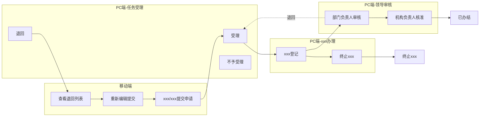
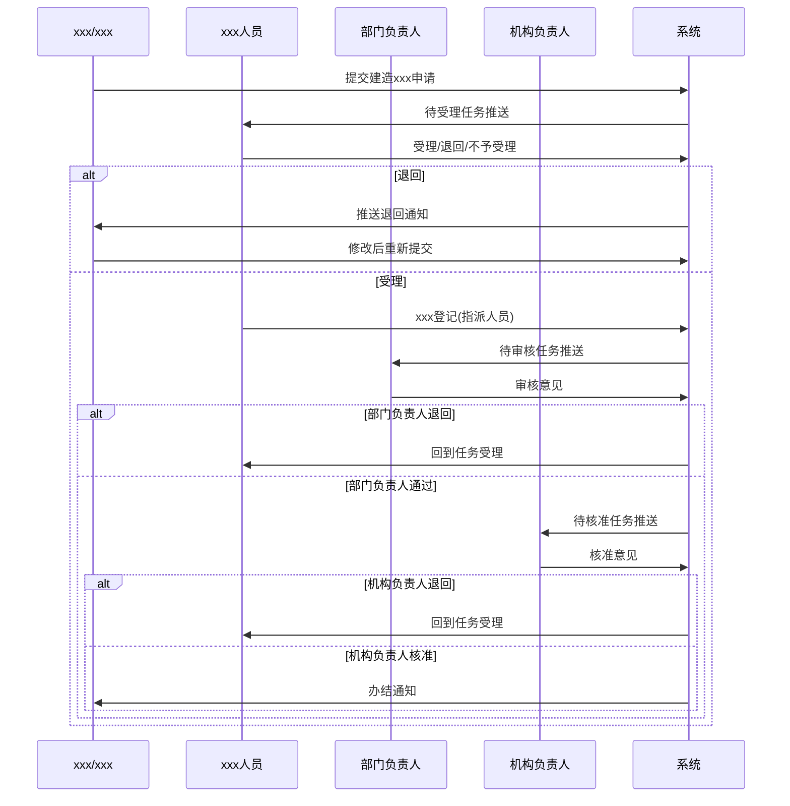

# xxxxxx系统需求总文档

---

## 文档信息

| 项目名称 | xxx辅助管理平台（xxx）- xxxxxx子系统 |
|---------|----------------------------------------|
| 文档版本 | V1.0 |
| 编写日期 | 2026-03-09 |
| 文档类型 | 需求总文档 |
| 适用范围 | 一期建设 |

---

## 1. 项目概述

### 1.1 项目背景

xxxxxx是xxx管理的重要组成部分，涉及xxx建造xxx申请、受理、办理、审核等环节。传统模式下，申请流程需要xxx或xxx多次往返xxx机构，纸质材料传递效率低下，审批过程不透明，难以实现全过程追溯。

为提升xxx工作的效率与规范化水平，实现xxx全流程线上化管理，特开发xxxxxx子系统。

### 1.2 项目目标

| 目标类型 | 具体目标 |
|---------|---------|
| 业务目标 | 实现建造xxx申请、受理、办理、审核的全流程线上管理 |
| 效率目标 | 缩短申请到办结的平均时长，减少申请人往返次数 |
| 规范目标 | 统一业务流程，规范审批环节，确保过程可追溯 |
| 数据目标 | 积累xxx数据，支撑统计分析与决策支持 |

### 1.3 建设范围

#### 一期建设范围

| 功能模块 | 建设内容 | 状态 |
|---------|---------|------|
| 建造xxx申请（移动端） | xxx/xxx提交申请、查看退回、重新提交 | ✅ 实现 |
| xxx机构管理 | 机构树形管理、资质信息维护 | ✅ 实现 |
| xxx人员管理 | 人员信息管理、资格证书、部门负责人标识 | ✅ 实现 |
| xxx受理（任务受理） | 受理/不予受理/退回操作 | ✅ 实现 |
| xxx办理 | xxx登记、终止xxx | ✅ 实现 |
| 领导审核 | 部门负责人审核、机构负责人核准 | ✅ 实现 |
| 统计分析 | 办理统计环形图、月度趋势折线图 | ✅ 实现 |

#### 一期暂不实现

| 功能模块 | 说明 |
|---------|------|
| 图纸确认环节 | xxx办理中的图纸确认流程 |
| 实xxx验环节 | 现场xxx流程 |
| 报告签发环节 | 证书/报告签发流程 |
| 文书管理 | xxx办理页面的文书管理Tab |
| 工作移交 | xxx人员之间的工作交接 |
| 数据导出 | 统计分析的Excel/图片导出 |
| 运营xxx | 仅支持建造xxx和初次xxx |

---

## 2. 系统架构

### 2.1 技术架构

```
┌─────────────────────────────────────────────────────────────┐
│                        用户层                                │
│  ┌─────────────────┐        ┌─────────────────────────┐    │
│  │    移动端        │        │        PC端              │    │
│  │  (uni-app Vue2) │        │  (Vue3 + Element Plus)  │    │
│  │  建造xxx申请    │        │  受理/办理/审核/管理     │    │
│  └─────────────────┘        └─────────────────────────┘    │
└─────────────────────────────────────────────────────────────┘
                              │
                              ▼
┌─────────────────────────────────────────────────────────────┐
│                        服务层                                │
│  ┌─────────────────────────────────────────────────────┐   │
│  │              Spring Boot 3 + MyBatis-Plus            │   │
│  │  /xxx/cbjy/*  (xxxxxx模块API)                     │   │
│  └─────────────────────────────────────────────────────┘   │
└─────────────────────────────────────────────────────────────┘
                              │
                              ▼
┌─────────────────────────────────────────────────────────────┐
│                        数据层                                │
│  ┌─────────────────────────────────────────────────────┐   │
│  │                  达梦 DM8 数据库                      │   │
│  │  CBJY_* (xxxxxx业务表)                             │   │
│  └─────────────────────────────────────────────────────┘   │
└─────────────────────────────────────────────────────────────┘
```

### 2.2 技术选型说明

| 端 | 技术栈 | 版本要求 | 说明 |
|---|--------|---------|------|
| PC前端 | Vue 3 + Element Plus | Options API | 管理端应用，支持复杂表单和列表 |
| 移动端 | uni-app | Vue 2 Options API | 跨平台移动应用，兼容微信小程序 |
| 后端 | Spring Boot 3 + MyBatis-Plus | JDK 17+ | 企业级服务框架 |
| 数据库 | 达梦 DM8 | - | 国产数据库，兼容Oracle语法 |

### 2.3 模块划分

```
xxxxxx子系统 (xxx/cbjy)
├── 申请模块 (sqd)     - 建造xxx申请单管理
├── 机构模块 (jyjg)    - xxx机构管理
├── 人员模块 (jyry)    - xxx人员管理
├── 受理模块 (slrw)    - 任务受理管理
├── 办理模块 (cjbl)    - xxx办理管理
├── 审核模块 (ldsh)    - 领导审核管理
└── 统计模块 (tjfx)    - 统计分析
```

---

## 3. 业务全景图

### 3.1 整体业务流程



### 3.2 业务时序图



---

## 4. 关键概念定义

### 4.1 核心业务术语

| 术语 | 定义 | 说明 |
|------|------|------|
| 建造xxx | 对新建xxx进行的首次xxx | xxx建造过程中的法定xxx |
| 初次xxx | 对现有xxx进行的首次入级xxx | 非新建xxx的首次xxx |
| xxx登记号 | xxx申请受理后的唯一编号 | 12位编码，全局唯一 |
| xxx种类 | xxx的分类 | 建造xxx(B)、初次xxx(C) |
| xxx | 高级xxx人员职称 | 可担任xxx组长 |
| xxx | 基础xxx人员职称 | 普通xxx人员 |
| 部门负责人 | xxx机构的管理人员 | 具有审核权限 |

### 4.2 状态定义

#### 申请单状态

| 状态值 | 状态名称 | 说明 |
|--------|---------|------|
| DSL | 待受理 | 申请已提交，等待xxx人员受理 |
| YSL | 已受理 | xxx人员已受理，进入xxx办理 |
| BSL | 不予受理 | xxx人员拒绝受理 |
| TH | 退回 | xxx人员退回给申请人修改 |
| BLZ | 办理中 | xxx办理进行中 |
| YBJ | 已办结 | 流程完成 |
| ZZJY | 终止xxx | xxx流程终止 |

#### 办理环节

| 环节值 | 环节名称 | 一期实现 |
|--------|---------|---------|
| CJDJ | xxx登记 | ✅ |
| TZQR | 图纸确认 | ❌ |
| SCJY | 实xxx验 | ❌ |
| BGQF | 报告签发 | ❌ |

### 4.3 编码规则

#### xxx登记号生成规则

**格式**：`YYYYXNNSSSSSS`（共12位）

| 组成部分 | 位数 | 说明 | 示例 |
|---------|------|------|------|
| YYYY | 4位 | 年份 | 2025 |
| X | 1位 | xxx类别代码 | B=建造xxx，C=初次xxx |
| NN | 2位 | 机构编码 | 41=xxx省级机构 |
| SSSSSS | 6位 | 流水序号 | 000123 |

**示例**：
- `2025B41000123` = 2025年 / 建造xxx(B) / xxx省级机构(41) / 第123号
- `2025C41000456` = 2025年 / 初次xxx(C) / xxx省级机构(41) / 第456号

---

## 5. 文档索引

本需求文档体系包含以下子文档：

| 序号 | 文档名称 | 文档路径 | 主要内容 |
|------|---------|---------|---------|
| 1 | 需求总文档 | [01-需求总文档/README.md](01-需求总文档/README.md) | 项目概述、架构、业务全景 |
| 2 | 功能说明子文档 | [02-功能说明子文档/README.md](02-功能说明子文档/README.md) | 各功能模块详细说明 |
| 3 | 界面操作子文档 | [03-界面操作子文档/README.md](03-界面操作子文档/README.md) | 页面设计、按钮操作、交互规范 |
| 4 | 角色权限子文档 | [04-角色权限子文档/README.md](04-角色权限子文档/README.md) | 角色定义、权限矩阵 |
| 5 | 业务流程和规则子文档 | [05-业务流程和规则子文档/README.md](05-业务流程和规则子文档/README.md) | 流程图、状态流转、业务规则 |
| 6 | 数据接口子文档 | [06-数据接口子文档/README.md](06-数据接口子文档/README.md) | 数据库设计、API契约 |

---

## 6. 附录

### 6.1 名词缩写对照

| 缩写 | 全称 | 中文 |
|------|------|------|
| xxx | HaiShi FuZhu GuanLi | xxx辅助管理 |
| cbjy | ChuanBo JianYan | xxxxxx |
| sqd | ShenQingDan | 申请单 |
| jyjg | JianYanJiGou | xxx机构 |
| jyry | JianYanRenYuan | xxx人员 |
| slrw | ShouLiRenWu | 受理任务 |
| cjbl | ChuanJianBanLi | xxx办理 |
| ldsh | LingDaoShenHe | 领导审核 |
| tjfx | TongJiFenXi | 统计分析 |

### 6.2 参考文档

| 文档名称 | 说明 |
|---------|------|
| 原型设计稿 | 移动端及PC端界面原型 |
| 接口设计文档 | 后端API详细设计 |
| 数据库设计文档 | 数据表结构详细设计 |


