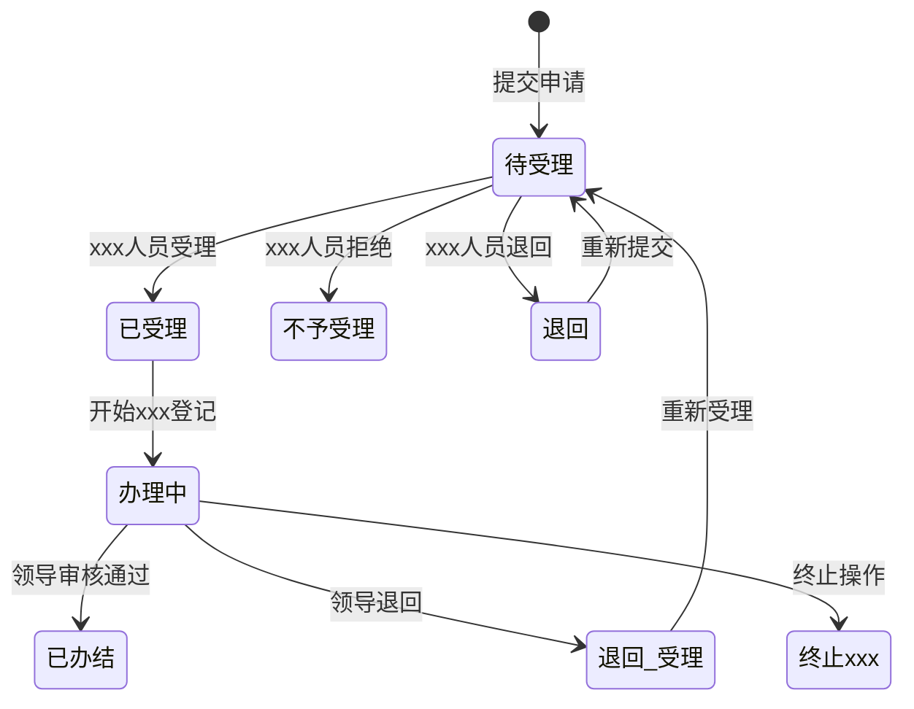
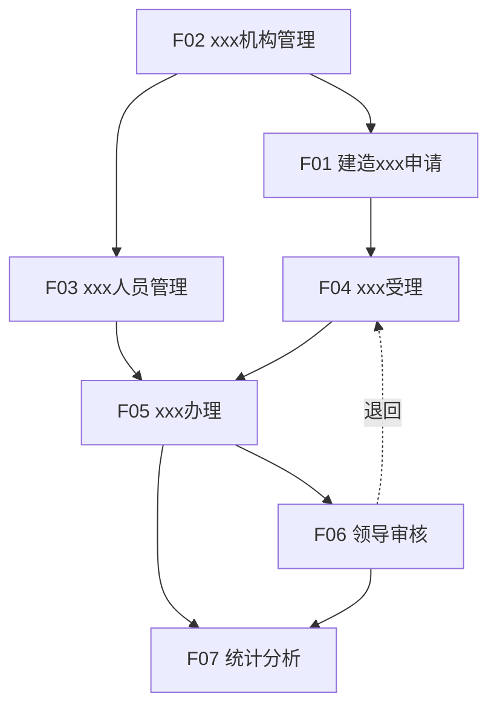

# 功能说明子文档

---

## 文档信息

| 项目名称 | xxx辅助管理平台 - xxxxxx子系统 |
|---------|--------------------------------|
| 文档版本 | V1.0 |
| 编写日期 | 2026-03-09 |
| 文档类型 | 功能说明子文档 |

---

## 功能模块总览

```
xxxxxx子系统
├── F01 建造xxx申请（移动端）
├── F02 xxx机构管理（PC端）
├── F03 xxx人员管理（PC端）
├── F04 xxx受理（PC端）
├── F05 xxx办理（PC端）
├── F06 领导审核（PC端）
└── F07 统计分析（PC端）
```

---

## F01 建造xxx申请（移动端）

### 1. 功能概述

| 属性 | 说明 |
|------|------|
| 功能编号 | F01 |
| 功能名称 | 建造xxx申请 |
| 访问端 | 移动端（uni-app） |
| 功能描述 | xxx/xxx通过手机端提交xxx建造xxx申请，选择xxx机构和xxx种类，上传申请材料 |

### 2. 功能清单

| 功能项 | 功能描述 | 优先级 |
|--------|---------|--------|
| F01-01 | 新建建造xxx申请 | P0 |
| F01-02 | 查看我的申请列表 | P0 |
| F01-03 | 查看申请详情 | P0 |
| F01-04 | 查看退回列表 | P0 |
| F01-05 | 重新编辑提交 | P0 |
| F01-06 | 重复申请校验 | P0 |

### 3. 功能详细说明

#### F01-01 新建建造xxx申请

**功能描述**：xxx/xxx填写xxx基本信息，上传申请材料，提交建造xxx申请。

**输入项**：

| 字段名 | 字段类型 | 是否必填 | 校验规则 | 说明 |
|--------|---------|---------|---------|------|
| xxx名 | 文本输入 | 是 | 长度1-100字符 | xxx名称 |
| xxx | 文本输入 | 是 | 长度1-100字符 | xxx注册xxx口 |
| xxx材质 | 文本输入 | 是 | 长度1-50字符 | 如钢质、玻璃钢等 |
| xxx长(m) | 数字输入 | 是 | 正数，最多2位小数 | xxx长度 |
| 总xxx | 数字输入 | 是 | 正数，最多2位小数 | xxx总xxx |
| 主机功率(kw) | 数字输入 | 是 | 正数，最多2位小数 | 主机功率 |
| xxx制造厂 | 文本输入 | 是 | 长度1-200字符 | 制造厂名称 |
| xxx所有人 | 文本输入 | 是 | 长度1-200字符 | xxx姓名或企业名称 |
| 计划建造开工日期 | 日期选择 | 是 | 不能早于今天 | 预计开工日期 |
| xxx机构 | 下拉选择 | 是 | 必选 | 数据来源：xxx机构管理 |
| xxx种类 | 下拉选择 | 是 | 建造xxx/初次xxx | 仅支持这两种 |
| 计划xxx日期 | 日期选择 | 是 | 不能早于计划建造开工日期 | 预计xxx日期 |
| xxx地点 | 文本输入 | 是 | 长度1-200字符 | xxx的具体地点 |
| 申请人 | 文本输入 | 是 | 长度1-100字符 | xxx个人或xxx名称 |
| 申请时间 | 日期选择 | 是 | 默认当前时间 | 自动填充 |
| 联系人 | 文本输入 | 是 | 长度1-50字符 | 联系人姓名 |
| 联系电话 | 文本输入 | 是 | 11位手机号 | 联系电话号码 |
| 特别说明 | 多行文本 | 否 | 最多500字符 | 补充说明信息 |

**上传材料**：

| 序号 | 材料名称 | 是否必传 | 文件要求 |
|------|---------|---------|---------|
| 1 | 经审批的设计图纸资料及图纸批准书复印件 | 是 | word/pdf，最多3个，单文件≤20M |
| 2 | xxx安全环保技术状况声明书 | 是 | word/pdf，最多3个，单文件≤20M |
| 3 | 现有xxxxxx证书及技术文件 | 是 | word/pdf，最多3个，单文件≤20M |
| 4 | xxx所有人授权申报xxx的委托书 | 是 | word/pdf，最多3个，单文件≤20M |
| 5 | xxxxxxxxx名号审批文件 | 是 | word/pdf，最多3个，单文件≤20M |
| 6 | xxx灭失/拆解或销毁处理文件 | 否 | word/pdf，最多3个，单文件≤20M |
| 7 | xxxxxx购买合同书或修造合同复印件 | 条件必传 | word/pdf，最多3个，单文件≤20M |
| 8 | xxx政批准造xxx(或买卖)的准造(更新)证副本 | 否 | word/pdf，最多3个，单文件≤20M |
| 9 | 其他 | 否 | word/pdf，最多3个，单文件≤20M |

**处理逻辑**：

1. 校验所有必填字段是否填写完整
2. 校验所有必传材料是否上传
3. 调用重复申请校验接口，检查是否存在未办结的同xxx名同xxx种类申请
4. 若存在未办结申请，弹窗提醒，阻止提交
5. 若校验通过，保存申请数据，状态设为"待受理"
6. 推送待受理任务给对应xxx机构的所有xxx人员

**输出项**：提交成功提示，跳转至我的申请列表

---

#### F01-02 查看我的申请列表

**功能描述**：申请人查看自己提交的所有申请记录。

**列表字段**：

| 字段名 | 显示方式 | 说明 |
|--------|---------|------|
| xxx名 | 文本 | xxx名称 |
| xxx种类 | 标签 | 建造xxx/初次xxx |
| 申请时间 | 日期 | yyyy-MM-dd HH:mm |
| 状态 | 标签 | 待受理/已受理/办理中/已办结/退回/不予受理/终止xxx |

**操作**：
- 点击列表项可查看详情
- 退回状态的申请可点击重新编辑

---

#### F01-03 查看申请详情

**功能描述**：查看申请的完整信息，包括基本信息、申请材料。

**显示内容**：
- 基本信息全部字段
- 申请材料列表（可预览/下载）
- 办理日志（如果已进入办理流程）

---

#### F01-04 查看退回列表

**功能描述**：查看被xxx人员退回的申请列表，便于修改后重新提交。

**列表字段**：

| 字段名 | 显示方式 | 说明 |
|--------|---------|------|
| xxx名 | 文本 | xxx名称 |
| xxx种类 | 标签 | 建造xxx/初次xxx |
| 退回时间 | 日期 | 被退回的时间 |
| 退回原因 | 文本 | xxx人员填写的退回原因 |

**操作**：
- 点击"重新编辑"进入编辑页面

---

#### F01-05 重新编辑提交

**功能描述**：对被退回的申请进行修改后重新提交。

**处理逻辑**：
1. 加载原申请数据到表单
2. 申请人可修改任意字段
3. 提交时执行与新建相同的校验逻辑
4. 保存后状态重置为"待受理"

---

#### F01-06 重复申请校验

**功能描述**：提交前校验是否存在未办结的同xxx名同xxx种类申请。

**校验规则**：
- 查询条件：xxx名相同 AND xxx种类相同 AND 状态为(待受理/办理中/整改中)
- 若存在匹配记录，返回提示信息
- 若不存在，允许提交

---

### 4. 状态流转



---

## F02 xxx机构管理（PC端）

### 1. 功能概述

| 属性 | 说明 |
|------|------|
| 功能编号 | F02 |
| 功能名称 | xxx机构管理 |
| 访问端 | PC端 |
| 功能描述 | 管理xxxxxx机构的基础信息，支持多级机构树形结构 |

### 2. 功能清单

| 功能项 | 功能描述 | 优先级 |
|--------|---------|--------|
| F02-01 | 查看机构树形列表 | P0 |
| F02-02 | 新建xxx机构 | P0 |
| F02-03 | 修改xxx机构 | P0 |
| F02-04 | 删除xxx机构 | P0 |
| F02-05 | 管理机构资质信息 | P0 |
| F02-06 | 查看机构人员信息 | P1 |
| F02-07 | 校验机构代码唯一性 | P0 |

### 3. 功能详细说明

#### F02-01 查看机构树形列表

**功能描述**：以树形结构展示所有xxx机构，支持展开/折叠。

**列表字段**：

| 字段名 | 显示方式 | 说明 |
|--------|---------|------|
| xxx机构名称 | 树形节点 | 支持多级展开 |
| 归属区域 | 文本 | 所属省市区域 |
| 部门负责人 | 文本 | 机构负责人 |
| 联系人 | 文本 | 联系人 |
| 排序号 | 数字 | 显示排序 |

**操作**：
- 展开节点查看下级机构
- 勾选进行批量删除

---

#### F02-02 新建xxx机构

**功能描述**：创建新的xxx机构，支持设置上级机构。

**机构信息字段**：

| 字段名 | 字段类型 | 是否必填 | 校验规则 | 说明 |
|--------|---------|---------|---------|------|
| 上级机构 | 下拉选择(树形) | 否 | - | 不选则为顶级机构 |
| 机构名称 | 文本输入 | 是 | 长度1-200字符，唯一 | 机构全称 |
| 机构代码 | 文本输入 | 是 | 4位字符，全局唯一 | 用于xxx登记号生成 |
| 归属区域 | 区域选择 | 是 | 必选省市区 | 行政区划 |
| 通讯地址 | 文本输入 | 否 | 最多500字符 | 机构通讯地址 |
| 排序号 | 数字输入 | 否 | 正整数 | 列表排序号 |
| 联系人 | 文本输入 | 否 | 最多50字符 | 机构联系人 |
| 联系电话 | 文本输入 | 否 | 手机号格式 | 联系电话 |
| 业务范围 | 多行文本 | 否 | 最多2000字符 | 机构业务范围描述 |

**资质信息字段**（可添加多条）：

| 字段名 | 字段类型 | 是否必填 | 校验规则 | 说明 |
|--------|---------|---------|---------|------|
| 证书名称 | 文本输入 | 是 | 最多100字符 | 资质证书名称 |
| 证书编号 | 文本输入 | 是 | 最多100字符 | 证书编号 |
| 证书类型 | 下拉选择 | 是 | 字典 | 证书分类 |
| 证书等级 | 下拉选择 | 否 | 字典 | 证书级别 |
| 发证机关 | 文本输入 | 否 | 最多100字符 | 颁发机构名称 |
| 发证日期 | 日期选择 | 否 | - | 证书颁发日期 |
| 有效期 | 日期选择 | 否 | - | 证书有效截止日期 |

**处理逻辑**：
1. 校验机构代码是否已存在
2. 校验机构名称是否已存在
3. 保存机构基本信息
4. 保存资质信息列表
5. 刷新机构树

---

#### F02-03 修改xxx机构

**功能描述**：修改已存在的xxx机构信息。

**处理逻辑**：
1. 加载机构基本信息和资质信息
2. 若修改机构代码，校验新代码是否已存在（排除自身）
3. 保存修改后的信息

---

#### F02-04 删除xxx机构

**功能描述**：删除xxx机构。

**删除前校验**：
- 是否存在下级机构？存在则不允许删除
- 是否存在关联的xxx人员？存在则不允许删除

**处理逻辑**：
- 支持单条删除和批量删除
- 删除机构同时删除关联的资质信息
- 物理删除或逻辑删除（根据系统规范）

---

#### F02-05 管理机构资质信息

**功能描述**：在机构编辑弹窗的"资质信息"Tab中管理资质证书。

**操作**：
- 新增资质：添加一行空白资质记录
- 修改资质：编辑已有资质记录
- 删除资质：删除资质记录（需确认）

---

#### F02-06 查看机构人员信息

**功能描述**：在机构编辑弹窗的"人员信息"Tab中查看该机构的xxx人员。

**说明**：
- 人员信息为只读展示
- 数据来源于xxx人员管理模块
- 新增/修改人员需在xxx人员管理模块操作

---

#### F02-07 校验机构代码唯一性

**功能描述**：保存机构时校验机构代码是否已存在。

**校验时机**：
- 新建时实时校验
- 修改时若代码变更则校验

---

## F03 xxx人员管理（PC端）

### 1. 功能概述

| 属性 | 说明 |
|------|------|
| 功能编号 | F03 |
| 功能名称 | xxx人员管理 |
| 访问端 | PC端 |
| 功能描述 | 管理各xxx机构下的xxx人员，设置xxx职称和部门负责人标识 |

### 2. 功能清单

| 功能项 | 功能描述 | 优先级 |
|--------|---------|--------|
| F03-01 | 查看xxx人员列表 | P0 |
| F03-02 | 新建xxx人员 | P0 |
| F03-03 | 修改xxx人员 | P0 |
| F03-04 | 删除xxx人员 | P0 |
| F03-05 | 按机构筛选人员 | P0 |

### 3. 功能详细说明

#### F03-01 查看xxx人员列表

**功能描述**：分页展示所有xxx人员，支持按机构筛选。

**列表字段**：

| 字段名 | 显示方式 | 说明 |
|--------|---------|------|
| 姓名 | 文本 | 人员姓名 |
| 所属部门 | 文本 | 归属xxx机构 |
| xxx职称 | 标签 | xxx/xxx |
| xxx证号 | 文本 | xxx证编号 |
| 是否部门负责人 | 标签 | 是/否 |

**筛选条件**：
- 所属机构（下拉选择）
- 姓名（模糊搜索）

---

#### F03-02 新建xxx人员

**功能描述**：创建新的xxx人员记录。

**基本信息字段**：

| 字段名 | 字段类型 | 是否必填 | 校验规则 | 说明 |
|--------|---------|---------|---------|------|
| 姓名 | 文本输入 | 是 | 最多50字符 | xxx人员姓名 |
| 联系方式 | 文本输入 | 是 | 11位手机号 | 手机号码 |
| 身份证号 | 文本输入 | 是 | 18位身份证格式 | 身份证号 |
| 所属部门 | 部门选择 | 是 | 必选 | 关联xxx机构 |
| 职务 | 文本输入 | 否 | 最多50字符 | 行政职务 |
| xxx职称 | 下拉选择 | 是 | 字典：xxx/xxx | xxx职称 |
| xxx证号 | 文本输入 | 否 | 最多50字符 | xxxxxx证号 |
| 系统用户 | 用户选择 | 是 | 必选 | 关联系统用户账号 |
| 是否部门负责人 | 下拉选择 | 是 | 是/否 | 设为"是"将作为审核领导 |
| 备注 | 多行文本 | 否 | 最多500字符 | 备注信息 |

**资格证书字段**（可添加多条）：

| 字段名 | 字段类型 | 是否必填 | 校验规则 | 说明 |
|--------|---------|---------|---------|------|
| 证书类型 | 文本输入 | 否 | 最多50字符 | 如"注册xxx" |
| 证件号码 | 文本输入 | 否 | 最多50字符 | 资格证件编号 |
| 级别 | 下拉选择 | 否 | 字典 | 证书级别 |
| 批准日期 | 日期选择 | 否 | - | 证书批准日期 |

**处理逻辑**：
1. 选择系统用户时，从框架用户管理模块中选择
2. 一个系统用户只能关联一个xxx人员
3. 保存人员基本信息
4. 保存资格证书列表
5. 自动更新到所属机构的人员信息Tab

---

#### F03-03 修改xxx人员

**功能描述**：修改已存在的xxx人员信息。

**处理逻辑**：
1. 加载人员基本信息和资格证书
2. 若修改系统用户关联，校验新用户是否已被关联
3. 保存修改后的信息

---

#### F03-04 删除xxx人员

**功能描述**：删除xxx人员记录。

**删除前校验**：
- 是否存在关联的xxx办理记录？存在则不允许删除

**处理逻辑**：
- 支持单条删除和批量删除
- 删除人员同时删除关联的资格证书

---

## F04 xxx受理（PC端）

### 1. 功能概述

| 属性 | 说明 |
|------|------|
| 功能编号 | F04 |
| 功能名称 | xxx受理（任务受理） |
| 访问端 | PC端 |
| 功能描述 | xxx人员对移动端提交的建造xxx申请进行受理、不予受理或退回操作 |

### 2. 功能清单

| 功能项 | 功能描述 | 优先级 |
|--------|---------|--------|
| F04-01 | 查看待受理列表 | P0 |
| F04-02 | 查看已办列表 | P0 |
| F04-03 | 查看申请详情 | P0 |
| F04-04 | 受理申请 | P0 |
| F04-05 | 不予受理 | P0 |
| F04-06 | 退回申请 | P0 |
| F04-07 | 修改申请信息 | P1 |

### 3. 功能详细说明

#### F04-01 查看待受理列表

**功能描述**：展示等待受理的申请列表，支持按机构树过滤。

**页面布局**：
- 左侧：机构树（xxx省 → 各地市 → 区县）
- 右侧：申请列表

**列表字段**：

| 字段名 | 显示方式 | 说明 |
|--------|---------|------|
| xxx名 | 文本 | 申请xxx名称 |
| xxx | 文本 | xxx口 |
| xxx机构 | 文本 | 申请的xxx机构名称 |
| xxx种类 | 标签 | 建造xxx/初次xxx |
| 申请人 | 文本 | 申请人姓名 |
| 申请时间 | 日期 | yyyy-MM-dd HH:mm |
| 受理状态 | 标签 | 待受理 |

**筛选条件**：
- 左侧机构树点击筛选
- xxx名模糊搜索
| 申请时间范围 |

---

#### F04-02 查看已办列表

**功能描述**：展示已处理的申请列表。

**列表字段**：同待受理列表，增加"处理结果"字段

---

#### F04-03 查看申请详情

**功能描述**：查看申请的完整信息。

**页面布局**：
- 基本信息：展示申请表单所有字段
- 申请材料：文件列表，可下载/预览
- 办理日志：流程处理记录

---

#### F04-04 受理申请

**功能描述**：受理人员确认接受申请，进入xxx办理流程。

**处理逻辑**：
1. 受理人可修改申请信息并保存
2. 点击"受理"按钮
3. 弹窗确认受理操作
4. 系统自动创建xxx办理记录
5. 自动生成12位xxx登记号
6. 申请状态变更为"已受理"
7. 记录办理日志（含受理通知书附件上传）

**受理通知书**：
- 不自动生成
- 受理人在办理日志中手动上传

---

#### F04-05 不予受理

**功能描述**：拒绝受理申请。

**处理逻辑**：
1. 点击"不予受理"按钮
2. 弹窗填写不予受理原因（必填）
3. 申请状态变更为"不予受理"
4. 记录办理日志
5. 通知申请人

---

#### F04-06 退回申请

**功能描述**：退回申请给申请人修改。

**处理逻辑**：
1. 点击"退回"按钮
2. 弹窗填写退回原因（必填）
3. 申请状态变更为"退回"
4. 记录办理日志
5. 推送通知给申请人
6. 申请人可在移动端"退回列表"中查看

---

#### F04-07 修改申请信息

**功能描述**：受理人在受理前可修改申请信息。

**处理逻辑**：
1. 进入受理页面
2. 编辑申请表单字段
3. 点击保存
4. 更新申请信息

---

## F05 xxx办理（PC端）

### 1. 功能概述

| 属性 | 说明 |
|------|------|
| 功能编号 | F05 |
| 功能名称 | xxx办理 |
| 访问端 | PC端 |
| 功能描述 | xxx人员对已受理的申请进行xxx登记，指派xxx人员和组长 |

### 2. 功能清单

| 功能项 | 功能描述 | 优先级 |
|--------|---------|--------|
| F05-01 | 查看待办列表 | P0 |
| F05-02 | 查看已办列表 | P0 |
| F05-03 | xxx登记 | P0 |
| F05-04 | 终止xxx | P0 |

### 3. 功能详细说明

#### F05-01 查看待办列表

**功能描述**：展示等待办理的xxx任务列表。

**页面布局**：
- 左侧：机构树
- 右侧：办理列表

**列表字段**：

| 字段名 | 显示方式 | 说明 |
|--------|---------|------|
| xxx登记号 | 文本 | 12位登记号 |
| xxx名号 | 文本 | xxx名称编号 |
| xxx类别 | 标签 | xxx种类 |
| 接收申报材料时间 | 日期 | 申请提交时间 |
| xxx人员 | 文本 | 指派的xxx人员（登记后显示） |
| xxx组长 | 文本 | xxx组长（登记后显示） |
| 办理环节 | 标签 | xxx登记 |
| 办理状态 | 标签 | 办理中 |

---

#### F05-02 查看已办列表

**功能描述**：展示已办理的xxx任务列表。

**列表字段**：同待办列表，增加"处理结果"字段

---

#### F05-03 xxx登记

**功能描述**：填写审查结论，指派xxx人员和组长。

**自动填充字段**：

| 字段名 | 来源 |
|--------|------|
| 关联受理单 | 自动关联 |
| xxx登记号 | 自动生成 |
| xxx名号 | 来自申请信息 |
| xxx种类 | 来自申请信息 |
| 申请材料接收时间 | 等于申请人提交时间 |
| 审查人 | 当前受理人 |
| 审查时间 | 当前时间 |

**手填字段**：

| 字段名 | 字段类型 | 是否必填 | 说明 |
|--------|---------|---------|------|
| 申请资料审查结论 | 多行文本 | 是 | 受理人填写审查结论 |
| xxx人员 | 人员选择(多选) | 是 | 从xxx人员管理中选择 |
| xxx组长 | 人员选择(单选) | 是 | 从xxx人员管理中选择 |

**人员选择弹窗字段**：
- 姓名
- 手机号
- 身份证号
- xxxxxx证号
- xxx职称

**处理逻辑**：
1. 受理成功后自动创建xxx办理记录
2. 自动生成xxx登记号
3. 填写审查结论和指派人员
4. 保存后提交领导审核
5. 记录办理日志

---

#### F05-04 终止xxx

**功能描述**：终止当前的xxx流程。

**处理逻辑**：
1. 点击"终止xxx"按钮
2. 弹窗填写终止原因（必填）
3. 办理状态变更为"终止xxx"
4. 记录办理日志
5. 通知申请人

---

## F06 领导审核（PC端）

### 1. 功能概述

| 属性 | 说明 |
|------|------|
| 功能编号 | F06 |
| 功能名称 | 领导审核 |
| 访问端 | PC端 |
| 功能描述 | 部门负责人对xxx人员的xxx办理结果进行审核 |

### 2. 功能清单

| 功能项 | 功能描述 | 优先级 |
|--------|---------|--------|
| F06-01 | 查看待审核列表 | P0 |
| F06-02 | 查看已审核列表 | P0 |
| F06-03 | 审核详情 | P0 |
| F06-04 | 审核通过 | P0 |
| F06-05 | 审核退回 | P0 |

### 3. 功能详细说明

#### F06-01 查看待审核列表

**功能描述**：展示等待审核的xxx任务列表。

**列表字段**：

| 字段名 | 显示方式 | 说明 |
|--------|---------|------|
| 审核节点名称 | 文本 | 如：xxx登记-部门负责人审核 |
| xxx登记号 | 文本 | 12位登记号 |
| xxx名号 | 文本 | xxx名称编号 |
| xxx类别 | 标签 | xxx种类 |
| 接收申报材料时间 | 日期 | 申请提交时间 |
| xxx人员 | 文本 | xxx人员姓名 |
| xxx组长 | 文本 | xxx组长姓名 |
| 审核状态 | 标签 | 待审核 |

---

#### F06-02 查看已审核列表

**功能描述**：展示已审核的xxx任务列表。

**列表字段**：同待审核列表，增加"审核结果"字段

---

#### F06-03 审核详情

**功能描述**：查看审核详情并填写审核意见。

**流程记录区域**（自动填充）：

| 字段名 | 来源 |
|--------|------|
| 受理人 | 来自受理环节 |
| 受理日期 | 来自受理环节 |
| 申请资料审查结论 | 来自xxx登记 |
| 审查人 | 来自xxx登记 |
| 审查日期 | 来自xxx登记 |
| xxx人员 | 来自xxx登记 |
| xxx组长 | 来自xxx登记 |

**审核填写字段**：

| 字段名 | 字段类型 | 是否必填 | 说明 |
|--------|---------|---------|------|
| xxx完成日期 | 日期选择 | 是 | 实际xxx完成日期 |
| xxx结论 | 单选 | 是 | 符合/不符合 |
| xxx结果说明 | 多行文本 | 是 | xxx结果详细说明 |
| xxx完工报告 | 文件上传 | 是 | 上传新的完工报告文件 |

**审核意见区域**：

| 列 | 说明 |
|----|------|
| 提交 | 显示提交人(创建人)和部门 |
| 审核意见 | 部门负责人姓名+部门，弹出意见填写 |
| 核准意见 | 机构负责人(签发人)姓名+部门，弹出意见填写 |

---

#### F06-04 审核通过

**功能描述**：审核通过xxx办理结果。

**两级审核流程**：

```
部门负责人审核 → 机构负责人核准 → 已办结
```

**处理逻辑**：
1. 填写xxx完成日期、xxx结论、xxx结果说明
2. 上传xxx完工报告
3. 填写审核意见
4. 点击"通过"按钮
5. 若为部门负责人审核通过 → 进入机构负责人核准环节
6. 若为机构负责人核准通过 → 流程结束，状态变为"已办结"
7. 记录办理日志

---

#### F06-05 审核退回

**功能描述**：退回xxx办理结果。

**处理逻辑**：
1. 点击"退回"按钮
2. 弹窗填写退回原因（必填）
3. 流程回到"任务受理"环节
4. 申请状态变更为"待受理"
5. 记录办理日志
6. 通知受理人

---

## F07 统计分析（PC端）

### 1. 功能概述

| 属性 | 说明 |
|------|------|
| 功能编号 | F07 |
| 功能名称 | 统计分析 |
| 访问端 | PC端 |
| 功能描述 | 以图表形式展示xxx工作的办理统计数据和趋势 |

### 2. 功能清单

| 功能项 | 功能描述 | 优先级 |
|--------|---------|--------|
| F07-01 | 办理统计环形图 | P0 |
| F07-02 | 月度办结趋势折线图 | P0 |
| F07-03 | 按区域/年度筛选 | P0 |

### 3. 功能详细说明

#### F07-01 办理统计环形图

**功能描述**：以环形图展示各状态的数量分布。

**图表配置**：

| 配置项 | 值 |
|--------|---|
| 图表类型 | 环形图(Doughnut) |
| 数据维度 | 办理中、已办结、终止xxx |
| 显示方式 | 数量+百分比 |

**数据来源**：
- 办理中：状态为"办理中"的记录数
- 已办结：状态为"已办结"的记录数
- 终止xxx：状态为"终止xxx"的记录数

---

#### F07-02 月度办结趋势折线图

**功能描述**：展示近12个月的每月办结数量趋势。

**图表配置**：

| 配置项 | 值 |
|--------|---|
| 图表类型 | 折线图(Line) |
| X轴 | 月份（近12个月） |
| Y轴 | 办结数量 |
| 数据点 | 每月办结数量 |

**数据来源**：
- 当前月份往前推12个月
- 统计每月状态变更为"已办结"的记录数

---

#### F07-03 按区域/年度筛选

**功能描述**：按区域和年度筛选统计数据。

**筛选条件**：

| 字段名 | 字段类型 | 说明 |
|--------|---------|------|
| 区域 | 下拉选择 | 如：xxx省，支持按地区筛选 |
| 年度 | 下拉选择/输入 | 统计的年份 |

**默认值**：
- 区域：当前用户所属区域或全省
- 年度：当前年份

---

## 功能依赖关系



---

## 补充说明

### 1. 功能优先级定义

| 优先级 | 说明 | 实现时间 |
|--------|------|---------|
| P0 | 核心功能，必须实现 | 一期 |
| P1 | 重要功能，建议实现 | 一期或二期 |
| P2 | 增强功能，可选实现 | 二期 |

### 2. 功能扩展建议

| 功能项 | 扩展建议 | 优先级 |
|--------|---------|--------|
| 草稿保存 | 支持申请草稿保存，避免重复填写 | P2 |
| 批量导入 | 支持xxx人员批量导入 | P2 |
| 消息推送 | 微信/短信消息推送 | P1 |
| 打印功能 | 申请表/受理通知书打印 | P2 |
| 数据导出 | 统计数据Excel导出 | P2 |


