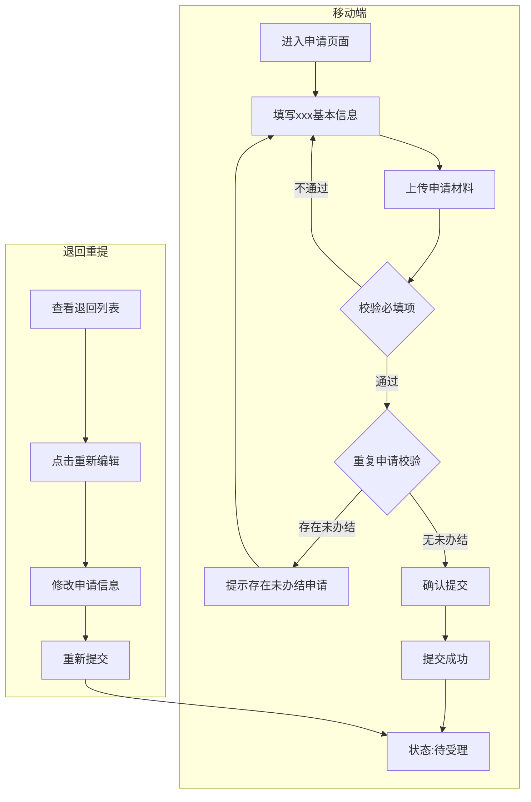
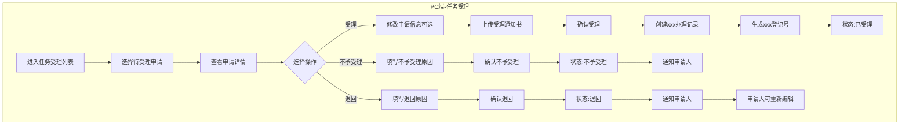
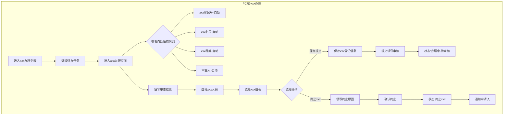
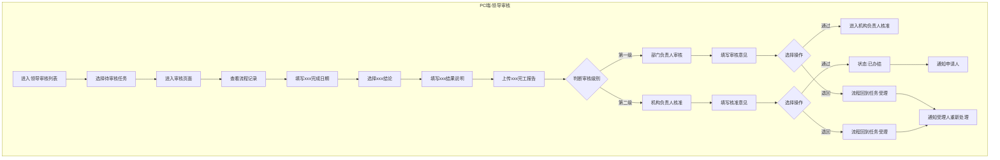
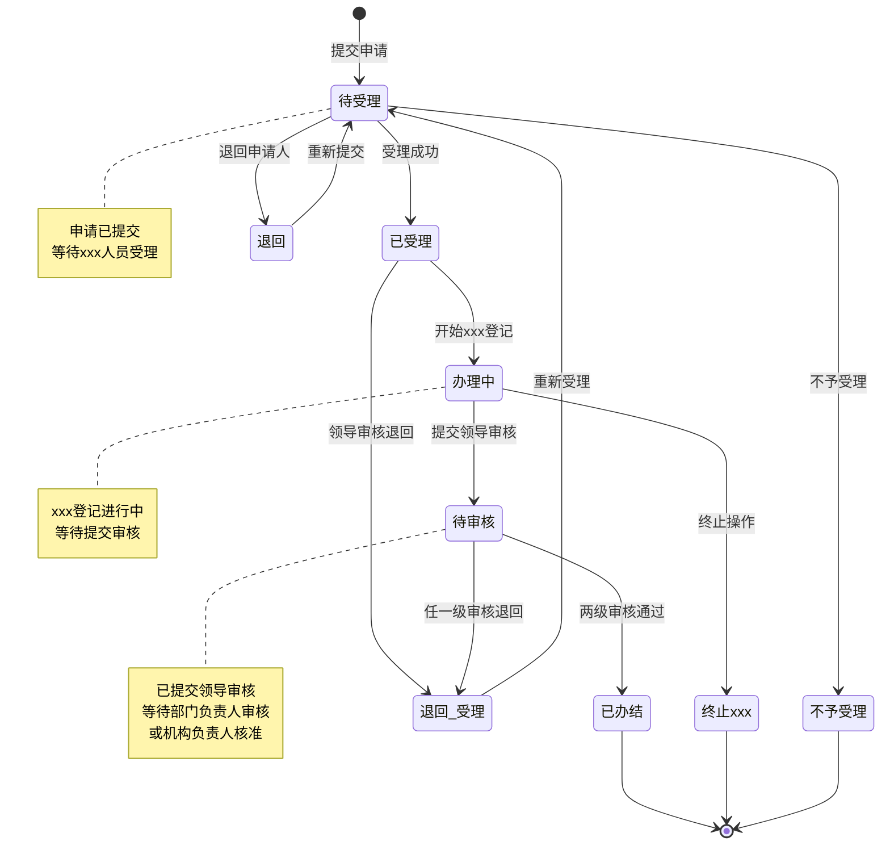

# 业务流程和规则子文档

---

## 文档信息

| 项目名称 | xxx辅助管理平台 - xxxxxx子系统 |
|---------|--------------------------------|
| 文档版本 | V1.0 |
| 编写日期 | 2026-03-09 |
| 文档类型 | 业务流程和规则子文档 |

---

## 1. 业务流程概述

### 1.1 一期业务流程范围

```
┌─────────────────────────────────────────────────────────────────┐
│                      xxxxxx业务流程（一期）                    │
│                                                                 │
│   移动端                        PC端                            │
│   ┌─────┐                     ┌─────────────────────────────┐  │
│   │申请 │                     │                             │  │
│   └──┬──┘                     │  ┌───────┐    ┌───────┐   │  │
│      │                        │  │任务受理│───▶│xxx办理│   │  │
│      ▼                        │  └───┬───┘    └───┬───┘   │  │
│   ┌─────┐                     │      │            │       │  │
│   │提交 │────────────────────▶│      │            ▼       │  │
│   └─────┘                     │      │      ┌───────┐    │  │
│      │                        │      │      │xxx登记│    │  │
│      │                        │      │      └───┬───┘    │  │
│      │                        │      │          │        │  │
│      │                        │      │          ▼        │  │
│      │                        │      │    ┌───────────┐  │  │
│      │                        │      │    │ 领导审核  │  │  │
│      │                        │      │    │(两级审核) │  │  │
│      │                        │      │    └─────┬─────┘  │  │
│      │                        │      │          │        │  │
│      │                        │      │    ┌─────┴─────┐  │  │
│      │                        │      │    │           │  │  │
│      │                        │      │  通过        退回  │  │
│      │                        │      │    │           │  │  │
│      │                        │      │    ▼           │  │  │
│      │                        │      │  已办结        │  │  │
│      │                        │      │                │  │  │
│      │◀───────────────────────│──────┼────────────────┘  │  │
│      │                        │      │                    │  │
│      ▼                        │      ▼                    │  │
│   ┌─────┐                     │  终止xxx                 │  │
│   │退回 │                     │                            │  │
│   │修改 │                     │                            │  │
│   └──┬──┘                     │                            │  │
│      │                        └─────────────────────────────┘  │
│      ▼                                                          │
│   ┌─────┐                                                       │
│   │重新 │                                                       │
│   │提交 │──────────────────────────────────────────────────────▶│
│   └─────┘                                                       │
│                                                                 │
└─────────────────────────────────────────────────────────────────┘
```

### 1.2 一期暂不实现的流程

| 流程环节 | 说明 | 计划实现时间 |
|---------|------|-------------|
| 图纸确认 | xxx人员审核申请图纸 | 二期 |
| 实xxx验 | 现场xxxxxx | 二期 |
| 报告签发 | 签发xxx证书/报告 | 二期 |
| 文书管理 | 管理xxx相关文书 | 二期 |
| 工作移交 | xxx人员工作交接 | 二期 |

---

## 2. 详细业务流程

### 2.1 建造xxx申请流程



### 2.2 任务受理流程



### 2.3 xxx办理流程



### 2.4 领导审核流程



---

## 3. 状态流转规则

### 3.1 申请单状态流转图



### 3.2 状态编码定义

| 状态编码 | 状态名称 | 说明 | 可执行操作 |
|---------|---------|------|-----------|
| DSL | 待受理 | 申请已提交，等待受理 | 受理、不予受理、退回 |
| YSL | 已受理 | 已受理，等待xxx登记 | 开始办理 |
| BSL | 不予受理 | xxx人员拒绝受理 | 无（流程结束） |
| TH | 退回 | 已退回给申请人 | 申请人重新编辑提交 |
| BLZ | 办理中 | xxx登记进行中 | 保存、提交审核、终止 |
| DSH | 待审核 | 已提交领导审核 | 部门负责人审核 |
| YBJ | 已办结 | 流程完成 | 无（流程结束） |
| ZZJY | 终止xxx | xxx终止 | 无（流程结束） |

### 3.3 办理环节定义

| 环节编码 | 环节名称 | 一期实现 | 说明 |
|---------|---------|---------|------|
| CJDJ | xxx登记 | ✅ | 填写审查结论、指派人员 |
| TZQR | 图纸确认 | ❌ | 二期实现 |
| SCJY | 实xxx验 | ❌ | 二期实现 |
| BGQF | 报告签发 | ❌ | 二期实现 |

### 3.4 状态流转规则表

| 当前状态 | 目标状态 | 触发条件 | 操作人 | 备注 |
|---------|---------|---------|--------|------|
| - | DSL | 提交申请 | 申请人 | 新建申请 |
| DSL | YSL | 受理成功 | xxx人员 | 进入办理 |
| DSL | BSL | 不予受理 | xxx人员 | 流程结束 |
| DSL | TH | 退回 | xxx人员 | 等待重提 |
| TH | DSL | 重新提交 | 申请人 | 退回重提 |
| YSL | BLZ | 开始登记 | xxx人员 | 自动流转 |
| BLZ | DSH | 提交审核 | xxx人员 | 提交领导 |
| BLZ | ZZJY | 终止xxx | xxx人员 | 流程结束 |
| DSH | YBJ | 两级通过 | 部门负责人/机构负责人 | 流程结束 |
| DSH | DSL | 任一级退回 | 部门负责人/机构负责人 | 回到受理 |

---

## 4. 业务规则详解

### 4.1 申请规则

#### 规则编号：R-APP-001 重复申请校验

| 项目 | 内容 |
|------|------|
| 规则名称 | 重复申请校验 |
| 适用场景 | 提交申请时 |
| 规则描述 | 若当前xxx名已存在同一xxx种类的未办结流程，阻止提交 |
| 校验条件 | xxx名相同 AND xxx种类相同 AND 状态 IN (待受理, 办理中, 整改中) |
| 提示信息 | "当前xxx尚有未办结的xxx申请，请待流程办结后申请" |

#### 规则编号：R-APP-002 申请时间默认值

| 项目 | 内容 |
|------|------|
| 规则名称 | 申请时间默认值 |
| 适用场景 | 新建申请时 |
| 规则描述 | 申请时间字段自动填充为当前系统时间 |
| 实现方式 | 前端默认值 + 后端二次校验 |

#### 规则编号：R-APP-003 xxx种类限制

| 项目 | 内容 |
|------|------|
| 规则名称 | xxx种类限制 |
| 适用场景 | 选择xxx种类时 |
| 规则描述 | 一期仅支持"建造xxx"和"初次xxx"两种 |
| 可选值 | 建造xxx(B)、初次xxx(C) |
| 排除值 | 运营xxx（二期实现） |

#### 规则编号：R-APP-004 日期校验规则

| 项目 | 内容 |
|------|------|
| 规则名称 | 日期校验规则 |
| 适用场景 | 填写日期字段时 |
| 规则描述 | 计划xxx日期不能早于计划建造开工日期 |
| 校验逻辑 | jhjyrq >= jhjzkgrq |

#### 规则编号：R-APP-005 文件上传限制

| 项目 | 内容 |
|------|------|
| 规则名称 | 文件上传限制 |
| 适用场景 | 上传申请材料时 |
| 规则描述 | 限制文件格式和大小 |
| 文件格式 | word/pdf |
| 单文件大小 | ≤20MB |
| 每项文件数 | ≤3个 |

---

### 4.2 受理规则

#### 规则编号：R-ACC-001 受理权限

| 项目 | 内容 |
|------|------|
| 规则名称 | 受理权限 |
| 适用场景 | 受理申请时 |
| 规则描述 | xxx机构下所有xxx人员均可受理本机构收到的申请 |
| 权限校验 | 申请.JYJG_ID = 当前用户.JYJG_ID |

#### 规则编号：R-ACC-002 受理通知书

| 项目 | 内容 |
|------|------|
| 规则名称 | 受理通知书 |
| 适用场景 | 受理申请后 |
| 规则描述 | 不自动生成受理通知书，由受理人在办理日志中手动上传 |
| 实现方式 | 办理日志附件上传功能 |

#### 规则编号：R-ACC-003 受理后退回

| 项目 | 内容 |
|------|------|
| 规则名称 | 受理后退回 |
| 适用场景 | 领导审核退回后 |
| 规则描述 | 退回后流程回到"任务受理"环节，受理人重新处理 |
| 状态变更 | DSH → DSL |

---

### 4.3 办理规则

#### 规则编号：R-HAN-001 xxx登记号生成

| 项目 | 内容 |
|------|------|
| 规则名称 | xxx登记号生成规则 |
| 适用场景 | 受理成功后自动生成 |
| 格式 | YYYYXNNSSSSSS（12位） |
| 组成 | YYYY=年份，X=xxx类别(B/C)，NN=机构编码，SSSSSS=流水号 |
| 示例 | 2025B41000123 = 2025年/建造xxx(B)/xxx41/第123号 |
| 唯一性 | 全局唯一，数据库约束 |

#### 规则编号：R-HAN-002 xxx人员选择

| 项目 | 内容 |
|------|------|
| 规则名称 | xxx人员选择 |
| 适用场景 | xxx登记时指派人员 |
| 规则描述 | xxx人员和xxx组长必须从本机构人员中选择 |
| 数据来源 | xxx人员管理模块，按JYJG_ID过滤 |
| 必须选择 | 至少选择1名xxx人员，必须选择1名xxx组长 |

#### 规则编号：R-HAN-003 终止xxx

| 项目 | 内容 |
|------|------|
| 规则名称 | 终止xxx |
| 适用场景 | xxx办理过程中 |
| 规则描述 | 可在xxx登记环节执行终止xxx操作 |
| 必填项 | 终止原因（必填） |
| 状态变更 | BLZ → ZZJY |

---

### 4.4 审核规则

#### 规则编号：R-AUD-001 两级审核机制

| 项目 | 内容 |
|------|------|
| 规则名称 | 两级审核机制 |
| 适用场景 | 领导审核环节 |
| 规则描述 | 最多两级审核：部门负责人审核 → 机构负责人核准 |
| 第一级 | 部门负责人（SFBMFZR=1）审核 |
| 第二级 | 机构负责人（BMFZR）核准 |
| 通过条件 | 两级均通过后流程结束 |

#### 规则编号：R-AUD-002 审核意见必填

| 项目 | 内容 |
|------|------|
| 规则名称 | 审核意见必填 |
| 适用场景 | 审核通过或退回时 |
| 规则描述 | 每级审核均需填写审核意见 |
| 实现方式 | 弹窗填写意见，通过或退回均需填写 |

#### 规则编号：R-AUD-003 审核退回流程

| 项目 | 内容 |
|------|------|
| 规则名称 | 审核退回流程 |
| 适用场景 | 任一级审核退回时 |
| 规则描述 | 退回后流程回到"任务受理"环节，不是回到xxx人员 |
| 原因说明 | 确保受理人能全面重新处理申请 |

#### 规则编号：R-AUD-004 xxx完工报告

| 项目 | 内容 |
|------|------|
| 规则名称 | xxx完工报告上传 |
| 适用场景 | 审核时填写审核内容 |
| 规则描述 | xxx完工报告为上传新文件，非选择已有文件 |
| 文件格式 | word/pdf |
| 文件大小 | ≤20MB |

---

### 4.5 数据规则

#### 规则编号：R-DAT-001 同部门可查看

| 项目 | 内容 |
|------|------|
| 规则名称 | 同部门可查看 |
| 适用场景 | 列表查询时 |
| 规则描述 | 同一xxx机构的人员可查看本机构的所有数据 |
| 实现方式 | 查询条件：JYJG_ID = 当前用户.JYJG_ID |

#### 规则编号：R-DAT-002 仅创建人可维护

| 项目 | 内容 |
|------|------|
| 规则名称 | 仅创建人可维护 |
| 适用场景 | 修改/删除操作时 |
| 规则描述 | 仅创建人可修改/删除自己创建的数据 |
| 例外 | 系统管理员可操作所有数据 |

#### 规则编号：R-DAT-003 敏感数据脱敏

| 项目 | 内容 |
|------|------|
| 规则名称 | 敏感数据脱敏 |
| 适用场景 | 列表展示时 |
| 规则描述 | 身份证号、联系电话等敏感字段需脱敏展示 |
| 脱敏规则 | 身份证：前3后4，中间*；手机号：前3后4，中间* |

---

## 5. 异常处理规则

### 5.1 业务异常处理

| 异常场景 | 异常代码 | 处理方式 |
|---------|---------|---------|
| 重复申请 | BIZ-001 | 弹窗提示，阻止提交 |
| 机构代码重复 | BIZ-002 | 表单校验提示，阻止保存 |
| 已被他人受理 | BIZ-003 | 提示"该申请已被受理"，刷新列表 |
| 删除机构失败 | BIZ-004 | 提示"存在下级机构或关联人员，无法删除" |
| 审核权限不足 | BIZ-005 | 提示"您不是该机构的部门负责人" |

### 5.2 数据一致性保障

| 场景 | 保障措施 |
|------|---------|
| 受理并发 | 乐观锁控制，防止重复受理 |
| 登记号生成 | 数据库序列+唯一约束 |
| 审核流程 | 状态机控制，严格按流程流转 |
| 文件上传 | 事务控制，失败回滚 |

---

## 6. 通知规则

### 6.1 站内通知

| 触发事件 | 通知对象 | 通知内容 |
|---------|---------|---------|
| 提交申请 | xxx机构所有人员 | "新申请待受理：{xxx名}" |
| 受理成功 | 申请人 | "您的申请已受理，xxx登记号：{登记号}" |
| 不予受理 | 申请人 | "您的申请已被不予受理，原因：{原因}" |
| 退回 | 申请人 | "您的申请已被退回，原因：{原因}" |
| 审核退回 | 受理人 | "xxx登记{登记号}被退回，请重新处理" |
| 办结 | 申请人 | "您的xxx申请已办结" |
| 终止xxx | 申请人 | "您的xxx申请已终止，原因：{原因}" |

### 6.2 待办任务

| 任务类型 | 任务名称 | 任务对象 |
|---------|---------|---------|
| 待受理 | 新申请待受理 | xxx机构所有xxx人员 |
| 待登记 | xxx登记待办理 | 指定的xxx人员 |
| 待审核 | xxx登记待审核 | 部门负责人 |
| 待核准 | xxx登记待核准 | 机构负责人 |

---

## 7. 业务规则检查清单

### 7.1 申请环节检查

- [ ] 必填字段是否完整
- [ ] 必传材料是否上传
- [ ] 重复申请是否校验
- [ ] 日期逻辑是否正确
- [ ] 文件格式和大小是否符合要求

### 7.2 受理环节检查

- [ ] 受理人是否为本机构人员
- [ ] 是否可修改申请信息
- [ ] 是否上传受理通知书
- [ ] 不予受理/退回原因是否填写

### 7.3 办理环节检查

- [ ] xxx登记号是否自动生成
- [ ] xxx人员是否已指派
- [ ] xxx组长是否已指派
- [ ] 审查结论是否已填写
- [ ] 终止原因是否填写（如终止）

### 7.4 审核环节检查

- [ ] 审核人是否为部门负责人
- [ ] xxx完成日期是否填写
- [ ] xxx结论是否选择
- [ ] xxx结果说明是否填写
- [ ] xxx完工报告是否上传
- [ ] 审核意见是否填写
- [ ] 退回原因是否填写（如退回）

---

## 8. 补充业务场景

### 8.1 边界场景处理

| 场景 | 处理方式 |
|------|---------|
| 申请人在办理过程中更换联系方式 | 不影响已提交申请，新申请使用新信息 |
| xxx机构调整（合并/撤销） | 历史数据保持原机构，新数据使用新机构 |
| xxx人员调动 | 已指派的任务继续完成，新任务使用新机构 |
| 部门负责人变更 | 历史审核记录保留，新审核由新负责人处理 |

### 8.2 特殊场景处理

| 场景 | 处理方式 |
|------|---------|
| 节假日申请 | 正常提交，工作日处理 |
| 紧急xxx | 一期暂无加急标识，按正常流程处理 |
| 批量申请 | 一期暂不支持批量申请，逐条提交 |
| 申请撤回 | 一期暂不支持撤回，需联系xxx人员退回 |


