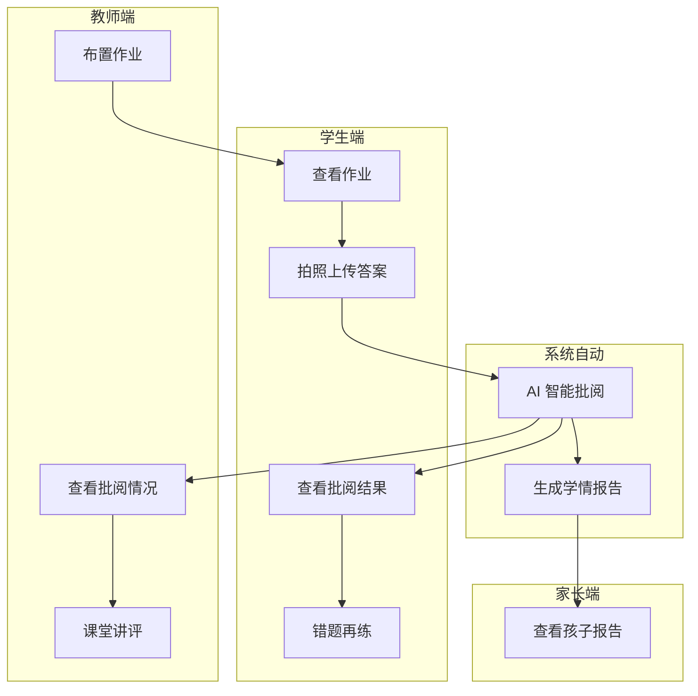
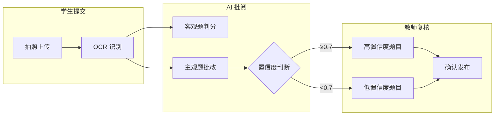
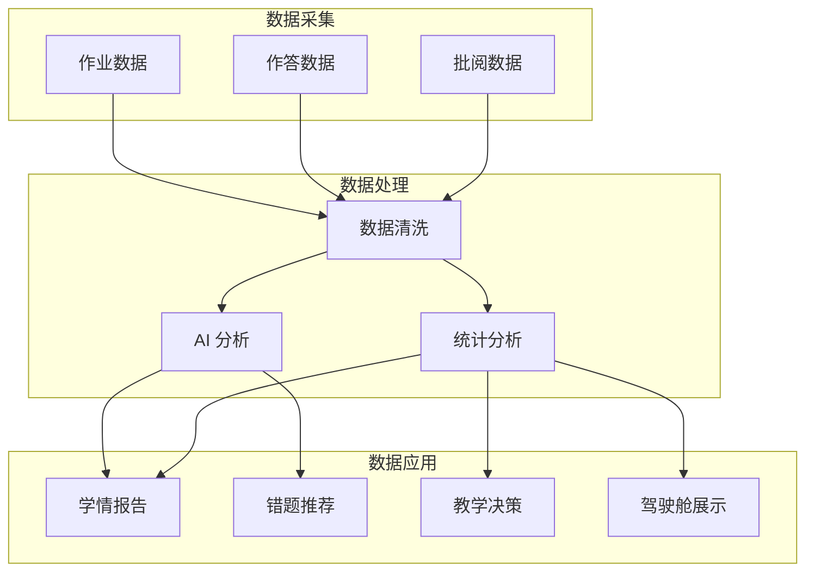

# 智能作业批阅平台系统需求总文档

---

## 文档信息

| 项目名称 | 智能作业批阅平台 |
|---------|----------------------------------|
| 文档版本 | V1.0 |
| 编写日期 | 2026-03-31 |
| 文档类型 | 需求总文档 |
| 适用范围 | 一期建设 |

---

## 1. 项目概述

### 1.1 项目背景

作业批改是教学过程中的重要环节，传统作业批改模式完全依赖教师人工批改，效率低下，难以实现个性化精准教学。

为贯彻落实《教育信息化 2.0 行动计划》《关于加强新时代教育体系建设的意见》等文件精神，推进信息技术与教育教学深度融合，减轻教师作业批改负担，实现个性化精准教学，特建设智能作业批阅平台。

### 1.2 项目目标

| 目标类型 | 具体目标 |
|---------|---------|
| 业务目标 | 实现作业发布、提交、批阅、讲评、分析的全流程线上管理 |
| 效率目标 | 通过 AI 智能批阅，减轻教师批改负担，批改效率提升 80% 以上 |
| 规范目标 | 统一作业管理流程，规范批阅标准，确保过程可追溯 |
| 数据目标 | 积累作业数据，支撑学情分析与教学决策支持 |

### 1.3 建设范围

#### 一期建设范围

| 功能模块 | 建设内容 | 状态 |
|---------|---------|------|
| 作业发布与管理 | 教师布置作业、管理作业生命周期 | ✅ 实现 |
| 作业智能批阅 | AI 自动批阅、手写识别、教师复核 | ✅ 实现 |
| 校本作业资源管理 | 题库管理、试卷管理、知识点关联 | ✅ 实现 |
| 作业报告 | 班级报告、个人报告、学情分析 | ✅ 实现 |
| 课堂作业讲评 | 课堂讲评、错题讲评、互动讲评 | ✅ 实现 |
| 错题再练 | 错题本、相似题推荐、巩固练习 | ✅ 实现 |
| 教师应用 | 一站式教学应用、工作台 | ✅ 实现 |
| 作业数据驾驶舱 | 数据可视化大屏、多维度分析 | ✅ 实现 |

#### 外部集成范围

| 集成项 | 集成内容 | 状态 |
|--------|---------|------|
| AI 大模型 API | 通义千问等，用于主观题智能批改 | ✅ 集成 |
| OCR 服务 | 阿里/百度 OCR，用于手写识别 | ✅ 集成 |
| 消息通知 | 微信模板消息/短信通知 | ✅ 集成 |
| 统一身份认证 | 学校现有统一认证系统对接 | ⏸️ 可选 |

---

## 2. 系统架构

### 2.1 技术架构

```
┌─────────────────────────────────────────────────────────────┐
│                        用户层                                │
│  ┌─────────────────┐        ┌─────────────────────────┐    │
│  │    移动端 H5     │        │        PC 端             │    │
│  │  (uni-app H5)   │        │  (Vue3 + Element Plus)  │    │
│  │  学生/家长/教师  │        │  教师/管理者/管理员      │    │
│  └─────────────────┘        └─────────────────────────┘    │
└─────────────────────────────────────────────────────────────┘
                              │
                              ▼
┌─────────────────────────────────────────────────────────────┐
│                        服务层                                │
│  ┌─────────────────────────────────────────────────────┐   │
│  │              Spring Boot 3 + MyBatis-Plus            │   │
│  │  /homework/*  (作业模块 API)                          │   │
│  │  /resource/*  (资源模块 API)                          │   │
│  │  /report/*    (报告模块 API)                          │   │
│  │  /mistake/*   (错题模块 API)                          │   │
│  │  /cockpit/*   (驾驶舱 API)                            │   │
│  └─────────────────────────────────────────────────────┘   │
└─────────────────────────────────────────────────────────────┘
                              │
                              ▼
┌─────────────────────────────────────────────────────────────┐
│                      外部服务层                              │
│  ┌─────────────────┐        ┌─────────────────────────┐    │
│  │   AI 大模型 API   │        │      OCR 服务           │    │
│  │  (通义千问等)     │        │   (阿里/百度 OCR)        │    │
│  │  主观题批改       │        │   手写识别              │    │
│  └─────────────────┘        └─────────────────────────┘    │
└─────────────────────────────────────────────────────────────┘
                              │
                              ▼
┌─────────────────────────────────────────────────────────────┐
│                        数据层                                │
│  ┌─────────────────────────────────────────────────────┐   │
│  │                  MySQL 8 数据库                        │   │
│  │  HOMEWORK_* (作业业务表)                              │   │
│  │  RESOURCE_* (资源业务表)                              │   │
│  │  REPORT_* (报告业务表)                                │   │
│  │  MISTAKE_* (错题业务表)                               │   │
│  │  SYS_* (系统基础表)                                   │   │
│  └─────────────────────────────────────────────────────┘   │
└─────────────────────────────────────────────────────────────┘
```

### 2.2 技术选型说明

| 端 | 技术栈 | 版本要求 | 说明 |
|---|--------|---------|------|
| PC 前端 | Vue 3 + Element Plus | Options API | 管理端应用，支持复杂表单和列表 |
| 移动端 H5 | uni-app + uView UI 2.x | Vue 2 Options API | 跨平台移动应用，支持微信内嵌访问 |
| 后端 | Spring Boot 3 + MyBatis-Plus | JDK 17+ | 企业级服务框架 |
| 数据库 | MySQL 8 | 8.0+ | 关系型数据库 |
| AI 服务 | 通义千问 API | - | 大模型服务，用于主观题批改 |
| OCR 服务 | 阿里 OCR | - | 手写识别服务 |

### 2.3 模块划分

```
智能作业批阅平台
├── 作业模块 (homework)    - 作业发布、提交、批阅管理
├── 资源模块 (resource)    - 题库、试卷、知识点管理
├── 报告模块 (report)      - 作业报告、学情分析
├── 错题模块 (mistake)     - 错题本、相似题推荐
├── 讲评模块 (comment)     - 课堂讲评管理
├── 驾驶舱模块 (cockpit)   - 数据可视化大屏
├── 教师应用 (teacher)     - 教师工作台
└── 基础模块 (base)        - 用户、班级、权限管理
```

### 2.4 部署架构

```
┌─────────────────────────────────────────────────────────────────┐
│                          用户访问层                              │
│                                                                 │
│   ┌─────────────┐         ┌─────────────┐                      │
│   │  移动端 H5   │         │   PC 端      │                      │
│   │  (HTTPS)    │         │  (HTTPS)    │                      │
│   └──────┬──────┘         └──────┬──────┘                      │
│          │                       │                              │
│          └───────────┬───────────┘                              │
│                      │                                          │
│                      ▼                                          │
│              ┌───────────────┐                                  │
│              │     Nginx     │                                  │
│              │  负载均衡/SSL  │                                  │
│              └───────┬───────┘                                  │
└──────────────────────┼──────────────────────────────────────────┘
                       │
                       ▼
┌─────────────────────────────────────────────────────────────────┐
│                          应用服务层                              │
│                                                                 │
│   ┌───────────────┐    ┌───────────────┐    ┌───────────────┐  │
│   │  Spring Boot  │    │  Spring Boot  │    │  Spring Boot  │  │
│   │  应用节点 1    │    │  应用节点 2    │    │  应用节点 N    │  │
│   └───────┬───────┘    └───────┬───────┘    └───────┬───────┘  │
│           │                    │                    │           │
│           └────────────────────┼────────────────────┘           │
│                                │                                │
└────────────────────────────────┼────────────────────────────────┘
                                 │
                                 ▼
┌─────────────────────────────────────────────────────────────────┐
│                          数据服务层                              │
│                                                                 │
│   ┌───────────────┐    ┌───────────────┐    ┌───────────────┐  │
│   │   MySQL 8     │    │   本地文件    │    │     Redis     │  │
│   │  主从复制     │    │  本地存储     │    │   缓存服务    │  │
│   └───────────────┘    └───────────────┘    └───────────────┘  │
│                                                                 │
│   ┌───────────────┐                                            │
│   │  Elasticsearch│                                            │
│   │  日志检索     │                                            │
│   └───────────────┘                                            │
└─────────────────────────────────────────────────────────────────┘
```

#### 部署环境要求

| 环境 | 配置要求 | 数量 | 说明 |
|------|---------|------|------|
| 应用服务器 | 4 核 8G | 2+ | Spring Boot 应用节点 |
| 数据库服务器 | 8 核 16G | 2 | MySQL 主从架构 |
| 文件存储 | 本地磁盘/NAS | 1 | 图片、文件本地存储 |
| 缓存服务器 | 2 核 4G | 1 | Redis 缓存 |
| 负载均衡 | Nginx | 1 | 负载均衡和 SSL 终止 |

#### 网络架构

| 区域 | 说明 | 安全策略 |
|------|------|---------|
| DMZ 区 | Nginx 负载均衡 | 开放 443 端口 |
| 应用区 | Spring Boot 应用 | 内网访问，仅开放应用端口 |
| 数据区 | MySQL、Redis、文件存储 | 内网访问，禁止外网直达 |

### 2.5 技术选型详细说明

#### 后端技术栈

| 技术 | 选型 | 说明 |
|------|------|------|
| 基础框架 | Spring Boot 3.x | 快速开发框架 |
| ORM 框架 | MyBatis-Plus | 数据库操作 |
| 数据库连接池 | HikariCP | 高性能连接池 |
| 权限框架 | Spring Security + JWT | 认证授权 |
| 日志框架 | Logback | 日志记录 |
| API 文档 | Swagger/Knife4j | API 文档生成 |

#### 前端技术栈

| 端 | 技术 | 说明 |
|------|------|------|
| PC 端 | Vue 3 + Element Plus | 管理端应用 |
| 移动端 | uni-app + uView UI 2.x | 跨平台 H5 应用 |

#### 中间件选型

| 中间件 | 选型 | 说明 |
|--------|------|------|
| 缓存 | Redis | 会话缓存、数据缓存 |
| 文件存储 | 本地文件系统/NAS | 图片、文件本地存储 |

---

## 3. 业务全景图

根据 CLAUDE.md 规范，后端包结构如下：

```
com.linewell.homework          # 作业核心模块
├── controller/
│   ├── TbBHomeworkPublishController.java    # 作业发布控制器
│   ├── TbBHomeworkSubmitController.java     # 作业提交控制器
│   └── TbBHomeworkGradeController.java      # 作业批阅控制器
├── entity/
│   ├── TbBHomeworkPublish.java              # 作业发布实体
│   ├── TbBHomeworkSubmit.java               # 作业提交实体
│   └── TbBHomeworkGrade.java                # 作业批阅实体
├── mapper/
│   ├── xml/
│   │   ├── TbBHomeworkPublishMapper.xml
│   │   ├── TbBHomeworkSubmitMapper.xml
│   │   └── TbBHomeworkGradeMapper.xml
│   ├── TbBHomeworkPublishMapper.java
│   ├── TbBHomeworkSubmitMapper.java
│   └── TbBHomeworkGradeMapper.java
└── service/
    ├── TbBHomeworkPublishService.java
    ├── TbBHomeworkSubmitService.java
    └── TbBHomeworkGradeService.java

com.linewell.resource          # 资源管理模块
com.linewell.report            # 报告分析模块
com.linewell.mistake           # 错题管理模块
com.linewell.comment           # 讲评管理模块
com.linewell.cockpit           # 驾驶舱模块
com.linewell.teacher           # 教师应用模块
com.linewell.base              # 基础数据模块
```

---

## 3. 业务全景图

### 3.1 整体业务流程



### 3.2 作业批阅核心流程



### 3.3 数据流向图



---

## 4. 用户角色体系

### 4.1 角色定义

| 角色 ID | 角色名称 | 角色描述 | 用户群体 |
|--------|---------|---------|---------|
| R01 | 学生 | 查看作业、提交答案、查看批阅结果 | 在校学生 |
| R02 | 教师 | 布置作业、批阅作业、讲评、查看报告 | 任课教师 |
| R03 | 家长 | 查看孩子作业报告和学情数据 | 学生家长 |
| R04 | 学校管理者 | 查看全校作业数据驾驶舱 | 校长/教务主任 |
| R05 | 系统管理员 | 管理基础配置、用户、权限等 | IT 运维人员 |

### 4.2 角色权限概览

| 功能模块 | 学生 (R01) | 教师 (R02) | 家长 (R03) | 管理者 (R04) | 管理员 (R05) |
|---------|-----------|-----------|-----------|------------|------------|
| 作业提交 | ✅ | - | - | - | ✅ |
| 作业布置 | - | ✅ | - | - | ✅ |
| 作业批阅 | - | ✅ | - | - | ✅ |
| 作业报告 | 个人 | 班级/个人 | 孩子报告 | 全校报告 | - |
| 课堂讲评 | - | ✅ | - | 查看 | - |
| 错题再练 | ✅ | ✅ | 查看 | - | - |
| 资源管理 | - | 查看/使用 | - | 查看 | ✅ |
| 数据驾驶舱 | - | 所教班级 | - | 全校 | - |
| 系统管理 | - | - | - | - | ✅ |

---

## 5. 关键概念定义

### 5.1 核心业务术语

| 术语 | 定义 | 说明 |
|------|------|------|
| AI 批阅 | 利用人工智能技术对作业进行自动批改 | 包含客观题判分和主观题批改 |
| 置信度 | AI 对判分结果的自信程度 | 取值范围 0-1，<0.7 标记待复核 |
| 校本资源 | 学校自有的教学资源 | 包含题库、试卷等，支持私有/共享 |
| 错题再练 | 基于错题数据的个性化巩固练习 | 智能推荐相似题目 |
| 数据驾驶舱 | 数据可视化大屏 | 支持多维度数据分析展示 |
| 学情报告 | 基于作业数据的分析报告 | 包含班级报告和个人报告 |

### 5.2 状态定义

#### 作业状态

| 状态编码 | 状态名称 | 说明 |
|---------|---------|------|
| WKS | 未开始 | 作业已发布，未到提交开始时间 |
| JXZ | 进行中 | 学生可提交作业 |
| YJZ | 已截止 | 超过提交截止时间 |
| YWC | 已完成 | 作业全流程结束 |

#### 提交状态

| 状态编码 | 状态名称 | 说明 |
|---------|---------|------|
| WTJ | 未提交 | 学生未提交答案 |
| YTJ | 已提交 | 学生已提交答案，等待批阅 |
| WPY | 未批阅 | AI 尚未完成批阅 |
| YPY | 已批阅 | AI 已完成批阅，等待教师确认 |
| YQR | 已确认 | 教师已确认批阅结果 |
| YFB | 已发布 | 批阅结果已发布给学生和家长 |

### 5.3 编码规则

#### 题目编号生成规则

**格式**：`SUBJ-YYYY-NNNNNN`（共 12 位）

| 组成部分 | 位数 | 说明 | 示例 |
|---------|------|------|------|
| SUBJ | 4 位 | 学科代码 | CHIN=语文，MATH=数学，ENGL=英语 |
| YYYY | 4 位 | 年份 | 2026 |
| NNNNNN | 6 位 | 流水序号 | 000001 |

**示例**：
- `MATH-2026-000001` = 数学/2026 年/第 1 题
- `CHIN-2026-000123` = 语文/2026 年/第 123 题

#### 学科代码对照表

| 代码 | 学科 | 代码 | 学科 |
|------|------|------|------|
| CHIN | 语文 | MATH | 数学 |
| ENGL | 英语 | PHYS | 物理 |
| CHEM | 化学 | BIO | 生物 |
| HIST | 历史 | GEO | 地理 |
| POL | 政治 | SCI | 科学 |

---

## 6. 文档索引

本需求文档体系包含以下子文档：

| 序号 | 文档名称 | 文档路径 | 主要内容 |
|------|---------|---------|---------|
| 1 | 需求总文档 | [01-需求总文档.md](01-需求总文档.md) | 项目概述、架构、业务全景 |
| 2 | 功能说明子文档 | [02-功能说明子文档.md](02-功能说明子文档.md) | 各功能模块详细说明 |
| 3 | 界面操作子文档 | [03-界面操作子文档.md](03-界面操作子文档.md) | 页面设计、按钮操作、交互规范 |
| 4 | 角色权限子文档 | [04-角色权限子文档.md](04-角色权限子文档.md) | 角色定义、权限矩阵 |
| 5 | 业务流程和规则子文档 | [05-业务流程和规则子文档.md](05-业务流程和规则子文档.md) | 流程图、状态流转、业务规则 |
| 6 | 数据接口子文档 | [06-数据接口子文档.md](06-数据接口子文档.md) | 数据库设计、API 契约 |
| 7 | 公共字典子文档 | [07-公共字典子文档.md](07-公共字典子文档.md) | 字典定义、编码规则 |

---

## 7. 非功能性需求

### 7.1 性能要求

#### 7.1.1 响应时间要求

| 场景 | 指标要求 | 说明 |
|------|---------|------|
| 首页加载 | < 2 秒 | 首屏内容加载时间 |
| 列表查询 | < 3 秒 | 常规列表查询响应时间 |
| 表单提交 | < 2 秒 | 数据保存操作响应时间 |
| AI 批阅 | < 10 秒/题 | 单题 AI 批阅时间 |
| 图片上传 | < 5 秒/张 | 单张图片上传时间（压缩后） |
| 报告生成 | < 30 秒 | 学情报告生成时间 |
| 数据驾驶舱 | < 5 秒 | 驾驶舱数据加载时间 |

#### 7.1.2 并发要求

| 指标 | 要求 | 说明 |
|------|------|------|
| 同时在线用户 | 1000+ | 并发在线用户数 |
| 并发提交 | 100+/秒 | 作业并发提交处理能力 |
| AI 批阅并发 | 50+/秒 | AI 批阅请求并发处理能力 |
| 数据库连接 | 200+ | 最大数据库连接数 |

#### 7.1.3 数据准确性要求

| 指标 | 要求 | 说明 |
|------|------|------|
| AI 批阅准确率 | > 85% | 整体批阅准确率 |
| 客观题判分 | > 95% | 选择题、判断题判分准确率 |
| 主观题批改 | > 80% | 简答题、作文题批改准确率 |
| OCR 识别率 | > 90% | 手写文字识别准确率 |

### 7.2 安全要求

#### 7.2.1 应用安全

| 要求 | 实现方式 | 说明 |
|------|---------|------|
| 密码加密 | BCrypt 加密存储 | 用户密码加密存储 |
| 接口认证 | JWT Token 认证 | API 接口身份认证 |
| 权限校验 | Spring Security + 权限标识 | 功能权限和数据权限控制 |
| SQL 注入防护 | MyBatis 参数化查询 | 防止 SQL 注入攻击 |
| XSS 防护 | 输入过滤 + 输出转义 | 防止跨站脚本攻击 |
| CSRF 防护 | CSRF Token | 防止跨站请求伪造 |

#### 7.2.2 数据安全

| 要求 | 实现方式 | 说明 |
|------|---------|------|
| 敏感信息脱敏 | 列表展示时脱敏 | 手机号、身份证等脱敏显示 |
| 传输加密 | HTTPS/TLS 1.3 | 数据传输加密 |
| 操作审计 | 完整记录所有操作 | 操作日志记录 |
| 数据备份 | 定时备份 + 增量备份 | 数据备份和恢复 |

#### 7.2.3 隐私保护

| 要求 | 实现方式 | 说明 |
|------|---------|------|
| 学生隐私保护 | 排名等功能可选隐藏 | 保护学生隐私 |
| 家长访问控制 | 仅限绑定孩子数据 | 家长仅可查看绑定孩子数据 |
| 数据最小化 | 按需收集和使用 | 仅收集必要数据 |

### 7.3 可用性要求

| 要求 | 指标 | 说明 |
|------|------|------|
| 系统可用性 | > 99% | 系统正常运行时间占比 |
| 数据备份 | 支持定时备份和恢复 | 全量 + 增量备份策略 |
| 关键操作撤销 | 支持撤销/回退操作 | 支持操作回滚 |
| 故障恢复 | RTO < 4 小时 | 故障恢复时间目标 |
| 数据恢复 | RPO < 1 小时 | 数据恢复点目标 |

### 7.4 监控要求

#### 7.4.1 应用监控

| 监控项 | 监控内容 | 告警阈值 |
|--------|---------|---------|
| CPU 使用率 | 应用服务器 CPU 使用率 | > 80% |
| 内存使用率 | 应用服务器内存使用率 | > 85% |
| JVM 堆内存 | JVM 堆内存使用情况 | > 80% |
| 接口响应时间 | API 接口平均响应时间 | > 3 秒 |
| 接口错误率 | API 接口错误率 | > 5% |
| 数据库连接池 | 连接池使用情况 | > 80% |

#### 7.4.2 业务监控

| 监控项 | 监控内容 | 告警阈值 |
|--------|---------|---------|
| AI 批阅失败率 | AI 批阅服务失败率 | > 10% |
| OCR 识别失败率 | OCR 服务失败率 | > 15% |
| 作业提交失败率 | 作业提交失败率 | > 5% |
| 消息推送失败率 | 消息推送失败率 | > 10% |

#### 7.4.3 日志要求

| 日志类型 | 保留周期 | 存储位置 |
|---------|---------|---------|
| 应用日志 | 30 天 | 本地 + ELK |
| 访问日志 | 30 天 | 本地 + ELK |
| 审计日志 | 1 年 | 数据库 + 归档 |
| 错误日志 | 90 天 | 本地 + ELK |

---

## 8. 附录

### 8.1 名词缩写对照

| 缩写 | 全称 | 中文 |
|------|------|------|
| AI | Artificial Intelligence | 人工智能 |
| OCR | Optical Character Recognition | 光学字符识别 |
| JWT | JSON Web Token | JSON 网络令牌 |
| API | Application Programming Interface | 应用程序编程接口 |
| H5 | HTML5 | 超文本标记语言第 5 版 |
| PC | Personal Computer | 个人电脑 |

### 8.2 参考文档

| 文档名称 | 说明 |
|---------|------|
| 智能作业批阅平台项目可研要求.txt | 项目可行性研究报告 |
| 整体需求分析文档.md | 整体需求分析文档 |
| 02 细化需求文档模版 | 细化需求文档编写模版 |
