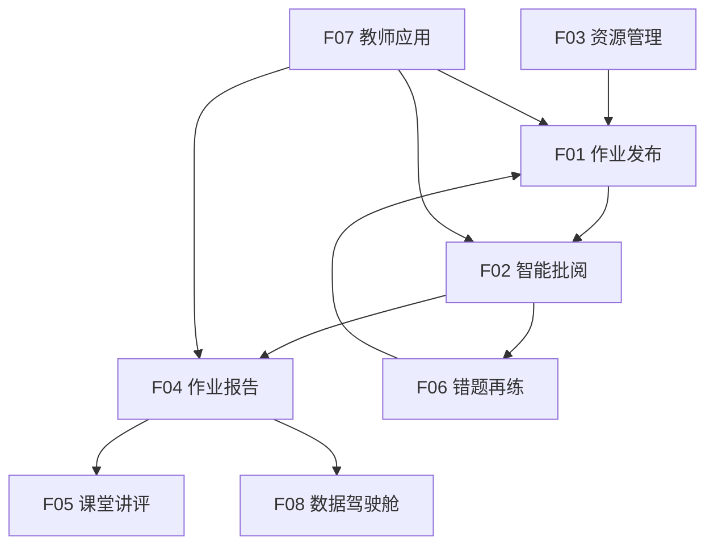

# 功能说明子文档

---

## 文档信息

| 项目名称 | 智能作业批阅平台 |
|---------|--------------------------------|
| 文档版本 | V1.0 |
| 编写日期 | 2026-03-31 |
| 文档类型 | 功能说明子文档 |

---

## 功能模块总览

```
智能作业批阅平台
├── F01 作业发布与管理（PC 端 + 移动端）
├── F02 作业智能批阅（PC 端 + 移动端）
├── F03 校本作业资源管理（PC 端）
├── F04 作业报告（PC 端 + 移动端）
├── F05 课堂作业讲评（PC 端 + 移动端）
├── F06 错题再练（PC 端 + 移动端）
├── F07 教师应用（PC 端 + 移动端）
└── F08 作业数据驾驶舱（PC 端）
```

---

## F01 作业发布与管理（PC 端 + 移动端）

### 1. 功能概述

| 属性 | 说明 |
|------|------|
| 功能编号 | F01 |
| 功能名称 | 作业发布与管理 |
| 访问端 | PC 端 + 移动端 |
| 功能描述 | 支持教师便捷地发布作业、管理作业生命周期，实现作业全流程数字化管理 |

### 2. 功能清单

| 功能项 | 功能描述 | 优先级 |
|--------|---------|--------|
| F01-01 | 新建作业 | P0 |
| F01-02 | 编辑作业 | P0 |
| F01-03 | 删除作业 | P0 |
| F01-04 | 查看作业列表 | P0 |
| F01-05 | 查看作业详情 | P0 |
| F01-06 | 截止作业 | P1 |
| F01-07 | 从题库选题 | P0 |
| F01-08 | 手动添加题目 | P0 |
| F01-09 | 上传试卷 | P1 |

### 3. 功能详细说明

#### F01-01 新建作业

**功能描述**：教师创建新作业，选择发布班级、题目等内容。

**输入项**：

| 字段名 | 字段类型 | 是否必填 | 校验规则 | 说明 |
|--------|---------|---------|---------|------|
| 作业标题 | 文本输入 | 是 | 长度 1-100 字符 | 作业名称 |
| 作业描述 | 多行文本 | 否 | 最多 500 字符 | 作业说明和要求 |
| 发布班级 | 班级多选 | 是 | 至少选择 1 个班级 | 接收作业的班级 |
| 作业类型 | 下拉选择 | 是 | 课后作业/课堂练习/单元测试/期中期末复习 | 作业分类 |
| 学科 | 下拉选择 | 是 | 必选 | 语文/数学/英语等 |
| 预计完成时长 | 数字输入 | 否 | 正整数，单位分钟 | 预计完成时间 |
| 布置日期 | 日期选择 | 是 | 默认当前日期 | 作业布置时间 |
| 提交截止日期 | 日期选择 | 是 | 不能早于布置日期 | 学生提交截止时间 |

**处理逻辑**：
1. 校验所有必填字段是否填写完整
2. 校验提交截止日期是否晚于布置日期
3. 校验至少选择一个发布班级
4. 校验至少包含一道题目（从题库选择或手动添加）
5. 保存作业数据，状态设为"未开始"
6. 推送通知给发布班级的学生

**输出项**：提交成功提示，跳转至作业列表

---

#### F01-02 编辑作业

**功能描述**：教师修改已发布但未截止的作业。

**处理逻辑**：
1. 加载作业完整信息
2. 校验作业状态是否为"未开始"或"进行中"
3. 已截止的作业不允许编辑
4. 保存修改后的信息

---

#### F01-03 删除作业

**功能描述**：教师删除已发布的作业。

**处理逻辑**：
1. 确认删除操作（二次确认弹窗）
2. 校验作业是否有学生提交
3. 已有学生提交的作业不允许删除
4. 逻辑删除作业记录

---

#### F01-04 查看作业列表

**功能描述**：分页展示教师发布的作业列表。

**列表字段**：

| 字段名 | 显示方式 | 说明 |
|--------|---------|------|
| 作业标题 | 文本 | 作业名称 |
| 发布班级 | 文本 | 班级名称列表 |
| 学科 | 标签 | 学科标识 |
| 作业类型 | 标签 | 课后作业/课堂练习等 |
| 布置日期 | 日期 | yyyy-MM-dd |
| 提交截止日期 | 日期 | yyyy-MM-dd |
| 提交人数/应交人数 | 数字 | 提交率统计 |
| 状态 | 标签 | 未开始/进行中/已截止/已完成 |

**筛选条件**：
- 学科（下拉选择）
- 作业类型（下拉选择）
- 状态（下拉选择）
- 布置日期范围
- 作业标题模糊搜索

---

#### F01-05 查看作业详情

**功能描述**：查看作业的完整信息，包括题目列表、提交情况等。

**显示内容**：
- 作业基本信息
- 题目列表（题目内容、分值、正确答案）
- 学生提交情况统计
- 批阅进度统计

---

#### F01-06 截止作业

**功能描述**：教师手动截止进行中的作业。

**处理逻辑**：
1. 校验作业状态是否为"进行中"
2. 截止后学生无法再提交作业
3. 作业状态变更为"已截止"

---

#### F01-07 从题库选题

**功能描述**：从校本题库中选择题目添加到作业。

**功能要点**：
- 支持按学科、年级、知识点、难度筛选
- 支持题目预览
- 支持批量选择题
- 显示已选题目数量和总分值

---

#### F01-08 手动添加题目

**功能描述**：教师手动输入题目内容添加到作业。

**输入项**：

| 字段名 | 字段类型 | 是否必填 | 说明 |
|--------|---------|---------|------|
| 题目类型 | 下拉选择 | 是 | 选择题/判断题/填空题/简答题等 |
| 题目内容 | 富文本输入 | 是 | 题目题干 |
| 选项内容 | 文本输入 | 条件必填 | 选择题/判断题需要 |
| 正确答案 | 文本输入 | 是 | 题目答案 |
| 分值 | 数字输入 | 是 | 题目分值 |
| 答案解析 | 多行文本 | 否 | 题目解析 |

---

#### F01-09 上传试卷

**功能描述**：教师上传 Word/PDF 试卷文件，系统自动解析题目。

**处理逻辑**：
1. 上传 Word/PDF 文件
2. 调用 AI 服务解析试卷结构
3. 识别题目并展示预览
4. 教师确认或调整题目信息
5. 保存题目到作业

---

## F02 作业智能批阅（PC 端 + 移动端）

### 1. 功能概述

| 属性 | 说明 |
|------|------|
| 功能编号 | F02 |
| 功能名称 | 作业智能批阅 |
| 访问端 | PC 端 + 移动端 |
| 功能描述 | 利用 AI 技术对作业进行自动批阅，支持客观题自动判分、主观题智能批改、手写识别等能力 |

### 2. 功能清单

| 功能项 | 功能描述 | 优先级 |
|--------|---------|--------|
| F02-01 | 拍照上传答案 | P0 |
| F02-02 | 提交作业 | P0 |
| F02-03 | AI 自动批阅 | P0 |
| F02-04 | 查看待批阅列表 | P0 |
| F02-05 | 查看已批阅列表 | P0 |
| F02-06 | 修改 AI 评分 | P0 |
| F02-07 | 添加批注 | P0 |
| F02-08 | 确认批阅结果 | P0 |
| F02-09 | 查看批阅详情 | P0 |

### 3. 功能详细说明

#### F02-01 拍照上传答案

**功能描述**：学生通过移动端拍照上传作业答案。

**功能要点**：
- 调用手机摄像头拍照
- 支持从相册选择图片
- 支持多题多张图片
- 图片预览和删除
- 自动压缩图片大小（单张≤5MB）

---

#### F02-02 提交作业

**功能描述**：学生确认并提交作业答案。

**处理逻辑**：
1. 校验所有题目是否都已上传答案
2. 记录提交时间和作答时长
3. 作业状态变更为"已提交"
4. 触发 AI 批阅流程

---

#### F02-03 AI 自动批阅

**功能描述**：系统自动调用 AI 服务进行作业批阅。

**处理逻辑**：
1. 调用 OCR 服务识别手写答案
2. 调用 AI 大模型进行批阅
3. 客观题（选择题、判断题、填空题）自动判分
4. 主观题（简答题、作文题、计算题）智能批改
5. 记录 AI 评分和置信度
6. 置信度<0.7 的题目标记为"待复核"

**AI 能力说明**：

| 题型 | AI 能力 | 说明 |
|------|--------|------|
| 选择题 | 选项识别 + 答案比对 | 自动判分 |
| 判断题 | 符号识别 + 答案比对 | 自动判分 |
| 填空题 | 文字识别 + 多答案匹配 | 自动判分 |
| 简答题 | 关键词匹配 + 语义理解 | 给出得分点 |
| 作文题 | 结构/内容/语法多维度评分 | 生成评语 |
| 计算题 | 步骤识别 + 过程分判定 | 识别解题过程 |

---

#### F02-04 查看待批阅列表

**功能描述**：教师查看待批阅的作业列表。

**列表字段**：

| 字段名 | 显示方式 | 说明 |
|--------|---------|------|
| 学生姓名 | 文本 | 提交作业的学生 |
| 作业标题 | 文本 | 作业名称 |
| 提交时间 | 日期 | yyyy-MM-dd HH:mm |
| AI 批阅状态 | 标签 | 已完成/进行中 |
| 待复核题目数 | 数字 | 置信度<0.7 的题目数量 |
| AI 判分 | 数字 | AI 给出的总分 |

**筛选条件**：
- 班级（下拉选择）
- 作业（下拉选择）
- 提交时间范围
- 待复核标记（是/否）

---

#### F02-05 查看已批阅列表

**功能描述**：教师查看已批阅的作业列表。

**列表字段**：同待批阅列表，增加"批阅教师"和"批阅时间"字段

---

#### F02-06 修改 AI 评分

**功能描述**：教师修改 AI 给出的评分。

**处理逻辑**：
1. 进入批阅详情页面
2. 查看 AI 评分和批注
3. 教师可修改每道题的得分
4. 系统自动重新计算总分
5. 记录修改痕迹（原 AI 评分保留）

---

#### F02-07 添加批注

**功能描述**：教师为作业添加批注。

**处理逻辑**：
1. 选择题目
2. 输入批注内容
3. 支持文字批注和红笔圈画
4. 保存批注

---

#### F02-08 确认批阅结果

**功能描述**：教师确认批阅结果并发布。

**处理逻辑**：
1. 检查所有题目是否已批阅
2. 确认总分无误
3. 点击"确认批阅"按钮
4. 作业状态变更为"已发布"
5. 推送通知给学生和家长

---

#### F02-09 查看批阅详情

**功能描述**：查看作业批阅的详细信息。

**显示内容**：
- 学生答案图片
- OCR 识别结果
- AI 评分和批注
- 教师修改的评分和批注
- 正确答案和解析

---

## F03 校本作业资源管理（PC 端）

### 1. 功能概述

| 属性 | 说明 |
|------|------|
| 功能编号 | F03 |
| 功能名称 | 校本作业资源管理 |
| 访问端 | PC 端 |
| 功能描述 | 建立学校自有作业资源库，支持题库管理、试卷管理、知识点关联，实现校本资源的沉淀与复用 |

### 2. 功能清单

| 功能项 | 功能描述 | 优先级 |
|--------|---------|--------|
| F03-01 | 题库列表查询 | P0 |
| F03-02 | 新建题目 | P0 |
| F03-03 | 修改题目 | P0 |
| F03-04 | 删除题目 | P0 |
| F03-05 | 批量导入题目 | P1 |
| F03-06 | 试卷列表查询 | P0 |
| F03-07 | 新建试卷 | P0 |
| F03-08 | 组卷 | P0 |
| F03-09 | 导出试卷 | P1 |
| F03-10 | 知识点管理 | P1 |

### 3. 功能详细说明

#### F03-01 题库列表查询

**功能描述**：分页展示题库中的题目。

**列表字段**：

| 字段名 | 显示方式 | 说明 |
|--------|---------|------|
| 题目标题 | 文本 | 题目内容摘要 |
| 题目类型 | 标签 | 选择题/填空题等 |
| 学科 | 标签 | 所属学科 |
| 年级 | 标签 | 适用年级 |
| 知识点 | 文本 | 关联的知识点 |
| 难度 | 标签 | 容易/中等/困难 |
| 分值 | 数字 | 默认分值 |
| 共享范围 | 标签 | 校本私有/区域共享 |

**筛选条件**：
- 学科（下拉选择）
- 年级（下拉选择）
- 题目类型（下拉选择）
- 知识点（树形选择）
- 难度（下拉选择）
- 共享范围（下拉选择）
- 题目标题模糊搜索

---

#### F03-02 新建题目

**功能描述**：创建新的题目资源。

**输入项**：

| 字段名 | 字段类型 | 是否必填 | 校验规则 | 说明 |
|--------|---------|---------|---------|------|
| 题目标题 | 富文本输入 | 是 | 最多 2000 字符 | 题目内容 |
| 题目类型 | 下拉选择 | 是 | 选择题/判断题/填空题/简答题/作文题/计算题 | 题目分类 |
| 学科 | 下拉选择 | 是 | 必选 | 所属学科 |
| 年级 | 下拉选择 | 是 | 必选 | 适用年级 |
| 知识点 | 知识点树选择 | 是 | 至少选择 1 个 | 关联知识点 |
| 难度 | 下拉选择 | 是 | 容易/中等/困难 | 题目难度 |
| 分值 | 数字输入 | 是 | 正数，最多 2 位小数 | 默认分值 |
| 选项内容 | 动态输入 | 条件必填 | 选择题/判断题需要 | A/B/C/D 选项 |
| 正确答案 | 文本输入 | 是 | 必填 | 标准答案 |
| 答案解析 | 富文本输入 | 否 | 最多 2000 字符 | 题目解析 |
| 题目来源 | 文本输入 | 否 | 最多 200 字符 | 来源说明 |
| 共享范围 | 下拉选择 | 是 | 校本私有/区域共享 | 共享设置 |

**处理逻辑**：
1. 校验必填字段
2. 选择题校验选项和答案是否匹配
3. 保存题目信息
4. 保存题目与知识点的关联关系

---

#### F03-03 修改题目

**功能描述**：修改已有的题目资源。

**处理逻辑**：
1. 加载题目完整信息
2. 校验题目是否被作业引用
3. 已被引用的题目修改需要提示影响范围
4. 保存修改后的信息

---

#### F03-04 删除题目

**功能描述**：删除题目资源。

**处理逻辑**：
1. 校验题目是否被作业引用
2. 已被引用的题目不允许删除
3. 逻辑删除题目记录

---

#### F03-05 批量导入题目

**功能描述**：从 Word/Excel 文件批量导入题目。

**处理逻辑**：
1. 上传 Word/Excel 文件
2. 调用 AI 服务解析题目结构
3. 识别题目并展示预览
4. 选择要导入的题目
5. 批量保存到题库

---

#### F03-06 试卷列表查询

**功能描述**：分页展示试卷列表。

**列表字段**：

| 字段名 | 显示方式 | 说明 |
|--------|---------|------|
| 试卷标题 | 文本 | 试卷名称 |
| 学科 | 标签 | 所属学科 |
| 年级 | 标签 | 适用年级 |
| 试卷类型 | 标签 | 单元测试/期中/期末等 |
| 题目数量 | 数字 | 包含的题目数 |
| 总分 | 数字 | 试卷总分 |
| 共享范围 | 标签 | 校本私有/区域共享 |

---

#### F03-07 新建试卷

**功能描述**：创建新的试卷资源。

**输入项**：

| 字段名 | 字段类型 | 是否必填 | 说明 |
|--------|---------|---------|------|
| 试卷标题 | 文本输入 | 是 | 试卷名称 |
| 学科 | 下拉选择 | 是 | 所属学科 |
| 年级 | 下拉选择 | 是 | 适用年级 |
| 试卷类型 | 下拉选择 | 是 | 单元测试/期中/期末/专项练习 |
| 预计时长 | 数字输入 | 否 | 建议完成时间（分钟） |
| 共享范围 | 下拉选择 | 是 | 校本私有/区域共享 |

---

#### F03-08 组卷

**功能描述**：从题库中选择题目组成试卷。

**功能要点**：
- 支持手动选题和智能组卷两种方式
- 显示已选题目列表和总分值
- 支持调整题目顺序
- 支持预览试卷

**智能组卷规则**：
1. 选择知识点范围
2. 设置难度分布
3. 设置题型分布
4. 设置总分值
5. 系统自动组卷

---

#### F03-09 导出试卷

**功能描述**：将试卷导出为 Word/PDF 格式。

**导出内容**：
- 试卷标题、学科、年级等基本信息
- 题目列表（含选项、答案、解析）
- 可选择是否包含答案

---

#### F03-10 知识点管理

**功能描述**：管理学科知识点树。

**功能要点**：
- 树形结构展示知识点
- 支持新增、修改、删除知识点
- 支持知识点层级调整
- 支持知识点导入导出

---

## F04 作业报告（PC 端 + 移动端）

### 1. 功能概述

| 属性 | 说明 |
|------|------|
| 功能编号 | F04 |
| 功能名称 | 作业报告 |
| 访问端 | PC 端 + 移动端 |
| 功能描述 | 基于批阅数据自动生成多维度作业分析报告，为教师、学生、家长提供数据洞察 |

### 2. 功能清单

| 功能项 | 功能描述 | 优先级 |
|--------|---------|--------|
| F04-01 | 查看班级报告 | P0 |
| F04-02 | 查看个人报告 | P0 |
| F04-03 | 导出报告 | P1 |
| F04-04 | 分享报告 | P1 |
| F04-05 | 打印报告 | P1 |

### 3. 功能详细说明

#### F04-01 查看班级报告

**功能描述**：教师查看所教班级的作业报告。

**显示内容**：

| 指标 | 说明 |
|------|------|
| 提交人数/应交人数 | 提交率统计 |
| 平均分 | 班级平均分 |
| 最高分/最低分 | 极值统计 |
| 分数段分布 | 各分数段人数分布（柱状图） |
| 错题 TOP 榜 | 错误率最高的题目（排行榜） |
| 优秀作业展示 | 高分作业列表 |

---

#### F04-02 查看个人报告

**功能描述**：学生/家长查看个人作业报告。

**显示内容**：

| 指标 | 说明 |
|------|------|
| 得分/总分 | 个人得分 |
| 班级排名 | 班级内排名（可选隐藏） |
| 作答详情 | 每道题的作答情况 |
| 错题分析 | 错题及知识点分析 |
| 学情建议 | 个性化学习建议 |

---

#### F04-03 导出报告

**功能描述**：将报告导出为 PDF 格式。

**导出内容**：
- 报告完整内容
- 包含图表和数据分析

---

#### F04-04 分享报告

**功能描述**：学生将报告分享给家长。

**分享方式**：
- 微信分享
- 生成分享链接

---

#### F04-05 打印报告

**功能描述**：打印报告。

**打印内容**：
- 适配 A4 纸张的打印样式
- 包含报告完整内容

---

## F05 课堂作业讲评（PC 端 + 移动端）

### 1. 功能概述

| 属性 | 说明 |
|------|------|
| 功能编号 | F05 |
| 功能名称 | 课堂作业讲评 |
| 访问端 | PC 端 + 移动端 |
| 功能描述 | 支持教师基于作业数据开展课堂讲评，实现重点讲评、错题讲评、互动讲评 |

### 2. 功能清单

| 功能项 | 功能描述 | 优先级 |
|--------|---------|--------|
| F05-01 | 讲评准备 | P0 |
| F05-02 | 开始讲评 | P0 |
| F05-03 | 展示优秀作业 | P0 |
| F05-04 | 展示典型错误 | P0 |
| F05-05 | 互动答题 | P1 |
| F05-06 | 讲评记录 | P0 |

### 3. 功能详细说明

#### F05-01 讲评准备

**功能描述**：教师选择要讲评的题目和内容。

**输入项**：

| 字段名 | 字段类型 | 是否必填 | 说明 |
|--------|---------|---------|------|
| 讲评主题 | 文本输入 | 是 | 讲评标题 |
| 讲评班级 | 班级选择 | 是 | 参与讲评的班级 |
| 讲评题目 | 题目选择 | 是 | 选择要讲评的题目 |
| 讲评模式 | 下拉选择 | 是 | 重点讲评/错题讲评/互动讲评 |

---

#### F05-02 开始讲评

**功能描述**：进入讲评模式。

**功能要点**：
- 大屏展示模式
- 支持切换题目
- 支持展示答案和解析

---

#### F05-03 展示优秀作业

**功能描述**：展示高分作业示例。

**功能要点**：
- 匿名处理学生信息
- 展示作业图片
- 标注亮点

---

#### F05-04 展示典型错误

**功能描述**：展示典型错误答案。

**功能要点**：
- 匿名处理学生信息
- 展示错误答案
- 分析错误原因

---

#### F05-05 互动答题

**功能描述**：发起随堂答题互动。

**功能要点**：
- 学生通过手机端答题
- 实时统计答题情况
- 展示答题结果

---

#### F05-06 讲评记录

**功能描述**：保存讲评记录。

**记录内容**：
- 讲评主题
- 讲评题目
- 讲评内容
- 讲评时间

---

## F06 错题再练（PC 端 + 移动端）

### 1. 功能概述

| 属性 | 说明 |
|------|------|
| 功能编号 | F06 |
| 功能名称 | 错题再练 |
| 访问端 | PC 端 + 移动端 |
| 功能描述 | 基于学生错题数据，智能推荐相似题目进行巩固练习，实现个性化错题巩固 |

### 2. 功能清单

| 功能项 | 功能描述 | 优先级 |
|--------|---------|--------|
| F06-01 | 错题本列表 | P0 |
| F06-02 | 错题详情 | P0 |
| F06-03 | 相似题推荐 | P0 |
| F06-04 | 练习错题 | P0 |
| F06-05 | 标记已掌握 | P0 |
| F06-06 | 班级错题分析 | P1 |
| F06-07 | 布置错题作业 | P1 |

### 3. 功能详细说明

#### F06-01 错题本列表

**功能描述**：学生查看自己的错题本。

**列表字段**：

| 字段名 | 显示方式 | 说明 |
|--------|---------|------|
| 题目内容 | 文本 | 题目标题摘要 |
| 题目类型 | 标签 | 选择题/填空题等 |
| 学科 | 标签 | 所属学科 |
| 知识点 | 文本 | 关联知识点 |
| 错误原因 | 标签 | 知识点不清/审题不清/计算错误 |
| 来源作业 | 文本 | 来源作业名称 |
| 记录时间 | 日期 | 错题记录时间 |
| 掌握状态 | 标签 | 未掌握/已掌握/待巩固 |

**筛选条件**：
- 学科（下拉选择）
- 掌握状态（下拉选择）
- 记录时间范围

---

#### F06-02 错题详情

**功能描述**：查看错题详细信息。

**显示内容**：
- 题目内容
- 学生错误答案
- 正确答案和解析
- 错误原因

---

#### F06-03 相似题推荐

**功能描述**：系统根据错题知识点推荐相似题目。

**推荐规则**：
1. 基于知识点匹配
2. 基于难度匹配
3. 基于题型匹配

---

#### F06-04 练习错题

**功能描述**：学生重新做错题。

**功能要点**：
- 隐藏答案和解析
- 学生重新作答
- 自动判分

---

#### F06-05 标记已掌握

**功能描述**：学生标记已掌握的错题。

**处理逻辑**：
1. 点击"已掌握"按钮
2. 错题状态变更为"已掌握"
3. 可从错题本移除或归档

---

#### F06-06 班级错题分析

**功能描述**：教师查看班级错题分析报告。

**显示内容**：
- 班级共性错题排行榜
- 各知识点错误率统计
- 错误原因分析

---

#### F06-07 布置错题作业

**功能描述**：教师基于班级共性错题布置巩固作业。

**功能要点**：
- 选择共性错题
- 组成错题巩固作业
- 发布给指定班级

---

## F07 教师应用（PC 端 + 移动端）

### 1. 功能概述

| 属性 | 说明 |
|------|------|
| 功能编号 | F07 |
| 功能名称 | 教师应用 |
| 访问端 | PC 端 + 移动端 |
| 功能描述 | 为教师提供一站式作业教学应用，包括作业布置、批阅、讲评、学情分析等全流程支持 |

### 2. 功能清单

| 功能项 | 功能描述 | 优先级 |
|--------|---------|--------|
| F07-01 | 教师工作台 | P0 |
| F07-02 | 我的班级 | P0 |
| F07-03 | 教学数据 | P0 |
| F07-04 | 消息通知 | P0 |

### 3. 功能详细说明

#### F07-01 教师工作台

**功能描述**：教师一站式工作入口。

**显示内容**：
- 待办事项（待批阅作业、待审核任务）
- 快捷入口（布置作业、查看报告、讲评等）
- 最近作业列表
- 消息通知

---

#### F07-02 我的班级

**功能描述**：教师查看所教班级列表和学生。

**显示内容**：
- 班级列表
- 班级学生名单
- 班级基本统计

---

#### F07-03 教学数据

**功能描述**：教师查看所教班级的教学数据。

**显示内容**：
- 作业布置统计
- 作业完成情况
- 学情趋势分析

---

#### F07-04 消息通知

**功能描述**：教师接收系统消息通知。

**通知类型**：
- 作业提交提醒
- 报告生成通知
- 系统通知

---

## F08 作业数据驾驶舱（PC 端）

### 1. 功能概述

| 属性 | 说明 |
|------|------|
| 功能编号 | F08 |
| 功能名称 | 作业数据驾驶舱 |
| 访问端 | PC 端 |
| 功能描述 | 为学校管理者、教研组提供作业数据可视化大屏，支持多维度数据分析与决策支持 |

### 2. 功能清单

| 功能项 | 功能描述 | 优先级 |
|--------|---------|--------|
| F08-01 | 驾驶舱首页 | P0 |
| F08-02 | 作业完成概览 | P0 |
| F08-03 | 学科作业量对比 | P0 |
| F08-04 | 作业完成趋势 | P0 |
| F08-05 | 年级作业分析 | P0 |
| F08-06 | 学情热力图 | P0 |
| F08-07 | 教师批阅效率 | P0 |

### 3. 功能详细说明

#### F08-01 驾驶舱首页

**功能描述**：数据可视化大屏首页。

**显示内容**：
- 核心指标卡（作业总数、提交率、平均分等）
- 各图表组件

---

#### F08-02 作业完成概览

**功能描述**：指标卡展示核心数据。

**指标项**：
- 作业总数
- 提交率
- 平均分
- 批阅及时率

---

#### F08-03 学科作业量对比

**功能描述**：柱状图展示各学科作业数量对比。

**图表配置**：
- 图表类型：柱状图
- X 轴：学科
- Y 轴：作业数量

---

#### F08-04 作业完成趋势

**功能描述**：折线图展示作业完成情况趋势。

**图表配置**：
- 图表类型：折线图
- X 轴：日期
- Y 轴：完成数量

---

#### F08-05 年级作业分析

**功能描述**：环形图展示各年级作业分布。

**图表配置**：
- 图表类型：环形图
- 数据维度：各年级作业数量

---

#### F08-06 学情热力图

**功能描述**：热力图展示各班级学情对比。

**图表配置**：
- 图表类型：热力图
- X 轴：班级
- Y 轴：学科
- 颜色深度：平均分/提交率

---

#### F08-07 教师批阅效率

**功能描述**：排行榜展示教师批阅时效。

**排序规则**：
- 按平均批阅时长排序
- 按批阅及时率排序

---

## 功能依赖关系



---

## 补充说明

### 1. 功能优先级定义

| 优先级 | 说明 | 实现时间 |
|--------|------|---------|
| P0 | 核心功能，必须实现 | 一期 |
| P1 | 重要功能，建议实现 | 一期或二期 |
| P2 | 增强功能，可选实现 | 二期 |

### 2. 功能扩展建议

| 功能项 | 扩展建议 | 优先级 |
|--------|---------|--------|
| 草稿保存 | 支持作业草稿保存 | P2 |
| 批量导入 | 支持题目批量导入 | P1 |
| 消息推送 | 微信/短信消息推送 | P1 |
| 打印功能 | 报告打印 | P1 |
| 数据导出 | 统计数据 Excel 导出 | P1 |
| 智能组卷 | AI 智能组卷 | P1 |
