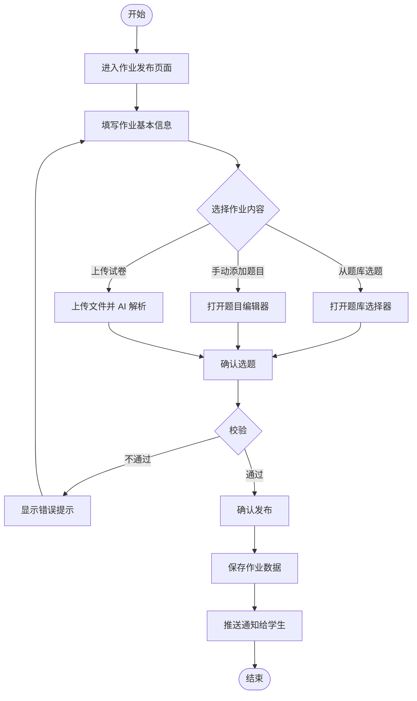
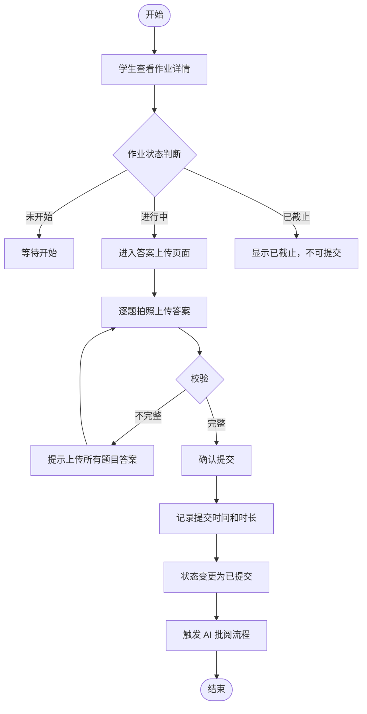
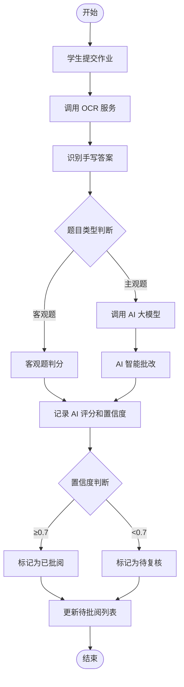
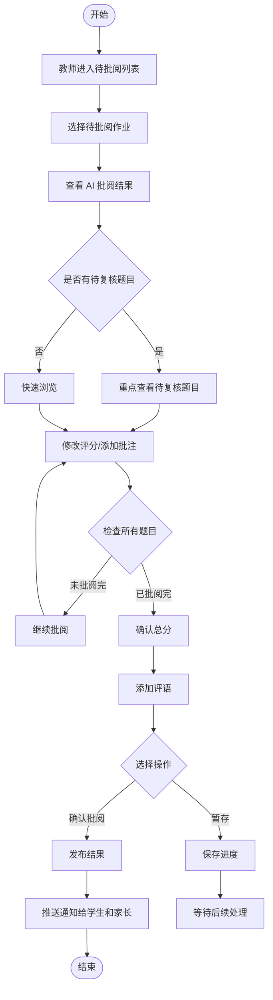
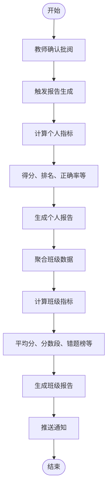
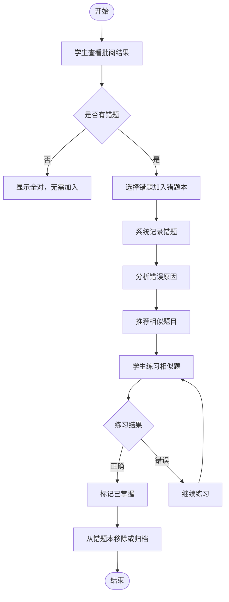
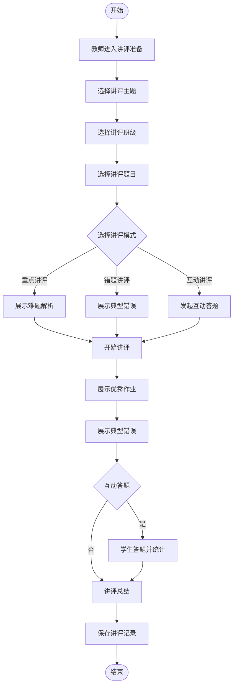
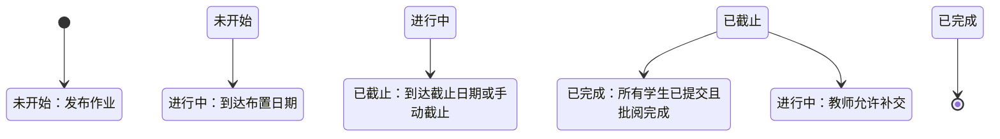
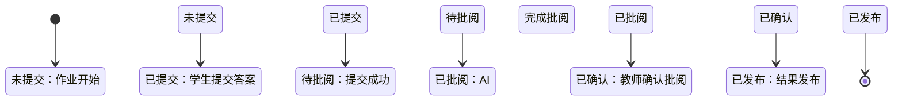

# 业务流程和规则子文档

---

## 文档信息

| 项目名称 | 智能作业批阅平台 |
|---------|--------------------------------|
| 文档版本 | V1.0 |
| 编写日期 | 2026-03-31 |
| 文档类型 | 业务流程和规则子文档 |

---

## 1. 业务流程概述

### 1.1 核心业务流程

```
┌─────────────────────────────────────────────────────────────────┐
│                    智能作业批阅平台核心流程                      │
│                                                                 │
│   教师端                        学生端                          │
│   ┌─────┐                     ┌─────┐                         │
│   │布置 │                     │查看 │                         │
│   │作业 │────────────────────▶│作业 │                         │
│   └─────┘                     └──┬──┘                         │
│                                  │                              │
│                                  ▼                              │
│   ┌─────┐                     ┌─────┐                         │
│   │查看 │◀────────────────────│上传 │                         │
│   │批阅 │    AI 智能批阅        │答案 │                         │
│   └──┬──┘    ┌──────────┐     └─────┘                         │
│      │       │OCR 识别   │                                      │
│      │       │AI 判分    │                                      │
│      │       │置信度判断│                                      │
│      │       └──────────┘                                      │
│      │                                                          │
│      ▼                                                          │
│   ┌─────┐                     ┌─────┐     ┌─────┐             │
│   │复核 │────────────────────▶│查看 │────▶│错题 │             │
│   │确认 │     发布结果         │结果 │     │再练 │             │
│   └─────┘                     └─────┘     └─────┘             │
│                                  │                              │
│                                  ▼                              │
│                            ┌─────┐                             │
│                            │家长 │                             │
│                            │查看 │                             │
│                            └─────┘                             │
│                                                                 │
└─────────────────────────────────────────────────────────────────┘
```

### 1.2 业务流程清单

| 流程编号 | 流程名称 | 涉及角色 | 流程说明 |
|---------|---------|---------|---------|
| P01 | 作业发布流程 | 教师 | 教师创建并发布作业 |
| P02 | 作业提交流程 | 学生 | 学生拍照上传答案并提交 |
| P03 | AI 批阅流程 | 系统 | 系统自动调用 AI 进行批阅 |
| P04 | 教师复核流程 | 教师 | 教师复核 AI 批阅结果并确认 |
| P05 | 报告生成流程 | 系统 | 系统自动生成学情报告 |
| P06 | 错题巩固流程 | 学生 | 学生查看错题并进行相似题练习 |
| P07 | 课堂讲评流程 | 教师 + 学生 | 教师基于作业数据开展课堂讲评 |

---

## 2. 详细业务流程

### 2.1 作业发布流程 (P01)



**流程说明**：
1. 教师进入作业发布页面
2. 填写作业标题、学科、类型、发布班级、预计时长、截止日期等基本信息
3. 选择作业内容来源：从题库选题、手动添加题目、上传试卷三种方式
4. 系统校验：必填字段、至少一个班级、至少一道题目
5. 校验通过后保存作业，状态设为"未开始"
6. 推送通知给发布班级的学生

**业务规则**：
- 必填字段：作业标题、学科、作业类型、发布班级、布置日期、截止日期
- 截止日期不能早于布置日期
- 至少选择一个发布班级
- 至少包含一道题目
- 作业保存后状态为"未开始"，到达布置日期后自动变为"进行中"

---

### 2.2 作业提交流程 (P02)



**流程说明**：
1. 学生查看作业列表，点击作业进入详情
2. 判断作业状态：未开始/进行中/已截止
3. 进行中的作业可提交，已截止的作业不可提交
4. 学生逐题拍照上传答案
5. 校验所有题目是否都已上传
6. 确认提交，记录提交时间和作答时长
7. 触发 AI 批阅流程

**业务规则**：
- 未开始状态的作业：显示作业信息，不可提交
- 进行中状态的作业：可查看可提交
- 已截止状态的作业：可查看，不可提交（除非教师允许补交）
- 所有题目答案都上传后才能提交
- 提交后记录作答时长（从打开作业到提交的时间）

---

### 2.3 AI 批阅流程 (P03)



**流程说明**：
1. 学生提交作业后，系统自动触发 AI 批阅
2. 调用 OCR 服务识别学生手写答案
3. 根据题目类型采用不同批阅策略
4. 客观题（选择题、判断题、填空题）：直接比对答案判分
5. 主观题（简答题、作文题、计算题）：调用 AI 大模型进行语义理解批改
6. 记录每道题的 AI 评分和置信度
7. 置信度≥0.7 的题目标记为已批阅，<0.7 的标记为待复核

**AI 能力说明**：

| 题型 | AI 能力 | 判分方式 |
|------|--------|---------|
| 选择题 | 选项识别 + 答案比对 | 自动判分 |
| 判断题 | 符号识别 (√/×) + 答案比对 | 自动判分 |
| 填空题 | 文字识别 + 多答案匹配 | 自动判分 |
| 简答题 | 关键词匹配 + 语义理解 | 给出得分点 |
| 作文题 | 结构/内容/语法/词汇多维度评分 | 生成评语 |
| 计算题 | 步骤识别 + 过程分判定 | 识别解题过程 |

---

### 2.4 教师复核流程 (P04)



**流程说明**：
1. 教师进入待批阅列表，选择待批阅作业
2. 查看 AI 批阅结果，包括每题评分、置信度、批注
3. 置信度<0.7 的题目高亮显示，提示教师重点复核
4. 教师可修改每题评分、添加批注
5. 系统自动重新计算总分
6. 确认总分无误后，添加评语
7. 点击"确认批阅"发布结果，或"暂存"保存进度

**业务规则**：
- AI 置信度<0.7 的题目必须教师复核确认
- 教师可修改 AI 评分，修改痕迹保留
- 批阅完成前可暂存进度
- 确认批阅后结果发布给学生和家长

---

### 2.5 报告生成流程 (P05)



**流程说明**：
1. 教师确认批阅后，系统自动触发报告生成
2. 计算学生个人指标：得分、班级排名、各知识点正确率等
3. 生成个人报告
4. 聚合班级所有学生数据
5. 计算班级指标：平均分、分数段分布、错题 TOP 榜等
6. 生成班级报告
7. 推送通知给学生和家长查看报告

**报告内容**：

| 报告类型 | 包含指标 |
|---------|---------|
| 个人报告 | 得分/总分、班级排名、作答详情、错题分析、学情建议 |
| 班级报告 | 提交率、平均分、最高/最低分、分数段分布、错题 TOP 榜、优秀作业 |

---

### 2.6 错题巩固流程 (P06)



**流程说明**：
1. 学生查看批阅结果，识别错题
2. 选择错题加入错题本
3. 系统记录错题信息：题目、错误答案、正确答案、知识点等
4. 分析错误原因（知识点不清/审题不清/计算错误）
5. 根据错题知识点推荐相似题目
6. 学生练习相似题
7. 练习正确则标记已掌握，从错题本移除或归档

**相似题推荐规则**：
1. 基于知识点匹配：相同或相近知识点
2. 基于难度匹配：相同或略低于原错题难度
3. 基于题型匹配：相同题型

---

### 2.7 课堂讲评流程 (P07)



**流程说明**：
1. 教师选择要讲评的作业和题目
2. 选择讲评模式：重点讲评/错题讲评/互动讲评
3. 进入讲评模式，大屏展示
4. 展示优秀作业示例（匿名处理）
5. 展示典型错误答案（匿名处理）
6. 可选发起互动答题，学生通过手机端答题
7. 实时统计答题情况
8. 讲评结束后保存记录

---

## 3. 状态流转规则

### 3.1 作业状态流转图



### 3.2 作业状态编码定义

| 状态编码 | 状态名称 | 说明 | 可执行操作 |
|---------|---------|------|-----------|
| WKS | 未开始 | 作业已发布，未到提交开始时间 | 编辑、删除 |
| JXZ | 进行中 | 学生可提交作业 | 编辑、截止 |
| YJZ | 已截止 | 超过提交截止时间 | 查看、允许补交 |
| YWC | 已完成 | 作业全流程结束 | 查看、导出 |

### 3.3 提交状态流转图



### 3.4 提交状态编码定义

| 状态编码 | 状态名称 | 说明 |
|---------|---------|------|
| WTJ | 未提交 | 学生未提交答案 |
| YTJ | 已提交 | 学生已提交答案，等待批阅 |
| WPY | 未批阅 | AI 尚未完成批阅 |
| YPY | 已批阅 | AI 已完成批阅，等待教师确认 |
| YQR | 已确认 | 教师已确认批阅结果 |
| YFB | 已发布 | 批阅结果已发布给学生和家长 |

---

## 4. 业务规则详解

### 4.1 作业发布规则

#### 规则编号：R-PUB-001 必填字段校验

| 项目 | 内容 |
|------|------|
| 规则名称 | 必填字段校验 |
| 适用场景 | 发布作业时 |
| 规则描述 | 校验必填字段是否填写完整 |
| 必填字段 | 作业标题、学科、作业类型、发布班级、布置日期、截止日期 |
| 错误提示 | "请填写完整作业信息" |

#### 规则编号：R-PUB-002 日期逻辑校验

| 项目 | 内容 |
|------|------|
| 规则名称 | 日期逻辑校验 |
| 适用场景 | 选择日期时 |
| 规则描述 | 截止日期不能早于布置日期 |
| 校验逻辑 | deadline >= publishDate |
| 错误提示 | "截止日期不能早于布置日期" |

#### 规则编号：R-PUB-003 题目数量校验

| 项目 | 内容 |
|------|------|
| 规则名称 | 题目数量校验 |
| 适用场景 | 发布作业时 |
| 规则描述 | 作业必须包含至少一道题目 |
| 校验逻辑 | questionCount >= 1 |
| 错误提示 | "请至少添加一道题目" |

---

### 4.2 作业提交规则

#### 规则编号：R-SUB-001 提交时间校验

| 项目 | 内容 |
|------|------|
| 规则名称 | 提交时间校验 |
| 适用场景 | 学生提交作业时 |
| 规则描述 | 作业状态为"进行中"时可提交 |
| 校验逻辑 | status == 'JXZ' |
| 错误提示 | "作业已截止，无法提交" |

#### 规则编号：R-SUB-002 答案完整性校验

| 项目 | 内容 |
|------|------|
| 规则名称 | 答案完整性校验 |
| 适用场景 | 学生提交答案时 |
| 规则描述 | 所有题目答案都上传后才能提交 |
| 校验逻辑 | uploadedCount == questionCount |
| 错误提示 | "请完成所有题目后再提交" |

---

### 4.3 AI 批阅规则

#### 规则编号：R-AI-001 置信度阈值

| 项目 | 内容 |
|------|------|
| 规则名称 | 置信度阈值 |
| 适用场景 | AI 批阅完成后 |
| 规则描述 | 置信度<0.7 的题目需教师复核 |
| 阈值设定 | 0.7 |
| 标识方式 | 高亮显示 + ⚠️标记 |

#### 规则编号：R-AI-002 批阅顺序

| 项目 | 内容 |
|------|------|
| 规则名称 | 批阅顺序 |
| 适用场景 | AI 批阅流程 |
| 规则描述 | 先 OCR 识别，再根据题型分流批阅 |
| 处理流程 | OCR 识别 → 题型判断 → 客观题/主观题分流 → 判分 |

---

### 4.4 教师复核规则

#### 规则编号：R-REV-001 待复核必检

| 项目 | 内容 |
|------|------|
| 规则名称 | 待复核必检 |
| 适用场景 | 教师复核时 |
| 规则描述 | 置信度<0.7 的题目必须教师确认 |
| 校验逻辑 | 有待复核题目时，确认按钮置灰，需先查看确认 |

#### 规则编号：R-REV-002 修改痕迹保留

| 项目 | 内容 |
|------|------|
| 规则名称 | 修改痕迹保留 |
| 适用场景 | 教师修改 AI 评分时 |
| 规则描述 | 修改 AI 评分时保留原评分记录 |
| 存储方式 | 在原评分记录中增加修改记录，包含修改人、修改时间、原评分、新评分 |

---

### 4.5 数据权限规则

#### 规则编号：R-DAT-001 学生数据隔离

| 项目 | 内容 |
|------|------|
| 规则名称 | 学生数据隔离 |
| 适用场景 | 学生查看数据时 |
| 规则描述 | 学生仅可查看自己的作业数据 |
| 实现方式 | 查询条件：STUDENT_ID = 当前用户 ID |

#### 规则编号：R-DAT-002 教师数据范围

| 项目 | 内容 |
|------|------|
| 规则名称 | 教师数据范围 |
| 适用场景 | 教师查看数据时 |
| 规则描述 | 教师仅可查看所教班级的数据 |
| 实现方式 | 通过 TB_S_TEACHER_CLASS 表关联过滤 |

---

## 5. 异常处理规则

### 5.1 业务异常处理

| 异常场景 | 异常代码 | 处理方式 |
|---------|---------|---------|
| 重复提交 | BIZ-SUB-001 | 提示"作业已提交，请勿重复提交" |
| 截止后提交 | BIZ-SUB-002 | 提示"作业已截止，无法提交" |
| 题目被删除 | BIZ-PUB-001 | 提示"题目已不存在，请重新选择" |
| AI 服务不可用 | BIZ-AI-001 | 降级为手动批阅模式，提示教师 |
| OCR 识别失败 | BIZ-OCR-001 | 提示学生重新拍照上传 |
| 报告生成失败 | BIZ-RPT-001 | 记录日志，支持手动重新生成 |

### 5.2 数据一致性保障

| 场景 | 保障措施 |
|------|---------|
| 提交并发 | 乐观锁控制，防止重复提交 |
| 批阅并发 | 行级锁控制，防止重复批阅 |
| 状态流转 | 状态机控制，严格按流程流转 |
| 文件上传 | 事务控制，失败回滚 |

---

## 6. 通知规则

### 6.1 站内通知

| 触发事件 | 通知对象 | 通知内容 |
|---------|---------|---------|
| 作业发布 | 学生 | "新作业已发布：{作业标题}，截止日期：{日期}" |
| 作业提交 | 教师 | "{学生姓名}已提交作业：{作业标题}" |
| AI 批阅完成 | 教师 | "待批阅作业：{作业标题}，{学生数量}人提交，{待复核数量}人待复核" |
| 批阅确认 | 学生、家长 | "作业已批阅：{作业标题}，得分：{分数}" |
| 报告生成 | 学生、家长 | "学情报告已生成：{作业标题}" |
| 截止提醒 | 学生 | "作业即将截止：{作业标题}，剩余时间：{时间}" |

### 6.2 待办任务

| 任务类型 | 任务名称 | 任务对象 |
|---------|---------|---------|
| 待提交 | 作业待提交 | 学生 |
| 待批阅 | 作业待批阅 | 教师 |
| 待复核 | 题目待复核 | 教师 |
| 待查看 | 报告待查看 | 学生、家长 |

---

## 7. 补充业务场景

### 7.1 边界场景处理

| 场景 | 处理方式 |
|------|---------|
| 学生请假无法提交 | 教师可单独延长该学生的截止日期 |
| 教师请假无法批阅 | 可委托其他教师代批阅 |
| 系统故障导致数据丢失 | 从备份恢复，支持手动补录 |
| 网络中断导致提交失败 | 本地缓存答案，网络恢复后自动提交 |

### 7.2 特殊场景处理

| 场景 | 处理方式 |
|------|---------|
| 批量导入学生 | 支持 Excel 批量导入，自动创建账号并分配班级 |
| 班级调整 | 学生可调班，历史数据保持原班级，新数据使用新班级 |
| 教师调动 | 教师可移交任教班级给其他教师，历史数据保留 |
| 毕业数据处理 | 毕业学生数据归档，可查询但不再参与统计 |

---

## 8. 业务规则检查清单

### 8.1 作业发布环节检查

- [ ] 必填字段是否完整
- [ ] 日期逻辑是否正确
- [ ] 至少选择一个班级
- [ ] 至少包含一道题目
- [ ] 题目分值计算是否正确

### 8.2 作业提交环节检查

- [ ] 作业状态是否为进行中
- [ ] 所有题目答案是否都已上传
- [ ] 图片大小是否符合要求
- [ ] 提交时间是否记录

### 8.3 AI 批阅环节检查

- [ ] OCR 识别是否成功
- [ ] 每题是否都有评分和置信度
- [ ] 待复核题目是否已标记
- [ ] 批阅结果是否已保存

### 8.4 教师复核环节检查

- [ ] 待复核题目是否已确认
- [ ] 评分修改是否保留痕迹
- [ ] 总分是否正确
- [ ] 评语是否已填写
- [ ] 批阅结果是否已发布

---

## 9. 附录

### 9.1 状态机配置

```yaml
homework:
  states: [WKS, JXZ, YJZ, YWC]
  transitions:
    - from: WKS
      to: JXZ
      trigger: publish
    - from: JXZ
      to: YJZ
      trigger: deadline
    - from: YJZ
      to: YWC
      trigger: complete
    - from: YJZ
      to: JXZ
      trigger: allowLateSubmit

submit:
  states: [WTJ, YTJ, WPY, YPY, YQR, YFB]
  transitions:
    - from: WTJ
      to: YTJ
      trigger: submit
    - from: YTJ
      to: WPY
      trigger: startAI
    - from: WPY
      to: YPY
      trigger: AIComplete
    - from: YPY
      to: YQR
      trigger: teacherConfirm
    - from: YQR
      to: YFB
      trigger: publish
```

