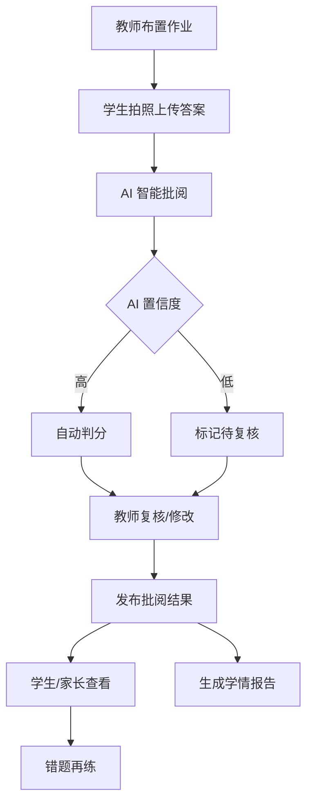

# 智能作业批阅平台需求分析文档

---

## 第 1 章 项目概述

### 1.1 功能背景与目标

本项目为智能作业批阅平台，旨在通过 AI 智能批阅技术，减轻教师作业批改负担，实现个性化精准教学，推动信息技术与教育教学的深度融合。

**建设目标**：
- **减负增效**：通过 AI 智能批阅技术，大幅减轻教师作业批改负担
- **精准教学**：基于作业数据实现个性化、精准化教学
- **深度融合**：推动信息技术与教育教学的深度融合
- **数据驱动**：建立作业数据驱动的教学决策支持体系

**项目预算**：约 200 万元

### 1.2 系统架构说明

| 端 | 技术栈 | 说明 |
|---|--------|------|
| PC 前端 | Vue 3 + Element Plus（Options API） | 教师应用、数据驾驶舱、资源管理、系统管理 |
| 移动端 H5 | UniApp + uView UI 2.x | 学生作业提交、家长查看报告、教师移动办公 |
| 后端 | Spring Boot 3 + MyBatis-Plus | 统一 API 服务 |
| 数据库 | MySQL 8 | 业务数据存储 |
| AI 服务 | 外部大模型 API（通义千问等） | 智能批阅、手写识别 |

### 1.3 整体业务流程图



---

## 第 2 章 角色与权限设计

### 2.1 角色列表

| 角色 | 说明 | 访问端 |
|------|------|--------|
| 学生 | 查看作业、拍照上传答案、查看批阅结果和错题 | 移动端 H5 |
| 教师 | 布置作业、批阅作业、讲评、查看学情报告 | PC 端 + 移动端 |
| 家长 | 查看孩子作业报告和学情数据 | 移动端 H5 |
| 学校管理者 | 查看全校作业数据驾驶舱 | PC 端 |
| 系统管理员 | 管理基础配置、用户、权限等 | PC 端 |

### 2.2 功能权限矩阵

| 功能模块 | 学生 | 教师 | 家长 | 学校管理者 | 系统管理员 |
|---------|------|------|------|----------|----------|
| 作业提交（移动端） | 新建/查看/查看批阅 | - | - | - | - |
| 作业布置 | - | 新建/修改/删除/查看 | - | - | - |
| 作业批阅 | - | 批阅/修改/查看 | - | - | - |
| 作业报告 | 查看个人报告 | 查看班级/个人报告 | 查看孩子报告 | 查看全校报告 | - |
| 课堂讲评 | - | 发起/主持/查看 | - | 查看 | - |
| 错题再练 | 练习/查看 | 布置/查看 | 查看 | - | - |
| 资源管理 | - | 查看/使用 | - | 查看 | 管理 |
| 数据驾驶舱 | - | 查看所教班级 | - | 查看全校 | - |
| 系统管理 | - | - | - | - | 全权管理 |

**权限规则**：
- 学生仅可查看和提交自己的作业
- 教师可查看所教班级学生的作业数据
- 家长仅可查看绑定孩子的作业报告
- 学校管理者可查看全校数据
- 系统管理员拥有所有权限

---

## 第 3 章 功能模块详细说明

### 3.1 作业发布与管理（PC 端 + 移动端）

- **访问端**：PC 端 + 移动端
- **功能描述**：支持教师便捷地发布作业、管理作业生命周期，实现作业全流程数字化管理。

#### 页面列表

**PC 端**：
- 作业发布列表页
- 作业发布表单页（新建/编辑）
- 作业详情页

**移动端**：
- 作业列表页（教师端）
- 作业发布表单页（教师端）

#### 字段说明 - 作业基本信息

| 字段名 | 字段类型 | 是否必填 | 说明 |
|--------|---------|---------|------|
| 作业标题 | 文本输入 | 是 | 作业名称 |
| 作业描述 | 多行文本 | 否 | 作业说明和要求 |
| 发布教师 | 用户选择（自动） | 自动 | 当前登录教师 |
| 发布班级 | 班级多选 | 是 | 选择接收作业的班级 |
| 作业类型 | 下拉选择 | 是 | 课后作业/课堂练习/单元测试/期中期末复习 |
| 学科 | 下拉选择 | 是 | 语文/数学/英语/物理/化学/生物/历史/地理/政治等 |
| 预计完成时长 | 数字输入 | 否 | 单位：分钟 |
| 布置日期 | 日期选择 | 是 | 默认当前日期 |
| 提交截止日期 | 日期选择 | 是 | 学生提交作业截止时间 |
| 作业状态 | 状态标识 | 自动 | 未开始/进行中/已截止/已结束 |

#### 字段说明 - 作业内容

| 字段名 | 字段类型 | 是否必填 | 说明 |
|--------|---------|---------|------|
| 题目来源 | 单选 | 是 | 题库选题/手动添加/上传试卷 |
| 题目列表 | 题目组件 | 条件必填 | 从题库选择的题目或手动添加的题目 |
| 附件 | 文件上传 | 否 | 作业相关附件（word/pdf/图片） |

#### 操作按钮

| 按钮名 | 触发条件 | 操作说明 |
|--------|---------|---------|
| 发布作业 | 表单校验通过 | 发布作业给指定班级 |
| 保存草稿 | 任意 | 保存为草稿（可选功能） |
| 编辑 | 未截止作业 | 修改作业信息 |
| 截止 | 进行中作业 | 手动截止作业 |
| 删除 | 任意 | 删除作业（需确认） |

#### 业务规则

1. 作业发布后，选定班级的学生可在移动端查看作业
2. 提交截止日期后，学生无法再提交作业
3. 教师可在作业截止前修改作业内容
4. 支持从题库选题、手动添加题目、上传整卷三种方式布置作业

#### 接口需求

| 接口名称 | 方法 | 路径 | 说明 |
|---------|------|------|------|
| 发布作业 | POST | /homework/publish/save | 保存并发布作业 |
| 查询作业列表 | GET | /homework/publish/list | 分页列表，支持多条件筛选 |
| 查询作业详情 | GET | /homework/publish/queryById | 查看作业详情 |
| 修改作业 | POST | /homework/publish/update | 修改作业信息 |
| 删除作业 | DELETE | /homework/publish/delete | 删除作业 |
| 查询班级列表 | GET | /class/class/list | 教师可布置的班级列表 |
| 查询题库 | GET | /resource/question/list | 题库查询接口 |

---

### 3.2 作业智能批阅（核心功能）

- **访问端**：PC 端 + 移动端
- **功能描述**：利用 AI 技术对作业进行自动批阅，支持客观题自动判分、主观题智能批改、手写识别等能力。

#### 页面列表

**PC 端**：
- 待批阅作业列表页
- 已批阅作业列表页
- 作业批阅详情页
- 批阅复核页

**移动端**：
- 待批阅列表（教师端）
- 批阅详情（教师端）

#### 字段说明 - 学生作业提交

| 字段名 | 字段类型 | 是否必填 | 说明 |
|--------|---------|---------|------|
| 作业 ID | 关联 ID | 自动 | 关联发布的作业 |
| 提交学生 | 用户关联 | 自动 | 当前登录学生 |
| 提交时间 | 日期时间 | 自动 | 提交时间戳 |
| 题目答案 | 图片/文本 | 是 | 每道题目的答案（拍照上传或文本输入） |
| 作答时长 | 数字 | 自动 | 单位：分钟 |

#### 字段说明 - AI 批阅结果

| 字段名 | 字段类型 | 说明 |
|--------|---------|------|
| 题目 ID | 关联 ID | 批阅的题目 |
| AI 判分 | 数字 | AI 给出的分数 |
| AI 置信度 | 数字（0-1） | AI 判分置信度，<0.7 标记待复核 |
| AI 批注 | 文本 | AI 给出的批注和解析 |
| 正确答案 | 文本 | 题目标准答案 |
| 学生答案 | 图片/文本 | 学生作答内容（OCR 识别后文本） |
| 最终判分 | 数字 | 教师确认后的最终分数（可修改 AI 判分） |
| 教师批注 | 文本 | 教师手动批注 |

#### 操作按钮

| 按钮名 | 触发条件 | 操作说明 |
|--------|---------|---------|
| 拍照上传 | 学生端 | 调用摄像头拍照或选择相册图片 |
| 提交作业 | 学生端 | 提交作业进入待批阅状态 |
| AI 批阅 | 系统自动 | 调用 AI 服务进行批阅 |
| 修改评分 | 教师端 | 修改 AI 判分结果 |
| 添加批注 | 教师端 | 手动添加批注 |
| 确认批阅 | 教师端 | 确认批阅结果并发布 |

#### 业务规则

1. 学生提交作业后，系统自动调用 AI 服务进行批阅
2. AI 批阅置信度<0.7 的题目，标记为"待复核"，提醒教师重点检查
3. 教师可查看 AI 批阅结果，修改评分和批注
4. 教师确认批阅后，结果对学生和家长可见
5. 客观题（选择题、判断题、填空题）支持全自动化批阅
6. 主观题（简答题、作文题、计算题）支持 AI 辅助批阅 + 教师复核

#### AI 能力说明

**客观题自动判分**：
- 选择题（单选/多选）：识别选项，自动比对答案
- 判断题：识别√/×，自动判分
- 填空题：识别填写内容，支持多答案匹配

**主观题智能批改**：
- 简答题：关键词匹配 + 语义理解，给出得分点
- 作文题：结构、内容、语法、词汇多维度评分，生成评语
- 计算题：步骤分判定，识别解题过程

**手写识别能力**：
- 支持手写汉字识别
- 支持手写数字/公式识别
- 支持英文手写识别

#### 接口需求

| 接口名称 | 方法 | 路径 | 说明 |
|---------|------|------|------|
| 提交作业 | POST | /homework/submit/save | 学生提交作业 |
| AI 批阅请求 | POST | /homework/ai/grade | 调用 AI 服务批阅 |
| 查询待批阅列表 | GET | /homework/grade/todoList | 教师待批阅列表 |
| 查询已批阅列表 | GET | /homework/grade/doneList | 已批阅列表 |
| 批阅详情 | GET | /homework/grade/queryById | 批阅详情（含 AI 结果） |
| 修改评分 | POST | /homework/grade/updateScore | 教师修改 AI 判分 |
| 确认批阅 | POST | /homework/grade/confirm | 确认并发布批阅结果 |

---

### 3.3 校本作业资源管理（PC 端）

- **访问端**：PC 端
- **功能描述**：建立学校自有作业资源库，支持题库管理、试卷管理、知识点关联，实现校本资源的沉淀与复用。

#### 页面列表

- 题库管理列表页
- 题目详情页（新建/编辑）
- 试卷管理列表页
- 试卷组卷页
- 知识点管理页

#### 字段说明 - 题库管理

| 字段名 | 字段类型 | 是否必填 | 说明 |
|--------|---------|---------|------|
| 题目 ID | 自动生成 | 自动 | 唯一标识 |
| 题目标题 | 文本输入 | 是 | 题目内容 |
| 题目类型 | 下拉选择 | 是 | 选择题/判断题/填空题/简答题/作文题/计算题 |
| 学科 | 下拉选择 | 是 | 语文/数学/英语等 |
| 年级 | 下拉选择 | 是 | 一年级至九年级/高一至高三 |
| 知识点 | 知识点选择树 | 是 | 关联的知识点 |
| 难度 | 下拉选择 | 是 | 容易/中等/困难 |
| 分值 | 数字输入 | 是 | 题目默认分值 |
| 标准答案 | 文本/富文本 | 是 | 标准答案和解析 |
| 题目来源 | 文本输入 | 否 | 来源说明 |
| 共享范围 | 下拉选择 | 是 | 校本私有/区域共享 |

#### 字段说明 - 试卷管理

| 字段名 | 字段类型 | 是否必填 | 说明 |
|--------|---------|---------|------|
| 试卷标题 | 文本输入 | 是 | 试卷名称 |
| 学科 | 下拉选择 | 是 | 所属学科 |
| 年级 | 下拉选择 | 是 | 适用年级 |
| 试卷类型 | 下拉选择 | 是 | 单元测试/期中/期末/专项练习 |
| 题目列表 | 题目关联 | 是 | 组卷题目及顺序 |
| 总分 | 数字 | 自动 | 各题目分值之和 |
| 预计时长 | 数字输入 | 否 | 建议完成时间（分钟） |
| 共享范围 | 下拉选择 | 是 | 校本私有/区域共享 |

#### 操作按钮

| 按钮名 | 触发条件 | 操作说明 |
|--------|---------|---------|
| 新建题目 | 题库列表 | 打开题目新建弹窗 |
| 导入题目 | 题库列表 | 批量导入题目（Word/Excel） |
| 组卷 | 试卷列表 | 打开组卷页面 |
| 导出试卷 | 试卷列表 | 导出 Word/PDF 试卷 |
| 保存 | 编辑页 | 保存资源 |
| 删除 | 列表页 | 删除资源（需确认） |

#### 业务规则

1. 题库支持校本私有和区域共享两种模式
2. 题目支持按学科、年级、知识点、难度等多维度筛选
3. 组卷支持手动选题和智能组卷两种方式
4. 试卷可导出为 Word/PDF 格式供打印使用

#### 接口需求

| 接口名称 | 方法 | 路径 | 说明 |
|---------|------|------|------|
| 题库列表 | GET | /resource/question/list | 题库查询，支持多条件筛选 |
| 题目详情 | GET | /resource/question/queryById | 查看题目详情 |
| 保存题目 | POST | /resource/question/save | 新建/修改题目 |
| 删除题目 | DELETE | /resource/question/delete | 删除题目 |
| 导入题目 | POST | /resource/question/import | 批量导入 |
| 试卷列表 | GET | /resource/paper/list | 试卷查询 |
| 保存试卷 | POST | /resource/paper/save | 保存试卷 |
| 组卷 | POST | /resource/paper/compose | 智能组卷 |

---

### 3.4 作业报告（PC 端 + 移动端）

- **访问端**：PC 端 + 移动端
- **功能描述**：基于批阅数据自动生成多维度作业分析报告，为教师、学生、家长提供数据洞察。

#### 页面列表

**PC 端（教师/管理者）**：
- 班级作业报告页
- 个人作业报告页
- 学情分析页

**移动端（学生/家长/教师）**：
- 作业报告页（个人）
- 学情简报页

#### 字段说明 - 班级报告（教师视角）

| 字段名 | 字段类型 | 说明 |
|--------|---------|------|
| 作业标题 | 文本 | 作业名称 |
| 发布班级 | 文本 | 班级名称 |
| 提交人数/应交人数 | 数字 | 提交率统计 |
| 平均分 | 数字 | 班级平均分 |
| 最高分/最低分 | 数字 | 极值统计 |
| 分数段分布 | 数组 | 各分数段人数分布 |
| 错题 TOP 榜 | 数组 | 错误率最高的题目 |
| 优秀作业展示 | 列表 | 高分作业展示 |

#### 字段说明 - 个人报告（学生/家长视角）

| 字段名 | 字段类型 | 说明 |
|--------|---------|------|
| 作业标题 | 文本 | 作业名称 |
| 得分/总分 | 数字 | 个人得分 |
| 班级排名 | 数字 | 班级内排名（可选显示） |
| 作答详情 | 列表 | 每道题的作答情况 |
| 错题分析 | 列表 | 错题及知识点分析 |
| 学情建议 | 文本 | 个性化学习建议 |

#### 操作按钮

| 按钮名 | 触发条件 | 操作说明 |
|--------|---------|---------|
| 查看报告 | 列表页操作列 | 打开报告详情页 |
| 导出报告 | 报告页 | 导出 PDF 报告 |
| 分享报告 | 移动端 | 分享给家长（学生端） |
| 打印报告 | PC 端 | 打印报告 |

#### 业务规则

1. 教师可查看所教班级的作业报告和个人报告
2. 学生可查看自己的作业报告
3. 家长可查看绑定孩子的作业报告
4. 排名功能支持隐藏（隐私保护）
5. 报告支持 PDF 导出和打印

#### 接口需求

| 接口名称 | 方法 | 路径 | 说明 |
|---------|------|------|------|
| 班级报告 | GET | /report/class/query | 班级维度的作业报告 |
| 个人报告 | GET | /report/student/query | 学生个人报告 |
| 学情分析 | GET | /report/analysis/query | 学情分析数据 |
| 导出报告 | GET | /report/export | 导出 PDF 报告 |

---

### 3.5 课堂作业讲评（PC 端 + 移动端）

- **访问端**：PC 端 + 移动端
- **功能描述**：支持教师基于作业数据开展课堂讲评，实现重点讲评、错题讲评、互动讲评。

#### 页面列表

**PC 端**：
- 讲评准备页
- 讲评展示页（大屏模式）

**移动端**：
- 讲评控制页（教师端）

#### 字段说明 - 讲评内容

| 字段名 | 字段类型 | 说明 |
|--------|---------|------|
| 讲评主题 | 文本 | 讲评标题 |
| 讲评班级 | 班级选择 | 参与讲评的班级 |
| 讲评题目 | 题目选择 | 选择要讲评的题目 |
| 讲评模式 | 下拉选择 | 重点讲评/错题讲评/互动讲评 |
| 展示内容 | 富文本 | 讲评内容（可编辑） |

#### 操作按钮

| 按钮名 | 触发条件 | 操作说明 |
|--------|---------|---------|
| 开始讲评 | 讲评页 | 进入讲评模式 |
| 切换题目 | 讲评中 | 切换展示的题目 |
| 展示优秀作业 | 讲评中 | 展示高分作业示例 |
| 展示典型错误 | 讲评中 | 展示典型错误答案 |
| 互动答题 | 讲评中 | 发起随堂答题互动 |
| 结束讲评 | 讲评中 | 结束讲评并记录 |

#### 业务规则

1. 教师可选择作业中的题目进行课堂讲评
2. 支持展示优秀作业和典型错误（匿名处理）
3. 支持随堂互动答题功能
4. 讲评记录可保存供后续复习使用

#### 接口需求

| 接口名称 | 方法 | 路径 | 说明 |
|---------|------|------|------|
| 讲评准备 | GET | /comment/prepare | 获取讲评准备数据 |
| 开始讲评 | POST | /comment/start | 开始讲评 |
| 讲评记录 | POST | /comment/save | 保存讲评记录 |
| 互动答题 | POST | /comment/quiz | 发起互动答题 |

---

### 3.6 错题再练（移动端 + PC 端）

- **访问端**：移动端 + PC 端
- **功能描述**：基于学生错题数据，智能推荐相似题目进行巩固练习，实现个性化错题巩固。

#### 页面列表

**移动端**：
- 错题本列表页
- 错题详情页
- 相似题推荐页
- 错题练习页

**PC 端**：
- 错题分析报告页（教师）
- 错题布置页（教师）

#### 字段说明 - 错题本

| 字段名 | 字段类型 | 说明 |
|--------|---------|------|
| 错题 ID | 关联 ID | 错题记录 |
| 题目内容 | 文本 | 原题目 |
| 错误答案 | 文本/图片 | 学生的错误作答 |
| 正确答案 | 文本 | 标准答案和解析 |
| 错误原因 | 下拉选择 | 知识点不清/审题不清/计算错误/其他 |
| 错题来源 | 文本 | 来源作业/试卷 |
| 错题时间 | 日期 | 记录时间 |
| 掌握状态 | 状态标识 | 未掌握/已掌握/待巩固 |

#### 字段说明 - 相似题推荐

| 字段名 | 字段类型 | 说明 |
|--------|---------|------|
| 原错题 | 关联 | 原始错题 |
| 推荐题目 | 题目列表 | 基于知识点和难度推荐的相似题 |
| 推荐原因 | 文本 | 推荐依据（同知识点/同类型等） |
| 推荐时间 | 日期 | 推荐时间 |

#### 操作按钮

| 按钮名 | 触发条件 | 操作说明 |
|--------|---------|---------|
| 加入错题本 | 作业详情页 | 将错题加入错题本 |
| 练习错题 | 错题本 | 重新做错题 |
| 推荐相似题 | 错题详情 | 获取相似题推荐 |
| 标记已掌握 | 错题详情 | 标记为已掌握 |
| 布置错题作业 | 教师端 | 基于班级错题布置作业 |

#### 业务规则

1. 学生错题自动加入错题本
2. 系统根据错题知识点智能推荐相似题目
3. 学生可标记错题掌握状态
4. 教师可查看班级错题分析报告
5. 教师可基于班级共性错题布置巩固作业

#### 接口需求

| 接口名称 | 方法 | 路径 | 说明 |
|---------|------|------|------|
| 错题本列表 | GET | /mistake/list | 个人错题列表 |
| 错题详情 | GET | /mistake/queryById | 错题详情 |
| 相似题推荐 | GET | /mistake/recommend | 推荐相似题目 |
| 标记掌握 | POST | /mistake/markMastered | 标记已掌握 |
| 班级错题分析 | GET | /mistake/classAnalysis | 教师查看班级错题分析 |

---

### 3.7 教师应用（PC 端 + 移动端）

- **访问端**：PC 端 + 移动端
- **功能描述**：为教师提供一站式作业教学应用，包括作业布置、批阅、讲评、学情分析等全流程支持。

#### 页面列表

**PC 端**：
- 教师工作台首页
- 我的班级页
- 教学数据页

**移动端**：
- 教师移动端首页
- 移动批阅页
- 消息通知页

#### 功能模块

| 模块 | 功能 | 说明 |
|------|------|------|
| 工作台 | 待办事项 | 待批阅作业、待处理事项 |
| 工作台 | 快捷入口 | 布置作业、查看报告、讲评等 |
| 我的班级 | 班级管理 | 查看所教班级列表和学生 |
| 教学数据 | 学情概览 | 教学数据汇总 |
| 消息通知 | 系统消息 | 作业提交提醒、报告推送等 |

#### 接口需求

| 接口名称 | 方法 | 路径 | 说明 |
|---------|------|------|------|
| 工作台数据 | GET | /teacher/dashboard | 教师工作台首页数据 |
| 我的班级 | GET | /teacher/classes | 教师所教班级列表 |
| 待办事项 | GET | /teacher/todo | 待办事项列表 |
| 教学数据 | GET | /teacher/teachingData | 教学数据汇总 |

---

### 3.8 作业数据驾驶舱（PC 端）

- **访问端**：PC 端
- **功能描述**：为学校管理者、教研组提供作业数据可视化大屏，支持多维度数据分析与决策支持。

#### 页面列表

- 数据驾驶舱首页（大屏展示）
- 数据分析详情页

#### 查询条件

| 字段名 | 字段类型 | 说明 |
|--------|---------|------|
| 时间范围 | 日期范围选择 | 统计时间范围 |
| 学段 | 下拉选择 | 小学/初中/高中 |
| 学科 | 下拉选择 | 各学科筛选 |
| 年级 | 下拉选择 | 年级筛选 |
| 班级 | 下拉选择 | 班级筛选 |

#### 图表说明

| 图表名称 | 图表类型 | 说明 |
|---------|---------|------|
| 作业完成概览 | 指标卡 | 作业总数、提交率、平均分等核心指标 |
| 学科作业量对比 | 柱状图 | 各学科作业数量对比 |
| 作业完成趋势 | 折线图 | 按时间趋势展示作业完成情况 |
| 年级作业分析 | 环形图 | 各年级作业分布 |
| 学情热力图 | 热力图 | 各班级学情对比 |
| 教师批阅效率 | 排行榜 | 教师批阅时效排名 |

#### 操作按钮

| 按钮名 | 触发条件 | 操作说明 |
|--------|---------|---------|
| 查询 | 筛选条件区 | 根据条件查询数据 |
| 重置 | 筛选条件区 | 清空筛选条件 |
| 导出 | 数据页 | 导出数据（Excel） |
| 大屏模式 | 首页 | 切换全屏展示模式 |

#### 业务规则

1. 学校管理者可查看全校数据
2. 教研组长可查看本学科数据
3. 年级组长可查看本年级数据
4. 数据支持实时刷新

#### 接口需求

| 接口名称 | 方法 | 路径 | 说明 |
|---------|------|------|------|
| 驾驶舱首页数据 | GET | /cockpit/dashboard | 驾驶舱核心数据 |
| 学科对比数据 | GET | /cockpit/subjectCompare | 学科作业对比 |
| 趋势数据 | GET | /cockpit/trend | 作业完成趋势 |
| 学情热力图 | GET | /cockpit/heatmap | 学情热力图数据 |

---

## 第 4 章 数据库设计要点

### 4.1 主要数据表清单

| 表名 | 中文名 | 说明 |
|------------|--------|------|
| HOMEWORK_PUBLISH | 作业发布表 | 教师发布的作业信息 |
| HOMEWORK_SUBMIT | 作业提交表 | 学生提交的作业信息 |
| HOMEWORK_GRADE | 作业批阅表 | AI 和教师批阅记录 |
| HOMEWORK_ANSWER | 学生答案表 | 学生每道题的作答 |
| RESOURCE_QUESTION | 题库表 | 题目资源信息 |
| RESOURCE_PAPER | 试卷表 | 试卷资源信息 |
| RESOURCE_PAPER_QUESTION | 试卷 - 题目关联表 | 试卷包含的题目 |
| REPORT_CLASS | 班级报告表 | 班级维度的报告数据 |
| REPORT_STUDENT | 学生报告表 | 学生个人报告数据 |
| MISTAKE_BOOK | 错题本表 | 学生错题记录 |
| MISTAKE_RECOMMEND | 错题推荐表 | 相似题推荐记录 |
| COMMENT_RECORD | 讲评记录表 | 课堂讲评记录 |
| SYS_USER | 用户表 | 学生/教师/家长/管理者账号 |
| SYS_CLASS | 班级表 | 学校班级信息 |
| SYS_TEACHER_CLASS | 教师 - 班级关联表 | 教师任教班级关系 |
| SYS_PARENT_STUDENT | 家长 - 学生关联表 | 家长与孩子的绑定关系 |
| SYS_SCHOOL | 学校表 | 学校基础信息 |
| SYS_KNOWLEDGE | 知识点表 | 学科知识点树 |

### 4.2 核心表字段设计

#### HOMEWORK_PUBLISH (作业发布表)

| 字段名 | 类型 | 说明 |
|--------|------|------|
| ID | VARCHAR(32) | 主键 |
| TITLE | VARCHAR(200) | 作业标题 |
| DESCRIPTION | TEXT | 作业描述 |
| TEACHER_ID | VARCHAR(32) | 发布教师 ID |
| HOMEWORK_TYPE | VARCHAR(20) | 作业类型 |
| SUBJECT | VARCHAR(20) | 学科 |
| ESTIMATED_DURATION | INT | 预计完成时长（分钟） |
| PUBLISH_DATE | DATETIME | 布置日期 |
| DEADLINE | DATETIME | 提交截止日期 |
| STATUS | VARCHAR(20) | 状态：未开始/进行中/已截止/已结束 |
| CREATE_USER | VARCHAR(32) | 创建人 |
| CREATE_TIME | DATETIME | 创建时间 |
| UPDATE_USER | VARCHAR(32) | 更新人 |
| UPDATE_TIME | DATETIME | 更新时间 |
| DEL_FLAG | TINYINT | 逻辑删除标记 |

#### HOMEWORK_SUBMIT (作业提交表)

| 字段名 | 类型 | 说明 |
|--------|------|------|
| ID | VARCHAR(32) | 主键 |
| HOMEWORK_ID | VARCHAR(32) | 作业 ID |
| STUDENT_ID | VARCHAR(32) | 提交学生 ID |
| SUBMIT_TIME | DATETIME | 提交时间 |
| DURATION | INT | 作答时长（分钟） |
| STATUS | VARCHAR(20) | 状态：已提交/已批阅/已确认 |
| TOTAL_SCORE | DECIMAL(5,2) | 总分 |
| CREATE_TIME | DATETIME | 创建时间 |

#### HOMEWORK_GRADE (作业批阅表)

| 字段名 | 类型 | 说明 |
|--------|------|------|
| ID | VARCHAR(32) | 主键 |
| SUBMIT_ID | VARCHAR(32) | 提交记录 ID |
| QUESTION_ID | VARCHAR(32) | 题目 ID |
| AI_SCORE | DECIMAL(5,2) | AI 判分 |
| AI_CONFIDENCE | DECIMAL(3,2) | AI 置信度（0-1） |
| AI_COMMENT | TEXT | AI 批注 |
| TEACHER_SCORE | DECIMAL(5,2) | 教师确认分数 |
| TEACHER_COMMENT | TEXT | 教师批注 |
| GRADE_USER | VARCHAR(32) | 批阅教师 ID |
| GRADE_TIME | DATETIME | 批阅时间 |
| REVIEW_FLAG | TINYINT | 待复核标记 |

#### RESOURCE_QUESTION (题库表)

| 字段名 | 类型 | 说明 |
|--------|------|------|
| ID | VARCHAR(32) | 主键 |
| TITLE | TEXT | 题目标题 |
| QUESTION_TYPE | VARCHAR(20) | 题目类型 |
| SUBJECT | VARCHAR(20) | 学科 |
| GRADE | VARCHAR(20) | 年级 |
| KNOWLEDGE_IDS | VARCHAR(500) | 知识点 ID 列表 |
| DIFFICULTY | VARCHAR(20) | 难度 |
| SCORE | DECIMAL(5,2) | 分值 |
| ANSWER | TEXT | 标准答案 |
| ANALYSIS | TEXT | 解析 |
| SOURCE | VARCHAR(200) | 题目来源 |
| SHARE_SCOPE | VARCHAR(20) | 共享范围：校本私有/区域共享 |
| SCHOOL_ID | VARCHAR(32) | 所属学校 ID |
| CREATE_USER | VARCHAR(32) | 创建人 |
| CREATE_TIME | DATETIME | 创建时间 |
| DEL_FLAG | TINYINT | 逻辑删除标记 |

#### MISTAKE_BOOK (错题本表)

| 字段名 | 类型 | 说明 |
|--------|------|------|
| ID | VARCHAR(32) | 主键 |
| STUDENT_ID | VARCHAR(32) | 学生 ID |
| QUESTION_ID | VARCHAR(32) | 题目 ID |
| HOMEWORK_ID | VARCHAR(32) | 来源作业 ID |
| WRONG_ANSWER | TEXT | 错误答案 |
| ERROR_REASON | VARCHAR(50) | 错误原因 |
| MASTER_STATUS | VARCHAR(20) | 掌握状态 |
| MISTAKE_TIME | DATETIME | 记录时间 |
| CREATE_TIME | DATETIME | 创建时间 |

### 4.3 表间关系

```
HOMEWORK_PUBLISH ──1:N── HOMEWORK_SUBMIT
HOMEWORK_SUBMIT ──1:N── HOMEWORK_GRADE
HOMEWORK_SUBMIT ──1:N── HOMEWORK_ANSWER
RESOURCE_PAPER ──1:N── RESOURCE_PAPER_QUESTION
RESOURCE_PAPER_QUESTION ──N:1── RESOURCE_QUESTION
HOMEWORK_SUBMIT ──1:N── MISTAKE_BOOK
SYS_USER ──1:N── HOMEWORK_PUBLISH (教师发布)
SYS_USER ──1:N── HOMEWORK_SUBMIT (学生提交)
SYS_CLASS ──1:N── HOMEWORK_PUBLISH (发布班级)
SYS_TEACHER_CLASS ──N:M── SYS_USER (教师 - 班级关联)
SYS_PARENT_STUDENT ──N:M── SYS_USER (家长 - 学生绑定)
SYS_SCHOOL ──1:N── RESOURCE_QUESTION (学校资源)
SYS_KNOWLEDGE ──1:N── RESOURCE_QUESTION (知识点关联)
```

---

## 第 5 章 接口契约汇总

### 5.1 作业发布与管理

| 接口名称 | 方法 | 路径 | 说明 |
|---------|------|------|------|
| 发布作业 | POST | /homework/publish/save | 保存并发布作业 |
| 作业列表 | GET | /homework/publish/list | 分页列表 |
| 作业详情 | GET | /homework/publish/queryById | 查看详情 |
| 修改作业 | POST | /homework/publish/update | 修改 |
| 删除作业 | DELETE | /homework/publish/delete | 删除 |

### 5.2 作业提交与批阅

| 接口名称 | 方法 | 路径 | 说明 |
|---------|------|------|------|
| 提交作业 | POST | /homework/submit/save | 学生提交 |
| 待批阅列表 | GET | /homework/grade/todoList | 教师待办 |
| 已批阅列表 | GET | /homework/grade/doneList | 已批阅 |
| 批阅详情 | GET | /homework/grade/queryById | 详情 |
| AI 批阅 | POST | /homework/ai/grade | 调用 AI |
| 修改评分 | POST | /homework/grade/updateScore | 教师修改 |
| 确认批阅 | POST | /homework/grade/confirm | 确认 |

### 5.3 资源管理

| 接口名称 | 方法 | 路径 | 说明 |
|---------|------|------|------|
| 题库列表 | GET | /resource/question/list | 题库查询 |
| 题目详情 | GET | /resource/question/queryById | 题目详情 |
| 保存题目 | POST | /resource/question/save | 保存题目 |
| 试卷列表 | GET | /resource/paper/list | 试卷列表 |
| 保存试卷 | POST | /resource/paper/save | 保存试卷 |

### 5.4 作业报告

| 接口名称 | 方法 | 路径 | 说明 |
|---------|------|------|------|
| 班级报告 | GET | /report/class/query | 班级报告 |
| 个人报告 | GET | /report/student/query | 个人报告 |
| 导出报告 | GET | /report/export | 导出 PDF |

### 5.5 错题再练

| 接口名称 | 方法 | 路径 | 说明 |
|---------|------|------|------|
| 错题本列表 | GET | /mistake/list | 错题列表 |
| 相似题推荐 | GET | /mistake/recommend | 推荐题目 |
| 标记掌握 | POST | /mistake/markMastered | 标记 |

### 5.6 数据驾驶舱

| 接口名称 | 方法 | 路径 | 说明 |
|---------|------|------|------|
| 驾驶舱数据 | GET | /cockpit/dashboard | 首页数据 |
| 趋势数据 | GET | /cockpit/trend | 趋势分析 |

---

## 第 6 章 非功能性需求

### 6.1 性能要求

- 页面响应时间 < 3 秒
- AI 批阅响应时间 < 10 秒/题
- 并发支持：支持 1000+ 用户同时在线
- 数据准确性：AI 批阅准确率 > 85%（客观题>95%）

### 6.2 数据安全要求

- 用户密码加密存储（BCrypt）
- 敏感信息（手机号、身份证号）脱敏展示
- 接口权限校验（JWT 认证）
- 操作日志完整记录
- 学生隐私保护（排名可选隐藏）

### 6.3 移动端适配要求

- UniApp H5 适配主流手机分辨率
- 支持微信内嵌访问
- 拍照上传支持相机/相册选择
- 适配 iOS 和 Android 主流系统

### 6.4 可用性要求

- 系统可用性 > 99%
- 支持数据备份和恢复
- 关键操作支持撤销/回退

---

## 第 7 章 外部集成需求

### 7.1 AI 服务集成

| 服务 | 提供商 | 用途 |
|------|--------|------|
| 大模型 API | 通义千问 | 主观题智能批改、语义理解 |
| OCR 服务 | 阿里 OCR | 手写识别、公式识别 |

### 7.2 消息通知

| 通知类型 | 渠道 | 说明 |
|---------|------|------|
| 作业提醒 | 微信模板消息/短信 | 作业布置/截止提醒 |
| 批阅通知 | 微信模板消息 | 批阅完成通知 |
| 报告推送 | 微信模板消息 | 学情报告推送 |

### 7.3 统一身份认证（可选）

- 支持对接学校现有统一身份认证系统
- 支持微信授权登录

---

## 第 8 章 确认事项

| 编号 | 问题 | 确认结果 |
|------|------|---------|
| 1 | 技术架构 | Vue 3 + Element Plus + Spring Boot 3 + MySQL 8 |
| 2 | 移动端形式 | UniApp H5 |
| 3 | AI 服务 | 集成外部大模型 API（通义千问等） |
| 4 | 手写识别 | 支持 |
| 5 | 学生账号 | 独立账号体系 |
| 6 | 家长角色 | 纳入系统（查看报告） |
| 7 | AI 修改评分 | 允许教师修改 |
| 8 | AI 置信度 | 记录并标记低置信度待复核 |
| 9 | 数据隔离 | 支持多学校/多校区/多班级 |
| 10 | 资源共享 | 支持校本私有 + 区域共享 |

---

## 附录：术语解释

| 术语 | 解释 |
|------|------|
| AI 批阅 | 利用人工智能技术对作业进行自动批改 |
| 置信度 | AI 对判分结果的自信程度（0-1） |
| 校本资源 | 学校自有的教学资源 |
| 错题再练 | 基于错题数据的个性化巩固练习 |
| 数据驾驶舱 | 数据可视化大屏，支持多维度数据分析 |
